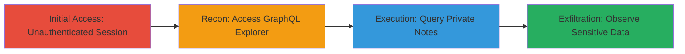

---
tags:
  - gitlab
  - graphql
  - information-disclosure
  - api-vulnerability
  - unauthenticated-access
type: attack_chain
tools:
  - '[[tools/GitLab-GraphQL-Explorer]]'
tactics:
  - '[[Discovery]]'
verified: false
platforms:
  - Web
  - GitLab
submitted: true
complexity: medium
created_at: '2023-10-01T00:00:00Z'
procedures:
  - '[[procedures/Exploit-GitLab-GraphQL-for-Private-Note-Disclosure]]'
step_count: 4
techniques:
  - '[[T1213.003]]'
  - '[[Exploit Public-Facing Application]]'
updated_at: '2025-12-14T17:25:53.268Z'
description: >-
  An attack chain exploiting inadequate authorization in GitLab's GraphQL API to
  disclose private system notes on public issues, revealing sensitive internal
  actions and references to confidential content.
skill_level: intermediate
impact_level: high
id: feb47afb-ba48-4ae5-bfba-f5d1ff5d8f03
validated: true
mitre_tactics:
  - '[[Discovery]]'
mitre_techniques:
  - '[[T1213.003]]'
  - '[[Exploit Public-Facing Application]]'
---
# Private System Note Disclosure via Unauthenticated GitLab GraphQL API

Multi-stage attack chain demonstrating the exploitation of an information disclosure vulnerability in GitLab's GraphQL API, where private system notes on issues are accessible without authentication. This reveals sensitive details like moves to private projects and references to confidential issues, which are hidden in the REST API and UI.

## Chain Metrics Dashboard

| Metric | Value |
|--------|-------|
| Chain Status | Unverified |
| Total Steps | 4 |
| Execution Time | ~5 minutes |
| Skill Level | Intermediate |
| Complexity | Medium |
| Impact Level | High |

## Attack Flow Visualization



## Prerequisites & Requirements

### Required Tools

- [[tools/GitLab-GraphQL-Explorer]]

### Target Environment

- GitLab instance (e.g., gitlab.com)
- Public project with issues that have private system actions (e.g., moves to private projects or duplicates of confidential issues)
- No specific ports required; web access only

### Initial Access Requirements

- No credentials needed (unauthenticated)
- Public internet access to GitLab
- No prior access; targets public-facing GraphQL endpoint

## Detailed Attack Procedures

### Step 1: Establish Unauthenticated Session
procedure: [[procedures/Exploit-GitLab-GraphQL-for-Private-Note-Disclosure]]

**Objective**: Ensure no authentication to simulate external attacker access.

**Instructions**: Open a private browser window to avoid any existing sessions.

**Expected Output**: Clean, unauthenticated browser session.

**Success Indicators**:
- No login prompts or user data visible
- Incognito mode active

### Step 2: Access GraphQL Explorer
procedure: [[procedures/Exploit-GitLab-GraphQL-for-Private-Note-Disclosure]]

**Objective**: Navigate to the public GraphQL interface for query execution.

**Instructions**: Visit the GitLab GraphQL Explorer URL using the unauthenticated session.

**Expected Output**: GraphQL Explorer interface loads without authentication.

**Success Indicators**:
- Explorer page accessible
- No redirect to login

### Step 3: Execute Disclosure Query
procedure: [[procedures/Exploit-GitLab-GraphQL-for-Private-Note-Disclosure]]

**Objective**: Query a public issue to fetch private system notes.

**Instructions**: Paste and execute the GraphQL query targeting a known public project and issue with private actions. Use [[commands/gitlab-graphql-fetch-issue-notes]]:

```graphql
query { project(fullPath:"username16/ci-test"){ issue(iid:"1"){ descriptionHtml notes{ edges{ node{ bodyHtml system author{ username } body } } } } } }
```

Compare results with the UI view at https://gitlab.com/username16/ci-test/issues/1.

**Expected Output**: JSON response including private notes.

**Success Indicators**:
- Query executes successfully
- Response contains system notes not visible in UI

### Step 4: Analyze Disclosed Information
procedure: [[procedures/Exploit-GitLab-GraphQL-for-Private-Note-Disclosure]]

**Objective**: Identify and extract sensitive details from the response.

**Instructions**: Review the GraphQL response for system notes indicating private actions.

**Expected Output**: Details like "moved to dynamic #1" (private project) and "marked as duplicate of #2" (confidential issue).

**Success Indicators**:
- Private project references exposed
- Confidential issue links revealed
- Internal actions visible

## Attack Chain Summary

### Key Achievements

1. Bypassed authentication to access private system notes via GraphQL
2. Disclosed sensitive internal project and issue details
3. Demonstrated discrepancy between GraphQL, REST API, and UI security

## Technique & Tactic Coverage

### MITRE ATT&CK Techniques

- [[T1213.003]] Code Repositories
- [[Exploit Public-Facing Application]] Exploit Public-Facing Application

### MITRE ATT&CK Tactics

- [[Discovery]] Discovery

---
*Last updated: 2023-10-01T00:00:00Z*
