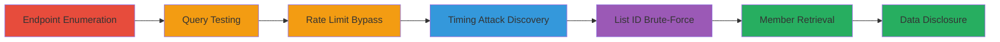

# Private Twitter List Members Disclosure via GraphQL Access Control Bypass and Timing Attack

Multi-stage attack chain demonstrating the exploitation of Twitter's GraphQL API vulnerabilities to disclose members of private lists without authorization. The attack begins with endpoint enumeration, identifies an access control flaw in the ListMembers query, uses timing differences to brute-force valid private list IDs, and finally retrieves sensitive user data.

## Chain Metrics Dashboard

| Metric | Value |
|--------|-------|
| Chain Status | Unverified |
| Total Steps | 7 |
| Execution Time | ~60 minutes |
| Skill Level | Intermediate |
| Complexity | Medium |
| Impact Level | High |

## Attack Flow Visualization

## Prerequisites & Requirements

### Required Tools

- [[tools/Wayback-Machine]]
- [[tools/Burp-Suite]]
- [[tools/Firefox]]
- [[tools/AWS-EC2]]

### Target Environment

- Twitter web, mobile, or TweetDeck clients
- Access to Twitter API endpoints (https://api.twitter.com/graphql)
- No special ports required; standard HTTPS (443)

### Initial Access Requirements

- Authenticated Twitter session (cookies or bearer token for API calls)
- Network access to Twitter domains and Wayback Machine
- AWS account for EC2 deployment

## Detailed Attack Procedures

### Step 1: Enumerate GraphQL Endpoints
procedure: [[procedures/Enumerate-GraphQL-Endpoints-Using-Wayback-Machine]]

**Objective**: Identify over 700 potential GraphQL endpoints from Twitter's client JavaScript files to find exploitable queries.

**Instructions**: Use the Wayback Machine to retrieve archived JavaScript files and extract queryIds.

**Expected Output**: List of endpoint names paired with queryIds, including the vulnerable ListMembers queryId (iUmNRKLdkKVH4WyBNw9x2A).

**Success Indicators**:
- Over 700 endpoints enumerated
- QueryIds extracted for testing

### Step 2: Test GraphQL Endpoints
procedure: [[procedures/Test-GraphQL-Endpoints-for-Access-Control-Bypass]]

**Objective**: Manually test endpoints with Burp Suite and Firefox to identify the ListMembers query's lack of privacy checks.

**Instructions**: Send POST requests to /graphql with the queryId and variables; observe that ListMembers fetches data without access validation.

**Expected Output**: Response containing list members for private lists without authorization errors.

**Success Indicators**:
- Arbitrary persisted queries executable
- No privacy checks on ListMembers

### Step 3: Attempt Brute-Force of List IDs
procedure: [[procedures/Attempt-Brute-Force-of-List-IDs-via-GraphQL]]

**Objective**: Script brute-force of snowflake list IDs but encounter GraphQL rate limits.

**Instructions**: Develop a script to generate snowflake IDs (timestamp + sequence + worker ID) and query ListMembers.

**Expected Output**: Rate limit blocks after a few requests.

**Success Indicators**:
- Script identifies rate limiting
- Need for bypass identified

### Step 4: Bypass Rate Limits
procedure: [[procedures/Bypass-Rate-Limits-Using-Alternative-Twitter-APIs]]

**Objective**: Leverage unenforced rate limits in other Twitter APIs to send high-volume requests for brute-forcing.

**Instructions**: Identify and use alternative endpoints with broken limits to proxy or amplify requests.

**Expected Output**: Ability to send thousands of requests without blocks.

**Success Indicators**:
- High-volume requests succeed
- No direct leak but enables scaling

### Step 5: Discover Timing Attack
procedure: [[procedures/Discover-Timing-Attack-via-Response-Headers]]

**Objective**: Identify 10-20ms difference in x-response-time header for valid vs. non-existent private list IDs.

**Instructions**: Use Burp Suite to monitor headers during queries; compare processing times.

**Expected Output**: Longer response time (e.g., 137ms) for valid private lists.

**Success Indicators**:
- Timing differential observed
- Valid IDs detectable via headers

### Step 6: Brute-Force Private List IDs
procedure: [[procedures/Brute-Force-Private-List-IDs-with-Timing-Differences]]

**Objective**: Deploy a PoC script on AWS EC2 to brute-force snowflake IDs using timing to find valid private lists.

**Instructions**: Run twileak.rb script to generate IDs and measure response times.

**Expected Output**: Detection of valid list ID with delayed response.

**Success Indicators**:
- Valid private list ID identified
- Script completes brute-force

### Step 7: Retrieve Private List Members
procedure: [[procedures/Retrieve-Private-List-Members-via-Bypassed-Query]]

**Objective**: Use the valid list ID to fetch unauthorized member details via ListMembers.

**Instructions**: POST to /graphql/iUmNRKLdkKVH4WyBNw9x2A/ListMembers with listId and count:20.

**Expected Output**: JSON response with user IDs, names, and details from private list.

**Success Indicators**:
- Member data disclosed
- No access errors

## Attack Chain Summary

### Key Achievements

1. Enumerated 700+ GraphQL endpoints to find the vulnerable ListMembers query.
2. Exploited access control bypass to read private list data without checks.
3. Used timing attack to brute-force and detect private list IDs efficiently.
4. Disclosed sensitive user groupings, enabling unauthorized enumeration.

## Technique & Tactic Coverage

### MITRE ATT&CK Techniques

- [[Exploit Public-Facing Application]] Exploit Public-Facing Application
- [[Account Discovery]] Account Discovery
- [[Vulnerability Scanning]] Gather Victim Org Information: Domains

### MITRE ATT&CK Tactics

- [[Discovery]] Discovery
- [[Reconnaissance]] Reconnaissance

---
*Last updated: 2023-10-01T00:00:00Z*
