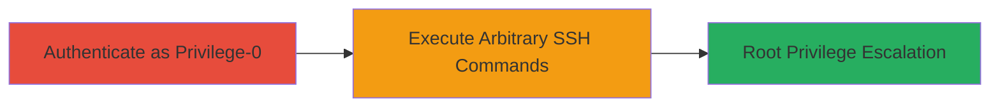

---
tags:
  - privilege-escalation
  - ssh
  - ubiquiti
  - edgeswitch
  - rce
  - embedded-linux
type: attack_chain
tools:
  - '[[tools/openssh-client]]'
tactics:
  - '[[Privilege Escalation]]'
verified: false
platforms:
  - Embedded Linux
  - Network Device
submitted: true
complexity: medium
created_at: '2023-10-01T00:00:00Z'
procedures:
  - '[[procedures/Authenticate-as-Privilege-0-User-on-Ubiquiti-EdgeSwitch]]'
  - '[[procedures/Execute-Arbitrary-Shell-Commands-via-SSH-for-Root-Escalation]]'
step_count: 2
techniques:
  - '[[Unix Shell]]'
  - '[[Exploitation for Privilege Escalation]]'
updated_at: '2025-12-14T17:30:35.667Z'
description: >-
  Authenticated privilege-0 user exploits SSH interface on Ubiquiti EdgeSwitch X
  v1.1.0 and prior to execute arbitrary shell commands, escalating to root
  privileges for full device control.
skill_level: intermediate
impact_level: high
id: 64069062-2325-46b7-8ebc-a78387a0d9eb
validated: true
mitre_tactics:
  - '[[Privilege Escalation]]'
mitre_techniques:
  - '[[Unix Shell]]'
  - '[[Exploitation for Privilege Escalation]]'
---
# Privilege Escalation from Privilege-0 to Root via Arbitrary SSH Command Execution on Ubiquiti EdgeSwitch

Multi-stage attack chain demonstrating privilege escalation on Ubiquiti EdgeSwitch X v1.1.0 and prior versions by exploiting the SSH interface to bypass CLI restrictions and execute arbitrary shell commands, achieving root access.

## Chain Metrics Dashboard

| Metric | Value |
|--------|-------|
| Chain Status | Unverified |
| Total Steps | 2 |
| Execution Time | ~5 minutes |
| Skill Level | Intermediate |
| Complexity | Medium |
| Impact Level | High |

## Attack Flow Visualization



## Prerequisites & Requirements

### Required Tools

- [[tools/openssh-client]]

### Target Environment

- Target OS/Platform: Embedded Linux on Ubiquiti EdgeSwitch X v1.1.0 or prior
- Required services/ports: SSH (port 22)
- Network access requirements: Network connectivity to the device's management interface

### Initial Access Requirements

- Credential requirements: Valid privilege-0 credentials (username/password)
- Network position: Direct or routed access to the SSH port
- Prior access needed: None, but authentication required

## Detailed Attack Procedures

### Step 1: Authenticate as Privilege-0 User
procedure: [[procedures/Authenticate-as-Privilege-0-User-on-Ubiquiti-EdgeSwitch]]

**Objective**: Gain initial authenticated access to the device as a privilege-0 user via SSH.

**Instructions**: Use an SSH client to connect to the target device with privilege-0 credentials. This establishes a session that can be leveraged for command execution.

Execute [[commands/ssh-authenticate]] to connect:

```bash
ssh privilege0_user@edgeswitch_ip
```

Enter the password when prompted.

**Expected Output**: Successful SSH login prompt or shell access.

**Success Indicators**:
- SSH connection established without errors
- User prompt appears (e.g., "EdgeSwitch>")

### Step 2: Execute Arbitrary Shell Commands for Root Escalation
procedure: [[procedures/Execute-Arbitrary-Shell-Commands-via-SSH-for-Root-Escalation]]

**Objective**: Bypass CLI restrictions by sending arbitrary shell commands over the SSH interface to escalate privileges to root.

**Instructions**: Once authenticated, instead of using restricted CLI commands, inject shell metacharacters or directly invoke shell to run unauthorized commands like privilege escalation exploits (e.g., sudo misconfigurations or kernel exploits if applicable). For demonstration, execute a command to check current privileges and attempt escalation.

Use [[commands/ssh-execute-arbitrary]] to run a shell command remotely:

```bash
ssh privilege0_user@edgeswitch_ip '/bin/sh -c "id; whoami"'
```

If the vulnerability allows, chain to a root escalation command such as exploiting a known suid binary or direct root shell invocation.

**Expected Output**: Output showing escalated privileges, e.g., "uid=0(root)" indicating root access.

**Success Indicators**:
- Arbitrary command execution succeeds without CLI restriction
- Privilege level shows root (uid=0)
- Full administrative control confirmed (e.g., access to /root or system files)

## Attack Chain Summary

### Key Achievements

1. Authenticated access as privilege-0 user via SSH
2. Bypassed CLI restrictions to execute arbitrary shell commands
3. Escalated to root privileges, enabling full device control including configuration changes and data access

## Technique & Tactic Coverage

### MITRE ATT&CK Techniques

- [[Unix Shell]]
- [[Exploitation for Privilege Escalation]]

### MITRE ATT&CK Tactics

- [[Privilege Escalation]]

---
*Last updated: 2023-10-01T00:00:00Z*
