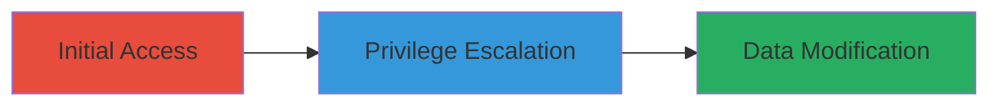

---
tags:
  - privilege-escalation
  - authorization-bypass
  - web
type: attack_chain
tools: []
tactics:
  - '[[Privilege Escalation]]'
verified: false
platforms:
  - Web
submitted: true
complexity: low
created_at: '2023-10-01T00:00:00Z'
procedures:
  - '[[procedures/Exploit-Basecamp-Comment-Trashing-Escalation]]'
step_count: 1
techniques:
  - '[[Exploitation for Privilege Escalation]]'
updated_at: '2025-12-14T17:29:09.671Z'
description: >-
  A privilege escalation vulnerability in Basecamp allowing non-admin users to
  delete other users' comments without proper authorization checks.
skill_level: intermediate
impact_level: low
id: 422ac831-3dd8-43f8-b1b0-3287d59cbff5
validated: true
mitre_tactics:
  - '[[Privilege Escalation]]'
mitre_techniques:
  - '[[Exploitation for Privilege Escalation]]'
---
# Privilege Escalation in Basecamp to Trash Other Users' Comments

Multi-stage attack chain demonstrating a complete attack workflow.

## Chain Metrics Dashboard

| Metric | Value |
|--------|-------|
| Chain Status | Unverified |
| Total Steps | 1 |
| Execution Time | ~5 minutes |
| Skill Level | Intermediate |
| Complexity | Low |
| Impact Level | Low |

## Attack Flow Visualization

## Prerequisites & Requirements

### Required Tools

- None (manual web interaction or browser developer tools)

### Target Environment

- Basecamp web application
- Access to a non-admin user account
- No specific services/ports required beyond standard HTTPS (443)

### Initial Access Requirements

- Valid non-admin credentials for Basecamp
- Network access to the Basecamp instance
- No prior elevated access needed

## Detailed Attack Procedures

### Step 1: Exploit Privilege Escalation
procedure: [[procedures/Exploit-Basecamp-Comment-Trashing-Escalation]]

**Objective**: Escalate privileges to trash comments belonging to other users without admin rights.

**Instructions**: Log in as a non-admin user and navigate to a project or discussion containing comments from other users. Use the browser's developer tools or a proxy like Burp Suite to intercept and modify the request for trashing a comment, targeting a comment ID from another user. Send the modified request to delete the comment, bypassing authorization checks.

**Expected Output**: The targeted comment is successfully trashed and removed from the discussion.

**Success Indicators**:
- Comment from another user is deleted
- No admin privileges required or error messages indicating insufficient permissions

## Attack Chain Summary

### Key Achievements

1. Unauthorized modification of other users' data
2. Demonstration of authorization flaw in comment management
3. Low-severity impact leading to data integrity issues

## Technique & Tactic Coverage

### MITRE ATT&CK Techniques

- [[Exploitation for Privilege Escalation]]

### MITRE ATT&CK Tactics

- [[Privilege Escalation]]

---
*Last updated: 2023-10-01T00:00:00Z*
