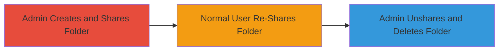

---
tags:
  - nextcloud
  - privilege-escalation
  - file-sharing
  - data-destruction
type: attack_chain
tools: []
tactics:
  - '[[Privilege Escalation]]'
  - '[[Resource Development]]'
verified: false
platforms:
  - Web
submitted: true
complexity: medium
created_at: '2023-10-01T00:00:00Z'
procedures:
  - '[[procedures/Admin-Creates-and-Shares-Folder-with-Normal-User]]'
  - '[[procedures/Normal-User-Re-Shares-Folder-to-Admin]]'
  - '[[procedures/Admin-Unshares-Folder-Causing-Deletion]]'
step_count: 3
techniques:
  - '[[Exploitation for Privilege Escalation]]'
  - '[[Data Destruction]]'
updated_at: '2025-12-14T17:29:09.785Z'
description: >-
  A multi-stage privilege escalation attack exploiting Nextcloud's file sharing
  feature, allowing a normal user to trick an admin into deleting admin-owned
  folders.
skill_level: intermediate
impact_level: high
id: 79bb6c0c-d74a-4081-bf41-6a54b7a81ee9
validated: true
mitre_tactics:
  - '[[Privilege Escalation]]'
  - '[[Resource Development]]'
mitre_techniques:
  - '[[Exploitation for Privilege Escalation]]'
  - '[[Data Destruction]]'
---
# Privilege Escalation in Nextcloud File Sharing Leading to Unauthorized Admin Folder Deletion

Multi-stage attack chain demonstrating a complete attack workflow exploiting a vulnerability in Nextcloud's file sharing mechanism.

## Chain Metrics Dashboard

| Metric | Value |
|--------|-------|
| Chain Status | Unverified |
| Total Steps | 3 |
| Execution Time | ~5 minutes |
| Skill Level | Intermediate |
| Complexity | Medium |
| Impact Level | High |

## Attack Flow Visualization

## Prerequisites & Requirements

### Required Tools

- Web browser (e.g., Chrome, Firefox)

### Target Environment

- Nextcloud instance (web-based file sharing platform)
- Admin and normal user accounts with access to the same instance
- No special ports or services beyond standard HTTP/HTTPS for Nextcloud

### Initial Access Requirements

- Valid admin credentials for initial setup
- Valid normal user credentials for exploitation
- Network access to the Nextcloud web interface

## Detailed Attack Procedures

### Step 1: Admin Creates and Shares Folder
procedure: [[procedures/Admin-Creates-and-Shares-Folder-with-Normal-User]]

**Objective**: Set up a shared folder owned by the admin that can be manipulated by a normal user.

**Instructions**: Log in to the Nextcloud web interface as the admin user. Navigate to the Files section, create a new folder (e.g., 'sample_folder'), and share it with the normal user (e.g., 'test') granting 'can share' permissions. This makes the folder visible and editable in sharing contexts for the recipient.

**Expected Output**: The folder appears in the normal user's 'Shared with you' section with sharing options enabled.

**Success Indicators**:
- Folder created successfully in admin's home directory
- Share invitation accepted or visible to normal user
- Normal user can view the folder

### Step 2: Normal User Re-Shares Folder
procedure: [[procedures/Normal-User-Re-Shares-Folder-to-Admin]]

**Objective**: Re-share the folder back to the admin, creating a circular sharing dependency that misleads the unshare action.

**Instructions**: Log in as the normal user (e.g., 'test'). Navigate to the home directory or 'Shared with you' section, locate the 'sample_folder', and re-share it with the admin user. Ensure the sharing permissions allow the admin to see it in their 'Shared with you' section.

**Expected Output**: The folder now appears in the admin's 'Shared with you' section as shared from the normal user.

**Success Indicators**:
- Re-share action completes without errors
- Admin receives notification or sees the folder in their shared view
- No permission denied messages

### Step 3: Admin Unshares Folder Causing Deletion
procedure: [[procedures/Admin-Unshares-Folder-Causing-Deletion]]

**Objective**: Trick the admin into unsharing the folder, which exploits the vulnerability to delete the original admin-owned folder.

**Instructions**: As the admin, navigate to Files > Shared with you, locate the 'sample_folder' (now appearing as shared from the normal user), and perform the unshare action. The system improperly handles this, propagating the deletion to the original folder in the admin's home directory.

**Expected Output**: The folder is removed from both users' views, and the original admin-owned folder is deleted, resulting in data loss.

**Success Indicators**:
- Unshare action succeeds
- Original folder disappears from admin's home directory
- Confirmation of data loss (e.g., via file list or recycle bin check)

## Attack Chain Summary

### Key Achievements

1. Established a shared resource under admin control accessible to low-privilege user
2. Created a misleading sharing loop to confuse ownership during unshare
3. Achieved unauthorized deletion of admin-owned data without direct access

## Technique & Tactic Coverage

### MITRE ATT&CK Techniques

- [[Exploitation for Privilege Escalation]] Exploitation for Privilege Escalation
- [[Data Destruction]] Data Destruction

### MITRE ATT&CK Tactics

- [[Privilege Escalation]] Privilege Escalation
- [[Resource Development]] Impact

---
*Last updated: 2023-10-01T00:00:00Z*
