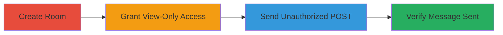

---
tags:
  - privilege-escalation
  - authorization-bypass
  - phabricator
  - conpherence
  - web
type: attack_chain
tools: []
tactics:
  - '[[Privilege Escalation]]'
verified: false
platforms:
  - Web
submitted: true
complexity: medium
created_at: '2023-10-01T00:00:00Z'
procedures:
  - '[[procedures/Exploit-Phabricator-Conpherence-Privilege-Escalation]]'
step_count: 4
techniques:
  - '[[Exploitation for Privilege Escalation]]'
  - '[[Exploit Public-Facing Application]]'
updated_at: '2025-12-14T17:29:20.114Z'
description: >-
  A multi-step attack exploiting insufficient authorization in Phabricator's
  Conpherence chat rooms, enabling view-only users to send unauthorized messages
  via direct POST requests.
skill_level: intermediate
impact_level: low
id: 36e2d65c-d2d5-4860-8278-e17101e324ad
validated: true
mitre_tactics:
  - '[[Privilege Escalation]]'
mitre_techniques:
  - '[[Exploitation for Privilege Escalation]]'
  - '[[Exploit Public-Facing Application]]'
---
# Privilege Escalation in Phabricator Conpherence Allowing View-Only Users to Send Messages

Multi-stage attack chain demonstrating a complete attack workflow exploiting a privilege escalation vulnerability in Phabricator's Conpherence chat rooms. View-only users can bypass UI restrictions and send messages via crafted POST requests to the update endpoint, potentially disrupting chats or leaking information in sensitive environments.

## Chain Metrics Dashboard

| Metric | Value |
|--------|-------|
| Chain Status | Unverified |
| Total Steps | 4 |
| Execution Time | ~5 minutes |
| Skill Level | Intermediate |
| Complexity | Medium |
| Impact Level | Low |

## Attack Flow Visualization



## Prerequisites & Requirements

### Required Tools

- Browser or HTTP client like curl

### Target Environment

- Phabricator instance with Conpherence enabled
- Web platform access
- No specific ports required beyond standard HTTP/HTTPS

### Initial Access Requirements

- Authenticated access to Phabricator as a user with room creation privileges
- Valid session cookies and CSRF token for the target user

## Detailed Attack Procedures

### Step 1: Create a New Room
procedure: [[procedures/Exploit-Phabricator-Conpherence-Privilege-Escalation]]

**Objective**: Establish a test Conpherence chat room to manipulate permissions.

**Instructions**: Use the Phabricator web interface to create a new Conpherence room. Navigate to the Conpherence section and follow the UI prompts to set up a basic room.

**Expected Output**: A new room is created with an assigned room ID (e.g., /conpherence/1/).

**Success Indicators**:
- Room appears in the Conpherence list
- Room ID is visible in the URL

### Step 2: Grant View-Only Privileges
procedure: [[procedures/Exploit-Phabricator-Conpherence-Privilege-Escalation]]

**Objective**: Assign viewing privileges to a target user without granting messaging or joining rights, setting up the privilege boundary for escalation.

**Instructions**: In the room settings, add the target user (or all users) with only 'Viewing' permission. Ensure no higher roles like 'Join' or 'Message' are enabled.

**Expected Output**: The user can view the room but sees no UI form for sending messages.

**Success Indicators**:
- Target user can access the room page
- No send button or form is visible to the user

### Step 3: Send Unauthorized Message via POST
procedure: [[procedures/Exploit-Phabricator-Conpherence-Privilege-Escalation]]

**Objective**: Bypass UI restrictions by crafting a direct POST request to the update endpoint using the view-only user's session.

**Instructions**: Authenticate as the view-only user, obtain the CSRF token and session cookies, then execute the unauthorized message POST using [[commands/phabricator-conpherence-unauthorized-message-post]]:

```bash
curl -X POST 'http://target-phabricator/conpherence/update/1/' \
  -H 'User-Agent: Mozilla/5.0 (X11; Linux x86_64; rv:45.0) Gecko/20100101 Firefox/45.0' \
  -H 'Accept: text/html,application/xhtml+xml,application/xml;q=0.9,*/*;q=0.8' \
  -H 'Accept-Language: en-US,en;q=0.5' \
  -H 'Accept-Encoding: gzip, deflate' \
  -H 'X-Phabricator-Csrf: B@6uaixbh422c60ea95853fee4' \
  -H 'X-Phabricator-Via: /' \
  -H 'Content-Type: application/x-www-form-urlencoded' \
  -H 'Cookie: phsid=35yvcfc22xj27th6hwawazghx5cnritidfccxdhh; phusr=lucasveiga' \
  -d '__form__=1&action=message&text=TESTTEXT&latest_transaction_id=10&__wflow__=true&__ajax__=true&__metablock__=6'
```

**Expected Output**: HTTP 200 response indicating successful update; no error on authorization.

**Success Indicators**:
- No permission denied error
- Server accepts the request

### Step 4: Verify Message Appearance
procedure: [[procedures/Exploit-Phabricator-Conpherence-Privilege-Escalation]]

**Objective**: Confirm the exploit by checking if the unauthorized message is visible in the room history.

**Instructions**: Refresh the room page in the browser as any viewer and check the chat history for the sent message.

**Expected Output**: The message 'TESTTEXT' appears in the chat log, attributed to the view-only user.

**Success Indicators**:
- Message is displayed without UI interaction
- Chat history updated with unauthorized content

## Attack Chain Summary

### Key Achievements

1. Successful creation and permission setup in Conpherence room
2. Bypassing authorization to send messages as view-only user
3. Verification of message persistence and visibility

## Technique & Tactic Coverage

### MITRE ATT&CK Techniques

- [[Exploitation for Privilege Escalation]]
- [[Exploit Public-Facing Application]]

### MITRE ATT&CK Tactics

- [[Privilege Escalation]]

---

*Last updated: 2023-10-01T00:00:00Z*
