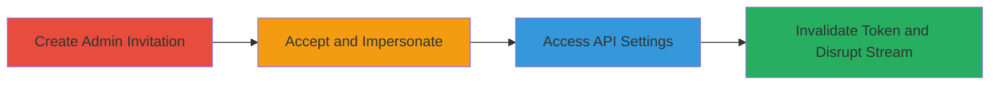

---
tags:
  - privilege-escalation
  - access-control-bypass
  - api-token
  - streamlabs
type: attack_chain
tools: []
tactics:
  - '[[Privilege Escalation]]'
  - '[[Lateral Movement]]'
verified: false
platforms:
  - Web
submitted: true
complexity: medium
created_at: '2023-10-01T00:00:00Z'
procedures:
  - '[[procedures/Create-Administrator-Invitation-in-Streamlabs]]'
  - '[[procedures/Accept-Invitation-and-Impersonate-Owner-Account]]'
  - '[[procedures/Access-Restricted-API-Settings-and-Refresh-Token]]'
step_count: 3
techniques:
  - '[[Exploitation for Privilege Escalation]]'
  - '[[Valid Accounts]]'
updated_at: '2025-12-14T17:29:57.360Z'
description: >-
  A multi-stage privilege escalation attack in Streamlabs allowing an
  administrator to access and manipulate the owner's restricted API settings,
  invalidating the API token and disrupting live streaming integrations.
skill_level: intermediate
impact_level: high
id: 7a2d9dee-1cc7-46e7-a3bb-842d83310186
validated: true
mitre_tactics:
  - '[[Privilege Escalation]]'
  - '[[Lateral Movement]]'
mitre_techniques:
  - '[[Exploitation for Privilege Escalation]]'
  - '[[Valid Accounts]]'
---
# Privilege Escalation in Streamlabs to Invalidate Owner's API Access Token

Multi-stage attack chain demonstrating a complete attack workflow exploiting insufficient access controls in Streamlabs to allow an administrator to invalidate the owner's API token, disrupting live streams and integrations.

## Chain Metrics Dashboard

| Metric | Value |
|--------|-------|
| Chain Status | Unverified |
| Total Steps | 3 |
| Execution Time | ~5 minutes |
| Skill Level | Intermediate |
| Complexity | Medium |
| Impact Level | High |

## Attack Flow Visualization

## Prerequisites & Requirements

### Required Tools

- Web browser (e.g., Chrome or Firefox)

### Target Environment

- Streamlabs web application
- Required services/ports: HTTPS (443)
- Network access requirements: Internet access to streamlabs.com

### Initial Access Requirements

- Owner account credentials for Streamlabs
- Separate admin user account (e.g., invited collaborator)
- No prior access needed beyond account creation

## Detailed Attack Procedures

### Step 1: Create Admin Invitation
procedure: [[procedures/Create-Administrator-Invitation-in-Streamlabs]]

**Objective**: Generate an invitation link granting administrator privileges to access the owner's account.

**Instructions**: Log in to the owner's Streamlabs account and navigate to the shared access settings to create the invitation.

**Expected Output**: A shareable invitation link with admin role.

**Success Indicators**:
- Invitation link generated successfully
- Link includes administrator privileges

### Step 2: Accept Invitation and Impersonate
procedure: [[procedures/Accept-Invitation-and-Impersonate-Owner-Account]]

**Objective**: Accept the admin invitation and switch to impersonate the owner's account view.

**Instructions**: Use a separate browser session logged in as the admin user to accept the invite and select the owner's account.

**Expected Output**: Admin dashboard loaded with access to the owner's account.

**Success Indicators**:
- Invitation accepted
- Owner's account impersonated without errors

### Step 3: Access Restricted Settings and Invalidate Token
procedure: [[procedures/Access-Restricted-API-Settings-and-Refresh-Token]]

**Objective**: Directly navigate to the hidden API settings page to refresh and invalidate the owner's API token, disrupting stream integrations.

**Instructions**: From the impersonated admin view, enter the direct URL to the API settings and click the refresh button.

**Expected Output**: New API token generated; old token invalidated, breaking widgets and OBS integrations.

**Success Indicators**:
- API settings page loads for admin
- Token refreshed successfully
- Stream disruptions observed (e.g., alert boxes fail)

## Attack Chain Summary

### Key Achievements

1. Bypassed admin menu restrictions to access owner-only settings
2. Invalidated API token, affecting 80% of API-dependent features
3. Disrupted live streaming operations mid-broadcast

## Technique & Tactic Coverage

### MITRE ATT&CK Techniques

- [[Exploitation for Privilege Escalation]] Exploitation for Privilege Escalation
- [[Valid Accounts]] Valid Accounts

### MITRE ATT&CK Tactics

- [[Privilege Escalation]] Privilege Escalation
- [[Lateral Movement]] Lateral Movement

---
*Last updated: 2023-10-01T00:00:00Z*
