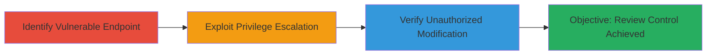

---
tags:
  - privilege-escalation
  - authorization-bypass
  - broken-access-control
  - web-vulnerability
type: attack_chain
tools: []
tactics:
  - '[[Privilege Escalation]]'
verified: false
platforms:
  - Web
submitted: true
complexity: medium
created_at: '2023-10-01T00:00:00Z'
procedures:
  - '[[procedures/Identify-Zomato-Review-Dashboard-Endpoint]]'
  - '[[procedures/Exploit-Zomato-Review-Edit-via-POST-Request]]'
  - '[[procedures/Verify-Zomato-Review-Modification]]'
step_count: 3
techniques:
  - '[[Exploitation for Privilege Escalation]]'
  - '[[Exploit Public-Facing Application]]'
updated_at: '2025-12-14T17:29:28.847Z'
description: >-
  A multi-stage privilege escalation attack exploiting missing authorization
  checks in Zomato's review dashboard handler, enabling any authenticated user
  to perform administrative actions on reviews such as editing, deleting, and
  moderating.
skill_level: intermediate
impact_level: high
id: 5e081ed2-6b4a-4924-81e9-07c56df026e0
validated: true
mitre_tactics:
  - '[[Privilege Escalation]]'
mitre_techniques:
  - '[[Exploitation for Privilege Escalation]]'
  - '[[Exploit Public-Facing Application]]'
---
# Privilege Escalation in Zomato Review Dashboard Allowing Unauthorized Review Control

Multi-stage attack chain demonstrating a complete privilege escalation workflow on Zomato.com, where authenticated users can perform admin-level review actions due to missing authorization checks in the dashboard handler endpoint.

## Chain Metrics Dashboard

| Metric | Value |
|--------|-------|
| Chain Status | Unverified |
| Total Steps | 3 |
| Execution Time | ~5 minutes |
| Skill Level | Intermediate |
| Complexity | Medium |
| Impact Level | High |

## Attack Flow Visualization



## Prerequisites & Requirements

### Required Tools

- Web browser or [[tools/cURL]] for sending requests
- Authenticated session on Zomato.com (user account login)

### Target Environment

- Web platform (Zomato.com)
- PHP-based backend
- Required services: HTTPS on port 443
- Network access: Direct internet access to zomato.com

### Initial Access Requirements

- Valid user credentials for authentication
- No admin privileges needed initially
- Session cookie from logged-in state

## Detailed Attack Procedures

### Step 1: Identify Vulnerable Endpoint
procedure: [[procedures/Identify-Zomato-Review-Dashboard-Endpoint]]

**Objective**: Locate the review dashboard handler endpoint that lacks proper authorization checks, allowing access to administrative actions.

**Instructions**: Examine the application's network traffic or source code hints to identify the endpoint /████dashboard_handler.php. This endpoint processes actions like get_manager_status, read, unread, feature, unfeature, moderate, drop, send_mail, revoke, mark-spam, remove-██████, add-█████████, and reject_reported█████████ without verifying user privileges.

Use browser developer tools to inspect review-related requests and confirm the endpoint's exposure.

**Expected Output**: Confirmation of the endpoint URL and supported actions via API exploration.

**Success Indicators**:
- Endpoint responds to unauthenticated or low-priv user requests
- List of exploitable actions identified

### Step 2: Exploit Privilege Escalation
procedure: [[procedures/Exploit-Zomato-Review-Edit-via-POST-Request]]

**Objective**: Send a crafted POST request to perform an unauthorized administrative action, such as editing a review.

**Instructions**: Authenticate as a regular user, then use [[commands/curl-zomato-review-edit]] to submit a POST request to https://www.zomato.com/██████████dashboard_handler.php with parameters action=█████, review_id=31268525, review=Privilege+Escalation. Ensure session cookies are included for authentication.

```bash
curl -X POST -b "cookies.txt" -d "action=█████&review_id=31268525&review=Privilege+Escalation" https://www.zomato.com/██████████dashboard_handler.php
```

**Expected Output**: HTTP 200 response indicating successful action processing, without error for insufficient privileges.

**Success Indicators**:
- No authorization error returned
- Server-side action executed

### Step 3: Verify Unauthorized Modification
procedure: [[procedures/Verify-Zomato-Review-Modification]]

**Objective**: Confirm the exploitation by observing the changes made to the target review.

**Instructions**: Navigate to the review page https://www.zomato.com/review/QvneAY in a browser and check the content for the injected text 'Privilege Escalation'. This validates that the edit was applied despite lacking admin rights.

**Expected Output**: Updated review content visible on the public page.

**Success Indicators**:
- Modified review text displayed
- No access denial when viewing

## Attack Chain Summary

### Key Achievements

1. Identified unprotected admin endpoint for review controls
2. Successfully edited an arbitrary review as a non-admin user
3. Verified impact through observable changes, demonstrating full review moderation control

## Technique & Tactic Coverage

### MITRE ATT&CK Techniques

- [[Exploitation for Privilege Escalation]] Exploitation for Privilege Escalation
- [[Exploit Public-Facing Application]] Exploit Public-Facing Application

### MITRE ATT&CK Tactics

- [[Privilege Escalation]] Privilege Escalation

---

*Last updated: 2023-10-01T00:00:00Z*
