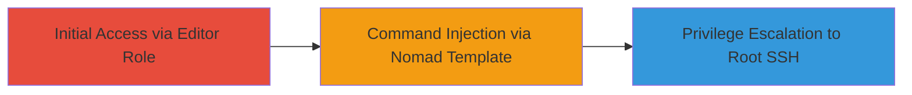

# Privilege Escalation to Root SSH Access in GitHub Enterprise Server via Nomad Template Injection

Multi-stage attack chain demonstrating a complete attack workflow exploiting a command injection vulnerability in the audit log forwarding configuration of GitHub Enterprise Server (GHES). An attacker with Management Console editor access can inject malicious Nomad templates to execute arbitrary commands as root, leading to full SSH access on the appliance. This affects GHES versions prior to 3.12.

## Chain Metrics Dashboard

| Metric | Value |
|--------|-------|
| Chain Status | Unverified |
| Total Steps | 1 |
| Execution Time | ~5 minutes |
| Skill Level | Intermediate |
| Complexity | Medium |
| Impact Level | High |

## Attack Flow Visualization

## Prerequisites & Requirements

### Required Tools

- Web browser for Management Console access

### Target Environment

- GitHub Enterprise Server (GHES) appliance running Linux
- Management Console with audit log forwarding feature enabled
- Nomad service integrated for template rendering
- Affected versions: All prior to 3.12

### Initial Access Requirements

- Valid credentials for Management Console with editor role
- Direct network access to the GHES appliance (typically HTTPS on port 8443)
- No prior root access required, but editor privileges are essential

## Detailed Attack Procedures

### Step 1: Exploit Nomad Template Injection
procedure: [[procedures/Exploit-Nomad-Template-Injection-for-Root-Access]]

**Objective**: Inject a malicious Nomad template into the audit log forwarding configuration to execute arbitrary commands as root, enabling SSH key generation and access.

**Instructions**: Access the Management Console, navigate to audit log forwarding settings, and submit a crafted Nomad template payload that triggers command execution during rendering. The unsanitized input allows template directives to run shell commands with root privileges on the appliance.

**Expected Output**: Successful command execution, such as generating an SSH key pair and adding the public key to authorized_keys, resulting in root SSH login capability.

**Success Indicators**:
- Confirmation of command execution (e.g., via echoed output in logs or direct SSH connection test)
- Ability to SSH as root using the injected key

## Attack Chain Summary

### Key Achievements

1. Bypassed input sanitization in Nomad templates to achieve remote command execution
2. Escalated privileges from Management Console editor to root on the GHES appliance
3. Gained persistent SSH access for full system control

## Technique & Tactic Coverage

### MITRE ATT&CK Techniques

- [[Unix Shell]]
- [[Exploitation for Privilege Escalation]]

### MITRE ATT&CK Tactics

- [[Privilege Escalation]]

---
*Last updated: 2023-10-01T00:00:00Z*
