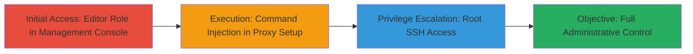

# Privilege Escalation to Root SSH Access via Command Injection in GitHub Enterprise Server Management Console

Multi-stage attack chain demonstrating privilege escalation in GitHub Enterprise Server via command injection in the Management Console's HTTP proxy setup feature.

## Chain Metrics Dashboard

| Metric | Value |
|--------|-------|
| Chain Status | Unverified |
| Total Steps | 2 |
| Execution Time | ~5 minutes |
| Skill Level | Intermediate |
| Complexity | Medium |
| Impact Level | High |

## Attack Flow Visualization

## Prerequisites & Requirements

### Required Tools

- Web browser for Management Console access

### Target Environment

- GitHub Enterprise Server appliance (versions prior to 3.12)
- Linux-based OS
- Services: SSH (port 22), HTTP Proxy configuration
- Network access: Direct access to the GHE instance Management Console

### Initial Access Requirements

- Editor role privileges in the Management Console
- Valid credentials for the GHE instance
- No prior root access required, but instance access needed

## Detailed Attack Procedures

### Step 1: Initial Access

procedure: [[procedures/Command-Injection-in-GHE-Update-Check-for-Priv-Esc]]

**Objective**: Gain access to the Management Console with editor privileges and navigate to the HTTP proxy setup to prepare for injection.

**Instructions**: Log in to the GitHub Enterprise Server Management Console using editor credentials. Navigate to the settings section for update checks and HTTP proxy configuration. Ensure the ghe-update-check feature is accessible during proxy setup.

**Expected Output**: Access to the proxy configuration form where input fields (e.g., proxy URL) can be manipulated.

**Success Indicators**:
- Successful login to Management Console
- Visibility of HTTP proxy setup options

### Step 2: Execution and Privilege Escalation

procedure: [[procedures/Command-Injection-in-GHE-Update-Check-for-Priv-Esc]]

**Objective**: Inject malicious commands into the ghe-update-check proxy setup to execute arbitrary code and escalate to root SSH access.

**Instructions**: In the HTTP proxy setup field (likely the proxy host or URL input), inject a command such as `; /bin/bash -c 'command' #` to chain a shell command. For example, inject a payload that establishes an SSH backdoor or directly spawns a root shell. Trigger the update check to execute the injection. Once escalated, connect via SSH using the newly created root access.

**Expected Output**: Execution of injected command, confirmation of root shell or SSH key installation, allowing full appliance control.

**Success Indicators**:
- Command execution without errors (e.g., shell prompt appears)
- Successful SSH login as root
- Ability to run root-level commands on the appliance

## Attack Chain Summary

### Key Achievements

1. Escalation from editor to root privileges without physical access
2. Full administrative control over the GHE appliance via SSH
3. Potential for further persistence or lateral movement on the network

## Technique & Tactic Coverage

### MITRE ATT&CK Techniques

- [[Unix Shell]]
- [[Exploitation for Privilege Escalation]]

### MITRE ATT&CK Tactics

- [[Execution]]
- [[Privilege Escalation]]

---
*Last updated: 2023-10-01T00:00:00Z*
