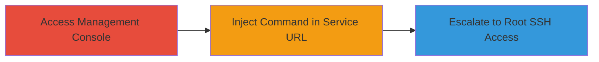

# Privilege Escalation via Command Injection in GitHub Enterprise Server Management Console

Multi-stage attack chain demonstrating privilege escalation through command injection in the GitHub Enterprise Server Management Console, targeting the actions-console Docker container to achieve root SSH access on the appliance. This vulnerability affects all versions prior to 3.12 and requires editor role access.

## Chain Metrics Dashboard

| Metric | Value |
|--------|-------|
| Chain Status | Unverified |
| Total Steps | 2 |
| Execution Time | ~5 minutes |
| Skill Level | Intermediate |
| Complexity | Medium |
| Impact Level | High |

## Attack Flow Visualization

## Prerequisites & Requirements

### Required Tools

- Web browser for accessing the Management Console

### Target Environment

- GitHub Enterprise Server appliance (versions prior to 3.12)
- Linux-based OS with Docker containers
- actions-console service running

### Initial Access Requirements

- Editor role credentials in the Management Console
- Network access to the GitHub Enterprise Server management interface (typically HTTPS on port 8443)
- No prior root access required, but authenticated session needed

## Detailed Attack Procedures

### Step 1: Access Management Console with Editor Role

**Objective**: Gain authenticated access to the Management Console to reach the service configuration settings.

**Instructions**: Log in to the GitHub Enterprise Server Management Console using valid editor role credentials. Navigate to the settings for the actions-console Docker container, specifically the service URL configuration section.

**Expected Output**: Successful login and access to the actions-console configuration page.

**Success Indicators**:
- Management Console dashboard loads without errors
- Editor permissions allow editing service URLs

### Step 2: Exploit Command Injection

procedure: [[procedures/Exploit-Command-Injection-in-Actions-Console-Service-URL]]

**Objective**: Inject malicious commands into the service URL field to execute arbitrary code in the actions-console container, leading to privilege escalation to root on the host.

**Instructions**: In the service URL setting for the actions-console, append a command injection payload after a legitimate URL, such as `http://example.com; id > /tmp/output.txt`. For escalation, use a payload that writes an SSH public key to the root authorized_keys file or spawns a reverse shell, e.g., `http://example.com; echo 'ssh-rsa AAAAB3NzaC1yc2E... attacker_key' >> /root/.ssh/authorized_keys`. Submit the form to trigger execution. Then, connect via SSH using the injected key.

**Expected Output**: Command executes in the container context, allowing host file modifications or shell access; SSH login succeeds as root.

**Success Indicators**:
- Injected command output visible (e.g., file created in container)
- SSH connection to the appliance as root is established

## Attack Chain Summary

### Key Achievements

1. Bypassed input validation in service URL to inject commands
2. Escalate privileges from editor to root via container breakout
3. Achieved persistent SSH access to the GitHub Enterprise Server appliance

## Technique & Tactic Coverage

### MITRE ATT&CK Techniques

- [[Unix Shell]]
- [[Exploitation for Privilege Escalation]]

### MITRE ATT&CK Tactics

- [[Execution]]
- [[Privilege Escalation]]

---
*Last updated: 2023-10-01T00:00:00Z*
