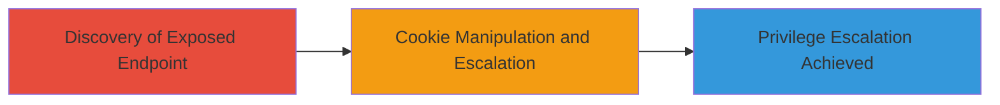

# Privilege Escalation via Exposed Apache Tomcat SessionExample Cookie Manipulation

Multi-stage attack chain demonstrating a complete attack workflow targeting the exposed Tomcat examples on wmf.ok.ru, leading to unauthorized session manipulation and privilege escalation on ok.ru.

## Chain Metrics Dashboard

| Metric | Value |
|--------|-------|
| Chain Status | Unverified |
| Total Steps | 1 |
| Execution Time | ~5 minutes |
| Skill Level | Intermediate |
| Complexity | Medium |
| Impact Level | High |

## Attack Flow Visualization



## Prerequisites & Requirements

### Required Tools

- Browser (e.g., Firefox or Chrome for manual interaction)
- [[tools/curl]]

### Target Environment

- Web platform with Apache Tomcat server
- Exposed servlet examples endpoint (e.g., /examples/jsp/snp/sessions/SessionExample)
- Network access to public subdomain (wmf.ok.ru)

### Initial Access Requirements

- No credentials required (public exposure)
- Direct internet access to the target subdomain
- No prior access needed

## Detailed Attack Procedures

### Step 1: Discovery and Exploitation of Exposed Tomcat Examples
procedure: [[procedures/Exploit-Exposed-Tomcat-SessionExample-for-Cookie-Manipulation]]

**Objective**: Identify the publicly accessible Tomcat Servlet Examples and exploit the SessionExample script to manipulate cookies, enabling privilege escalation on the associated ok.ru platform.

**Instructions**: Begin by accessing the exposed endpoint using a browser or [[commands/curl-access-endpoint]] to verify availability:

```bash
curl -v http://wmf.ok.ru/examples/jsp/snp/sessions/SessionExample
```

Navigate to the SessionExample interface, which allows setting and viewing session attributes via insecure forms. Use the form to inject or modify cookie values that correspond to ok.ru session tokens, simulating privilege escalation by altering user roles or IDs.

For manual testing, open the URL in a browser, interact with the session creation form, and submit manipulated cookie data (e.g., via developer tools) to override session parameters.

**Expected Output**: Successful access returns the SessionExample page with forms for session attribute manipulation; manipulated cookies result in altered session behavior, confirming escalation potential.

**Success Indicators**:
- HTTP 200 response on endpoint access
- Ability to set arbitrary session attributes without authentication
- Observed changes in ok.ru session privileges upon cookie injection
