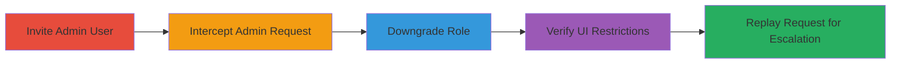

# Privilege Escalation via HTTP Request Replay After Role Downgrade in Omise Dashboard

Multi-stage attack chain demonstrating unauthorized access and privilege escalation in Omise's test dashboard, where a downgraded user can replay admin-level HTTP requests to edit or add links despite role revocation.

## Chain Metrics Dashboard

| Metric | Value |
|--------|-------|
| Chain Status | Unverified |
| Total Steps | 5 |
| Execution Time | ~10 minutes |
| Skill Level | Intermediate |
| Complexity | Medium |
| Impact Level | High |

## Attack Flow Visualization

## Prerequisites & Requirements

### Required Tools

- [[tools/Burp-Suite]]

### Target Environment

- Web platform
- Access to Omise dashboard at https://dashboard.omise.co
- Owner-level credentials for team management

### Initial Access Requirements

- Valid owner account in Omise
- Network access to dashboard (no specific ports beyond HTTPS/443)
- Invited user account with initial access

## Detailed Attack Procedures

### Step 1: Invite User with Admin Role
procedure: [[procedures/Invite-User-with-Admin-Role]]

**Objective**: Grant temporary admin privileges to a test user to perform privileged actions.

**Instructions**: Log in as the owner and navigate to the team management page to invite a user with admin role.

**Expected Output**: Invitation sent, user accepts and gains admin access to dashboard features like editing links.

**Success Indicators**:
- User listed in team with admin role
- User can access and perform admin actions in UI

### Step 2: Intercept Admin HTTP Request with Burp
procedure: [[procedures/Intercept-Admin-HTTP-Request-with-Burp]]

**Objective**: Capture an HTTP request for a privileged admin action, such as editing or adding a link.

**Instructions**: Configure Burp Suite as a proxy, log in as the admin user, navigate to the links page, and perform an edit or add action while intercepting the request.

**Expected Output**: Intercepted POST or PUT request containing admin action details (e.g., link edit payload).

**Success Indicators**:
- Request captured in Burp Repeater or Intruder
- Request includes session tokens and admin-specific headers

### Step 3: Downgrade User Role to None
procedure: [[procedures/Downgrade-User-Role-to-None]]

**Objective**: Revoke admin privileges from the user to simulate role downgrade.

**Instructions**: As the owner, return to the team management page and change the user's role from admin to none.

**Expected Output**: User's role updated to none in the team list.

**Success Indicators**:
- Role change reflected in dashboard team view
- No immediate logout or session invalidation

### Step 4: Verify UI Access Restrictions
procedure: [[procedures/Verify-UI-Access-Restrictions]]

**Objective**: Confirm that UI-level access controls are enforced post-downgrade, hiding admin features.

**Instructions**: As the downgraded user, refresh the dashboard or revisit the links page to check visibility of edit/add features.

**Expected Output**: UI shows restricted view; create/edit link options no longer visible or accessible.

**Success Indicators**:
- Admin UI elements hidden
- Attempts to access via UI fail with permission errors

### Step 5: Replay Intercepted HTTP Request with Burp
procedure: [[procedures/Replay-Intercepted-HTTP-Request-with-Burp]]

**Objective**: Bypass backend role validation by resending the original admin request, achieving privilege escalation.

**Instructions**: In Burp Suite, forward or replay the intercepted request without modifications, targeting the links endpoint.

**Expected Output**: Request succeeds; link edited or added as if user still had admin role.

**Success Indicators**:
- Backend processes request successfully
- Changes visible in dashboard despite UI restrictions

## Attack Chain Summary

### Key Achievements

1. Simulated role-based access control bypass via request replay
2. Demonstrated lack of server-side role revalidation
3. Highlighted discrepancy between UI and backend enforcement in test environment

## Technique & Tactic Coverage

### MITRE ATT&CK Techniques

- [[Exploitation for Privilege Escalation]]
- [[Exploit Public-Facing Application]]

### MITRE ATT&CK Tactics

- [[Privilege Escalation]]

---

*Last updated: 2023-10-01T00:00:00Z*
