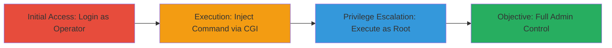

---
tags:
  - command-injection
  - privilege-escalation
  - rce
  - ubiquiti
  - edgeswitch
type: attack_chain
tools: []
tactics:
  - '[[Privilege Escalation]]'
  - '[[Execution]]'
commands: []
platforms:
  - Web
  - Embedded Network Switch
  - Linux
complexity: medium
procedures:
  - '[[procedures/Login-to-EdgeSwitch-Web-GUI-as-Operator]]'
  - '[[procedures/Inject-OS-Command-via-CGI-Script]]'
  - '[[procedures/Escalate-Privileges-to-Root-via-Command-Execution]]'
step_count: 3
techniques:
  - '[[Unix Shell]]'
  - '[[Exploitation for Privilege Escalation]]'
description: >-
  Multi-stage attack exploiting command injection in the EdgeSwitch Web GUI to
  escalate from operator privileges to root access.
skill_level: intermediate
impact_level: high
id: 9cc8967e-0123-4ee6-8a68-1e504bef592b
created_at: '2025-12-14T17:29:44.365Z'
updated_at: '2025-12-14T17:29:44.365Z'
verified: false
validated: true
submitted: true
mitre_tactics:
  - '[[Privilege Escalation]]'
  - '[[Execution]]'
mitre_techniques:
  - '[[Unix Shell]]'
  - '[[Exploitation for Privilege Escalation]]'
---
# Privilege Escalation via OS Command Injection in Ubiquiti EdgeSwitch Web GUI

## Overview

This attack chain demonstrates how an attacker with limited operator access (Privilege-1) can exploit an OS command injection vulnerability in the Web GUI of Ubiquiti Networks EdgeSwitch devices prior to version 1.7.1. The CGI script in the web interface fails to properly sanitize user input, allowing injection of arbitrary OS commands. This leads to remote code execution as root and privilege escalation to administrator level (Privilege-15), potentially compromising the entire device and network.

The vulnerability was identified through manual testing of the web interface. No specialized tools are required beyond a web browser or HTTP client for crafting requests.

## Chain Metrics Dashboard

| Metric | Value |
|--------|-------|
| Chain Status | Unverified |
| Total Steps | 3 |
| Execution Time | ~5 minutes |
| Skill Level | Intermediate |
| Complexity | Medium |
| Impact Level | High |

## Attack Flow Visualization

## Prerequisites & Requirements

### Required Tools

- Web browser (e.g., Firefox or Chrome) or HTTP client like curl

### Target Environment

- Ubiquiti EdgeSwitch device running firmware prior to version 1.7.1
- Web GUI accessible over HTTP/HTTPS (default port 80/443)
- Embedded Linux-based OS on the switch

### Initial Access Requirements

- Valid Privilege-1 (operator) credentials
- Network access to the device's management interface
- No prior root access needed

## Detailed Attack Procedures

### Step 1: Initial Access
procedure: [[procedures/Login-to-EdgeSwitch-Web-GUI-as-Operator]]

**Objective**: Gain authenticated access to the Web GUI with limited operator privileges to access vulnerable CGI endpoints.

**Instructions**: Open a web browser and navigate to the EdgeSwitch management IP address. Enter the operator username and password to log in. This establishes a session as Privilege-1 user, allowing interaction with the web interface without admin rights.

**Expected Output**: Successful login redirect to the dashboard, with operator-level menu options visible (e.g., limited configuration views).

**Success Indicators**:
- Login successful without errors
- Session cookie or token established for subsequent requests

### Step 2: Execution
procedure: [[procedures/Inject-OS-Command-via-CGI-Script]]

**Objective**: Craft and submit a malicious HTTP request to the vulnerable CGI script, injecting an OS command into unsanitized input parameters.

**Instructions**: Identify the vulnerable CGI endpoint (typically under configuration or diagnostic sections). Use the browser's developer tools or an HTTP client to modify a form submission or parameter. For example, append a command like `; id` to an input field that gets passed to the CGI script without sanitization. Submit the request to trigger the injection.

**Expected Output**: The CGI script executes the injected command, and output may appear in the response or logs if not suppressed.

**Success Indicators**:
- Injected command output visible in HTTP response (e.g., user ID details)
- No sanitization errors; command runs without rejection

### Step 3: Privilege Escalation
procedure: [[procedures/Escalate-Privileges-to-Root-via-Command-Execution]]

**Objective**: Leverage the command injection to run privilege-escalating commands as root, gaining full administrator (Privilege-15) control over the device.

**Instructions**: In a follow-up injected request, execute commands like `; sudo -i` or device-specific escalation payloads to switch to root shell. Once escalated, modify user privileges or access restricted areas via the GUI or injected sessions.

**Expected Output**: Root shell access or confirmation of escalated privileges, such as ability to view/edit admin configurations.

**Success Indicators**:
- Commands execute with root permissions (e.g., output shows root user)
- Access to Privilege-15 features unlocked in the GUI

## Attack Chain Summary

### Key Achievements

1. Authenticated access to vulnerable Web GUI as operator
2. Successful OS command injection via CGI script
3. Privilege escalation to root, enabling full device compromise

## Technique & Tactic Coverage

### MITRE ATT&CK Techniques

- [[Unix Shell]]
- [[Exploitation for Privilege Escalation]]

### MITRE ATT&CK Tactics

- [[Privilege Escalation]]
- [[Execution]]

---
*Last updated: 2023-10-01*
