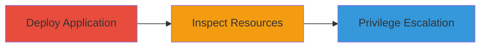

# Privilege Escalation via Overly Permissive IAM Role in aws-lambda-ecs-run-task Application

Multi-stage attack chain demonstrating the deployment and exploitation of a misconfigured AWS Lambda application for privilege escalation.

## Chain Metrics Dashboard

| Metric | Value |
|--------|-------|
| Chain Status | Unverified |
| Total Steps | 2 |
| Execution Time | ~10 minutes |
| Skill Level | Intermediate |
| Complexity | Medium |
| Impact Level | High |

## Attack Flow Visualization



## Prerequisites & Requirements

### Required Tools

- AWS CLI
- AWS SAM CLI

### Target Environment

- AWS account with deployment permissions
- Required services: IAM, Lambda, ECS, SQS
- Network access: Internet connectivity for GitHub clone and AWS API calls

### Initial Access Requirements

- Valid AWS credentials with permissions to create Lambda functions, IAM roles, and deploy applications
- No prior compromise needed, but assumes legitimate deployment access

## Detailed Attack Procedures

### Step 1: Deploy the Application
procedure: [[procedures/Deploy-aws-lambda-ecs-run-task-Application]]

**Objective**: Deploy the aws-lambda-ecs-run-task sample application to create the vulnerable Lambda function and IAM role.

**Instructions**: Clone the repository from GitHub and use AWS SAM to build and deploy the application. Ensure AWS credentials are configured.

First, clone the repo:

```bash
git clone https://github.com/awslabs/aws-lambda-ecs-run-task.git
cd aws-lambda-ecs-run-task
```

Then build and deploy using SAM:

```bash
sam build
sam deploy --guided
```

Follow the prompts to set the stack name (e.g., rLambdaEcsRunTaskStack) and confirm deployment.

**Expected Output**: Successful deployment confirmation, with outputs including the Lambda function ARN and role ARN.

**Success Indicators**:
- Stack deployed without errors
- Lambda function rLambdaFunction created
- IAM role rLambdaFunctionRole attached

### Step 2: Inspect and Exploit IAM Role
procedure: [[procedures/Inspect-and-Exploit-IAM-Role-Permissions]]

**Objective**: Inspect the IAM role attached to the Lambda function to confirm AdministratorAccess policy, then demonstrate privilege escalation by invoking the function to perform unrestricted AWS actions.

**Instructions**: Use AWS CLI to describe the role and attached policies. If control is gained over the Lambda (e.g., via code injection or event trigger), invoke it to execute admin actions like listing all S3 buckets.

Describe the role:

```bash
aws iam get-role --role-name rLambdaFunctionRole
```

List attached policies:

```bash
aws iam list-attached-role-policies --role-name rLambdaFunctionRole
```

To exploit, update the Lambda code to run an admin command (e.g., via console or API) and invoke:

```bash
aws lambda invoke --function-name rLambdaFunction output.json --payload '{"command": "aws s3 ls"}'
```

**Expected Output**: Role description showing AdministratorAccess ARN (arn:aws:iam::aws:policy/AdministratorAccess). Invocation returns unrestricted AWS actions, e.g., full S3 bucket list.

**Success Indicators**:
- Policy confirms full admin access
- Lambda invocation performs root-level actions without denial

## Attack Chain Summary

### Key Achievements

1. Successful deployment of the vulnerable application
2. Identification of overly permissive IAM role
3. Demonstration of privilege escalation to full AWS administrator

## Technique & Tactic Coverage

### MITRE ATT&CK Techniques

- [[T1078.004]]
- [[Sudo and Sudo Caching]]

### MITRE ATT&CK Tactics

- [[Privilege Escalation]]

---
*Last updated: 2023-10-01T12:00:00Z*
