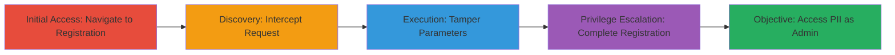

# Privilege Escalation via Registration Parameter Tampering and Injection in DoD Web Application

Multi-stage attack chain demonstrating a complete attack workflow exploiting a DoD web application's registration vulnerabilities to achieve administrator privileges and access to sensitive PII such as SSNs, names, phones, and emails.

## Chain Metrics Dashboard

| Metric | Value |
|--------|-------|
| Chain Status | Unverified |
| Total Steps | 7 |
| Execution Time | ~10 minutes |
| Skill Level | Intermediate |
| Complexity | Medium |
| Impact Level | High |

## Attack Flow Visualization

## Prerequisites & Requirements

### Required Tools

- [[tools/Burp-Suite]]

### Target Environment

- Web application built on ColdFusion
- Publicly accessible registration endpoint (e.g., https://████/████████/newuser.cfm)
- No prior authentication required for registration

### Initial Access Requirements

- Network access to the target web application
- No credentials needed; anonymous access to registration page
- Proxy tool configured to intercept HTTPS traffic (may require CA certificate installation)

## Detailed Attack Procedures

### Step 1: Enable Web Intercepting Proxy
procedure: [[procedures/Setup-Web-Proxy-Intercept]]

**Objective**: Set up a proxy to capture and modify HTTP requests during the registration process.

**Instructions**: Launch Burp Suite and configure your browser to route traffic through the proxy (default: 127.0.0.1:8080). Install the Burp CA certificate to handle HTTPS interception.

**Expected Output**: Proxy is active, and browser traffic is intercepted.

**Success Indicators**:
- Burp Suite shows incoming requests from the browser
- No SSL errors in the browser

### Step 2: Browse to Initial Registration Page
procedure: [[procedures/Setup-Web-Proxy-Intercept]]

**Objective**: Navigate to the application's registration starting point and select initial options.

**Instructions**: Open the browser and go to https://████/████████/screen_questions.cfm. Select options from dropdown lists, such as location class (e.g., █████████).

**Expected Output**: Redirected to the main registration form.

**Success Indicators**:
- Page loads without errors
- Dropdown selections are captured in proxy if intercepting

### Step 3: Proceed to Actual Registration Page

**Objective**: Reach the core registration form.

**Instructions**: After selections, proceed to https://████/████████/newuser.cfm?loc_class=L (this step can often be direct if skipping preliminaries).

**Expected Output**: Registration form is displayed for input.

**Success Indicators**:
- Form fields for personal info, SSN, etc., are visible

### Step 4: Fill in Registration Form

**Objective**: Enter basic user data to prepare for tampering.

**Instructions**: Input legitimate-looking personal information (e.g., name, email) and a unique SSN. If the SSN is already registered, try variations to avoid duplicate errors.

**Expected Output**: Form is filled and ready to submit.

**Success Indicators**:
- No validation errors on basic fields
- SSN check passes (not duplicate)

### Step 5: Intercept and Modify Registration Request
procedure: [[procedures/Tamper-Registration-Parameters-for-Escalation]]

**Objective**: Tamper with the POST request to escalate privileges via parameter manipulation and injection.

**Instructions**: With proxy intercepting, submit the form. In the intercepted POST to https://████/████████/newuser.cfm, modify user_type from default (5) to 4, set fname to 'Hackerone<%', and lname to 'test<%xss'. Forward the modified request.

**Expected Output**: Registration completes without errors.

**Success Indicators**:
- Server accepts modified parameters
- No rejection of injection characters

### Step 6: Complete Registration and Accept Privacy Policy

**Objective**: Finalize the account creation and login.

**Instructions**: After forwarding, the application logs in the new user and presents a privacy policy page. Accept it to proceed.

**Expected Output**: User is logged in with the new account.

**Success Indicators**:
- Login successful
- Privacy policy accepted without issues

### Step 7: Verify Administrator Access
procedure: [[procedures/Verify-Administrator-Access]]

**Objective**: Confirm elevated privileges and access sensitive data.

**Instructions**: Navigate to admin features or PII dashboards. Check for access to all applicants' data including SSNs.

**Expected Output**: Full admin dashboard with sensitive PII visible.

**Success Indicators**:
- Admin-only pages load
- PII data (SSNs, etc.) is accessible

## Attack Chain Summary

### Key Achievements

1. Bypassed registration restrictions to create an admin account
2. Exposed sensitive DoD applicant PII including SSNs
3. Demonstrated potential for data theft and further compromise

## Technique & Tactic Coverage

### MITRE ATT&CK Techniques

- [[Exploit Public-Facing Application]] Exploit Public-Facing Application
- [[Exploitation for Privilege Escalation]] Exploitation for Privilege Escalation
- [[JavaScript]] JavaScript (for injection aspects, adapted to ColdFusion delimiters)

### MITRE ATT&CK Tactics

- [[Initial Access]] Initial Access
- [[Privilege Escalation]] Privilege Escalation

---
*Last updated: 2023-10-01T12:00:00Z*
