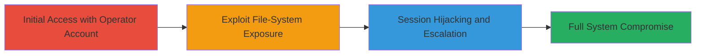

# Privilege Escalation via Session Hijacking in Ubiquiti EdgeOS

Multi-stage attack chain demonstrating privilege escalation from a non-privileged operator account to full admin/root access in Ubiquiti EdgeOS version 1.9.1.1 and prior, leveraging inadequate file-system protections and weak session management.

## Chain Metrics Dashboard

| Metric | Value |
|--------|-------|
| Chain Status | Unverified |
| Total Steps | 3 |
| Execution Time | ~5 minutes |
| Skill Level | Intermediate |
| Complexity | Medium |
| Impact Level | High |

## Attack Flow Visualization

## Prerequisites & Requirements

### Required Tools

- Web browser (e.g., Chrome with developer tools for session inspection)

### Target Environment

- Ubiquiti EdgeOS version 1.9.1.1 or prior
- Linux-based router OS
- Web interface accessible (typically port 80/443)

### Initial Access Requirements

- Valid non-privileged operator (read-only) account credentials
- Network access to the EdgeOS web interface
- No prior admin access required

## Detailed Attack Procedures

### Step 1: Initial Access
procedure: [[procedures/Access-EdgeOS-Web-Interface-with-Operator-Account]]

**Objective**: Gain read-only access to the EdgeOS web interface using operator credentials to establish a foothold.

**Instructions**: Log in to the web interface at the router's IP address (e.g., https://192.168.1.1) using the operator username and password. Verify read-only access by attempting to view configuration pages without modification capabilities.

**Expected Output**: Successful login to the dashboard with limited view-only permissions.

**Success Indicators**:
- Dashboard loads without errors
- Configuration pages are viewable but not editable

### Step 2: Exploit File-System Exposure
procedure: [[procedures/Exploit-File-System-Exposure-for-Sensitive-Information]]

**Objective**: Leverage the lack of file-system protections to read sensitive files containing session data or credentials.

**Instructions**: From the operator session, navigate to file-system accessible endpoints in the web interface (e.g., diagnostic or log sections). Use browser developer tools to inspect and access unprotected paths like /tmp or session storage directories, extracting admin session tokens or cookies.

**Expected Output**: Retrieval of sensitive files or data, such as admin session IDs stored in plain text.

**Success Indicators**:
- Sensitive files readable without authentication escalation
- Admin session details obtained (e.g., cookie values)

### Step 3: Session Hijacking and Escalation
procedure: [[procedures/Perform-Session-Hijacking-for-Privilege-Escalation]]

**Objective**: Hijack the admin session using extracted data to gain full root access and compromise the system.

**Instructions**: Replace the operator session cookie in the browser with the hijacked admin session cookie. Refresh the web interface to assume admin privileges, then perform root-level actions like configuration changes or shell access.

**Expected Output**: Elevated privileges allowing full system control, including root shell access.

**Success Indicators**:
- Web interface now permits modifications
- Root commands executable via integrated tools

## Attack Chain Summary

### Key Achievements

1. Initial foothold with minimal credentials
2. Exposure and extraction of sensitive session data
3. Full privilege escalation to root without direct credential compromise

## Technique & Tactic Coverage

### MITRE ATT&CK Techniques

- [[Steal Web Session Cookie]] Steal Web Session Cookie
- [[Exploitation for Privilege Escalation]] Exploitation for Privilege Escalation

### MITRE ATT&CK Tactics

- [[Credential Access]] Credential Access
- [[Privilege Escalation]] Privilege Escalation

---
*Last updated: 2023-10-01T12:00:00Z*
