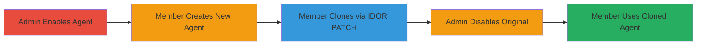

# Privilege Persistence via IDOR in Dust Agent Configuration Cloning

Multi-stage attack chain demonstrating a complete attack workflow for privilege persistence in the Dust platform by cloning admin-managed AI agents.

## Chain Metrics Dashboard

| Metric | Value |
|--------|-------|
| Chain Status | Unverified |
| Total Steps | 5 |
| Execution Time | ~5 minutes |
| Skill Level | Intermediate |
| Complexity | Medium |
| Impact Level | High |

## Attack Flow Visualization



## Prerequisites & Requirements

### Required Tools

- Browser or API client (e.g., curl) for dashboard and HTTP requests

### Target Environment

- Dust platform (SaaS web application)
- Authenticated access as member and admin accounts
- No specific ports; web-based over HTTPS

### Initial Access Requirements

- Valid member credentials for the workspace
- Admin credentials for enabling/disabling agents
- Network access to eu.dust.tt

## Detailed Attack Procedures

### Step 1: Admin Enables Target Agent

**Objective**: Ensure the target admin agent (e.g., 'gemini-pro') is active for cloning.

**Instructions**: Log in to the admin account via the Dust dashboard and navigate to the agent management section. Change the status of the target agent from disabled to enabled.

**Expected Output**: Agent status updated to 'active' in the dashboard.

**Success Indicators**:
- Agent shows as enabled in admin view
- No errors in dashboard

### Step 2: Member Creates New Agent
procedure: [[procedures/Clone-Admin-Agent-via-SID-Overwrite]]

**Objective**: Create a new agent under the member's control to serve as a base for cloning.

**Instructions**: Log in to the member account via the Dust dashboard. Navigate to the agent creation feature and create a new private agent with basic configuration (e.g., name it 'test-agent'). Note the generated agent ID.

**Expected Output**: New agent created successfully, visible in member's dashboard.

**Success Indicators**:
- Agent listed in member's agents
- Agent ID obtained for editing

### Step 3: Member Clones Admin Agent via IDOR
procedure: [[procedures/Clone-Admin-Agent-via-SID-Overwrite]]

**Objective**: Exploit the IDOR in the PATCH endpoint to overwrite the SID of the new agent with an admin agent's SID (e.g., 'gemini-pro'), effectively cloning it.

**Instructions**: Use an API client to send a PATCH request to the agent configuration endpoint. Replace {agent-id} with the new agent's ID and {w_id} with the workspace ID (e.g., BSsJ1zPUYE). Set the 'sid' in the payload to 'gemini-pro'. Execute [[commands/patch-agent-config-clone]]:

```bash
curl -X PATCH https://eu.dust.tt/api/w/BSsJ1zPUYE/assistant/agent_configurations/JpY5xizXRo \
  -H "Content-Type: application/json" \
  -H "Cookie: redacted" \
  -d '{"assistant":{"name":"gemini-pro-clone","pictureUrl":"https://dust.tt/static/emojis/bg-blue-300/brain/1f9e0","description":"An assistant designed to provide clear, concise, and factual responses efficiently.","instructions":"test-gemini-pro","status":"active","scope":"private","actions":[],"model":{"modelId":"claude-3-5-sonnet-20241022","providerId":"anthropic","temperature":0.7},"maxStepsPerRun":8,"visualizationEnabled":true,"templateId":null,"tags":[]}}'
```

**Expected Output**: 200 OK response, agent configuration updated.

**Success Indicators**:
- Cloned agent appears functional in member's dashboard
- SID matches admin agent

### Step 4: Admin Disables Original Agent

**Objective**: Simulate admin management by disabling the original agent to test persistence.

**Instructions**: Log back into the admin account via the dashboard. Navigate to the original agent (e.g., 'gemini-pro') and change its status to disabled. Save the changes.

**Expected Output**: Original agent status updated to 'disabled'.

**Success Indicators**:
- Original agent no longer usable by admin or members directly
- No impact on cloned agent

### Step 5: Member Uses Cloned Agent

**Objective**: Verify that the cloned agent persists and functions despite the original being disabled, achieving privilege persistence.

**Instructions**: Log in to the member account and interact with the cloned agent in the dashboard (e.g., run a query using the gemini-pro model). Confirm it calls the underlying AI model successfully.

**Expected Output**: Cloned agent responds with AI model output.

**Success Indicators**:
- Cloned agent executes without errors
- Access to restricted model persists post-disablement

## Attack Chain Summary

### Key Achievements

1. Bypassed admin controls to clone restricted agents
2. Persisted access to disabled resources via IDOR
3. Undermined resource management in multi-tenant SaaS environment

## Technique & Tactic Coverage

### MITRE ATT&CK Techniques

- [[Account Manipulation]] Account Manipulation
- [[Valid Accounts]] Valid Accounts

### MITRE ATT&CK Tactics

- [[Persistence]] Persistence
- [[Privilege Escalation]] Privilege Escalation

---
*Last updated: 2023-10-01T00:00:00Z*
