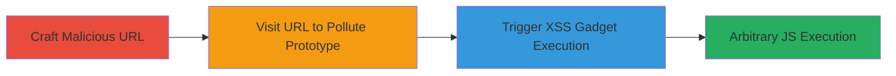

# Prototype Pollution Leading to DOM-based XSS via Swiftype CDN Script

Multi-stage attack chain demonstrating exploitation of prototype pollution in the Swiftype CDN script to inject and execute arbitrary JavaScript via DOM-based XSS.

## Chain Metrics Dashboard

| Metric | Value |
|--------|-------|
| Chain Status | Unverified |
| Total Steps | 2 |
| Execution Time | ~1 minute |
| Skill Level | Intermediate |
| Complexity | Medium |
| Impact Level | High |

## Attack Flow Visualization

## Prerequisites & Requirements

### Required Tools

- Web browser (e.g., Chrome, Firefox)

### Target Environment

- Web platform with Swiftype CDN script loaded (e.g., https://blog.swiftype.com/)
- No specific services/ports required beyond HTTP/HTTPS access
- Network access to the target site

### Initial Access Requirements

- No credentials needed
- Direct network access to the public-facing website
- No prior access required; social engineering or direct link sharing for delivery

## Detailed Attack Procedures

### Step 1: Craft Malicious URL for Prototype Pollution
procedure: [[procedures/Craft-Malicious-URL-for-Prototype-Pollution]]

**Objective**: Create a URL with a crafted hash that exploits the deparam function to pollute Object.prototype.

**Instructions**: Construct the URL by appending a hash fragment that targets __proto__ to set arbitrary properties, such as #__proto__[asd]=alert(document.domain). This leverages the vulnerable parsing in https://s.swiftypecdn.com/install/v2/st.js.

**Expected Output**: A valid URL like https://blog.swiftype.com/#__proto__[asd]=alert(document.domain) ready for delivery.

**Success Indicators**:
- URL hash correctly formatted with __proto__ pollution payload
- No syntax errors in the crafted string

### Step 2: Trigger XSS via Polluted Prototype
procedure: [[procedures/Trigger-XSS-via-Polluted-Prototype]]

**Objective**: Navigate to the crafted URL to trigger prototype pollution and subsequent XSS execution via the script's gadget.

**Instructions**: Open the crafted URL in a victim's browser. The deparam function parses the hash, polluting Object.prototype with the payload. The _convertStringHooksToFunctions gadget then evaluates the polluted property using eval(), executing the JavaScript.

**Expected Output**: Alert box displaying the document.domain or arbitrary JS execution in the browser context.

**Success Indicators**:
- Prototype pollution confirmed (e.g., via console: Object.prototype.asd === 'alert(document.domain)')
- XSS triggered: Alert or other JS payload executes
- Potential for session hijacking if cookies are accessible

## Attack Chain Summary

### Key Achievements

1. Successful prototype pollution of Object.prototype via URL hash manipulation
2. Chained exploitation to DOM-based XSS using eval() in the script's gadget
3. Arbitrary JavaScript execution on affected sites, enabling data theft or phishing

## Technique & Tactic Coverage

### MITRE ATT&CK Techniques

- [[Exploit Public-Facing Application]] Exploit Public-Facing Application
- [[JavaScript]] JavaScript

### MITRE ATT&CK Tactics

- [[Initial Access]] Initial Access
- [[Execution]] Execution

---
*Last updated: 2023-10-01T00:00:00Z*
