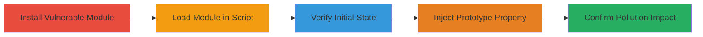

# Prototype Pollution in object-path-set Leading to Global Object Injection

Multi-stage attack chain demonstrating exploitation of a prototype pollution vulnerability in the object-path-set Node.js module version 1.0.0. This allows arbitrary property injection into Object.prototype, which can alter behavior of all objects in the application, leading to denial of service (DoS), remote code execution (RCE), or property injection attacks.

## Chain Metrics Dashboard

| Metric | Value |
|--------|-------|
| Chain Status | Unverified |
| Total Steps | 5 |
| Execution Time | ~5 minutes |
| Skill Level | Intermediate |
| Complexity | Medium |
| Impact Level | High |

## Attack Flow Visualization



## Prerequisites & Requirements

### Required Tools

- [[tools/npm]]

### Target Environment

- Node.js runtime (version compatible with npm modules)
- Linux or any OS with Node.js installed
- No specific services or ports required; local development environment

### Initial Access Requirements

- Access to a Node.js project or script environment
- No credentials needed; assumes developer or attacker control over module installation
- Prior access to run npm commands and execute JavaScript

## Detailed Attack Procedures

### Step 1: Install Vulnerable Module
procedure: [[procedures/Exploit-Prototype-Pollution-in-object-path-set]]

**Objective**: Set up the environment by installing the vulnerable object-path-set module version 1.0.0.

**Instructions**: Use [[commands/npm-install-object-path-set]] to install the module via npm.

```bash
npm i object-path-set@1.0.0
```

**Expected Output**: Module installed successfully, added to node_modules directory with confirmation message like "added 1 package".

**Success Indicators**:
- Package listed in package.json or node_modules
- No installation errors

### Step 2: Load Module and Prepare Test Object
procedure: [[procedures/Exploit-Prototype-Pollution-in-object-path-set]]

**Objective**: Require the module in a JavaScript script and create an empty test object to observe pollution effects.

**Instructions**: Create a new JavaScript file (e.g., exploit.js) and require the module:

```javascript
const setPath = require('object-path-set');
const obj = {};
```

**Expected Output**: Script loads without errors; obj is an empty object.

**Success Indicators**:
- Module requires successfully
- obj.__proto__ is clean (no polluted properties yet)

### Step 3: Verify Initial Property State
procedure: [[procedures/Exploit-Prototype-Pollution-in-object-path-set]]

**Objective**: Confirm that the test object does not have the target property before exploitation.

**Instructions**: Add a console log to check the property:

```javascript
console.log('Before: ' + obj.polluted); // Should output 'Before: undefined'
```

Run the script with Node.js:

```bash
node exploit.js
```

**Expected Output**: "Before: undefined"

**Success Indicators**:
- Property is undefined on the test object
- No prior pollution detected

### Step 4: Exploit with Prototype Polluting Path
procedure: [[procedures/Exploit-Prototype-Pollution-in-object-path-set]]

**Objective**: Call the setPath function with a path that targets __proto__ to pollute Object.prototype.

**Instructions**: Invoke the vulnerable function:

```javascript
setPath({}, '__proto__.polluted', 'yes');
```

**Expected Output**: No errors; property set silently on prototype.

**Success Indicators**:
- Function executes without throwing
- Prototype chain is modified (verifiable in debugger)

### Step 5: Confirm Pollution Effect
procedure: [[procedures/Exploit-Prototype-Pollution-in-object-path-set]]

**Objective**: Verify that the pollution affects all objects by checking the test object again.

**Instructions**: Log the property post-exploitation:

```javascript
console.log('After: ' + obj.polluted); // Should output 'After: yes'
```

Run the updated script:

```bash
node exploit.js
```

**Expected Output**: "After: yes"

**Success Indicators**:
- Property now returns 'yes' on the test object
- Global impact confirmed; affects new objects created afterward

## Attack Chain Summary

### Key Achievements

1. Successful installation of the vulnerable module without detection.
2. Injection of arbitrary properties into Object.prototype via unvalidated paths.
3. Demonstration of global object behavior alteration, enabling further attacks like DoS or RCE in dependent applications.

## Technique & Tactic Coverage

### MITRE ATT&CK Techniques

- [[Supply Chain Compromise]] Supply Chain Compromise
- [[JavaScript]] JavaScript

### MITRE ATT&CK Tactics

- [[Execution]] Execution
- [[Command and Control]] Command and Control

---
*Last updated: 2023-10-01T00:00:00Z*
