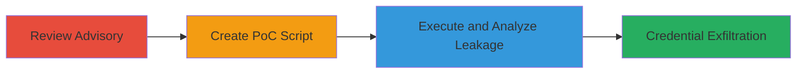

# Proxy-Authorization Header Leakage via Cross-Origin Redirects in undici

Multi-stage attack chain demonstrating the discovery and exploitation of an information disclosure vulnerability in the undici Node.js HTTP client library. The chain exploits the failure to clear Proxy-Authorization headers during cross-origin redirects, allowing proxy credentials to be leaked to third-party attacker-controlled endpoints. This can compromise proxy access in applications relying on undici for HTTP requests, violating Fetch specification expectations for forbidden header handling.

## Chain Metrics Dashboard

| Metric | Value |
|--------|-------|
| Chain Status | Unverified |
| Total Steps | 3 |
| Execution Time | ~5 minutes |
| Skill Level | Intermediate |
| Complexity | Medium |
| Impact Level | High |

## Attack Flow Visualization



## Prerequisites & Requirements

### Required Tools

- Node.js environment with undici installed
- Local server for attacker endpoint (e.g., on port 8182)

### Target Environment

- Node.js applications using undici for HTTP requests
- Proxy server requiring authentication
- Network access to redirecting endpoints

### Initial Access Requirements

- Development or testing environment with undici
- Ability to run Node.js scripts
- Control over a redirecting server and capture server

## Detailed Attack Procedures

### Step 1: Review Security Advisory
procedure: [[procedures/Review-Undici-Security-Advisory]]

**Objective**: Identify gaps in header clearing behavior by analyzing existing advisories on undici's redirect handling.

**Instructions**: Access and read the GHSA advisory GHSA-wqq4-5wpv-mx2g, which details the clearing of Authorization and Cookie headers on cross-domain redirects but omits Proxy-Authorization. Note the discrepancy as a potential vulnerability vector for credential leakage.

**Expected Output**: Understanding that Proxy-Authorization is not handled like forbidden headers per the Fetch spec.

**Success Indicators**:
- Advisory reviewed and gap identified
- Hypothesis formed on header persistence

### Step 2: Create and Execute PoC Script
procedure: [[procedures/Create-and-Execute-Undici-PoC-Script]]

**Objective**: Develop and run a proof-of-concept to test if Proxy-Authorization headers are forwarded during cross-origin redirects.

**Instructions**: Install undici via npm if needed (`npm install undici`), then create a Node.js script that uses undici's request function to target a redirecting endpoint (e.g., http://anysite.com/redirect.php?url=http://attacker.com:8182/vvv) with Proxy-Authorization: 'xxxxxxxx' and maxRedirections: 3. Execute the script using [[commands/node-execute-poc]]:

```bash
node poc-undici-leak.js
```

Set up a local listener on port 8182 to capture incoming requests.

**Expected Output**: Request logged on attacker server showing Proxy-Authorization header intact.

**Success Indicators**:
- Script executes without errors
- Redirect follows to attacker endpoint

### Step 3: Analyze Response to Confirm Leakage
procedure: [[procedures/Analyze-Proxy-Header-Leakage]]

**Objective**: Verify the leakage by inspecting the captured request headers and response details.

**Instructions**: In the PoC script, log the statusCode, headers, and body of the final response. Review the attacker server's logs to confirm the Proxy-Authorization header was sent uncledared. Use tools like netcat or a simple HTTP server to inspect the incoming request.

**Expected Output**: Logs showing Proxy-Authorization: 'xxxxxxxx' in the request to the cross-origin target.

**Success Indicators**:
- Header confirmed in captured request
- No clearing observed, validating the vulnerability

## Attack Chain Summary

### Key Achievements

1. Identified omission in undici's header clearing logic via advisory review.
2. Demonstrated practical leakage using a controlled PoC script.
3. Confirmed impact on proxy credential security in Node.js applications.

## Technique & Tactic Coverage

### MITRE ATT&CK Techniques

- [[Unsecured Credentials]] Unsecured Credentials
- [[Exploit Public-Facing Application]] Exploit Public-Facing Application

### MITRE ATT&CK Tactics

- [[Collection]] Collection

---
*Last updated: 2023-10-01T00:00:00Z*
