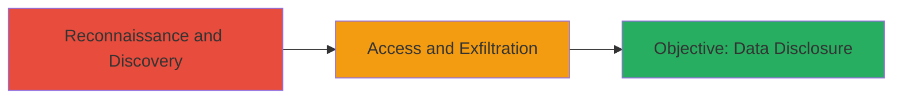

---
id: a1b2c3d4-e5f6-7890-abcd-ef1234567890
name: Public AWS S3 Bucket Exposure Leading to iOS Source Code Disclosure
type: attack_chain
description: A reconnaissance-based attack exploiting a misconfigured public AWS S3 bucket to disclose proprietary iOS application source code, configurations, and test data.
verified: false
submitted: false
step_count: 1
created_at: 2023-10-01T12:00:00Z
updated_at: 2023-10-01T12:00:00Z
procedures: [[procedures/Access-Public-AWS-S3-Bucket]]
techniques: [[Exploit Public-Facing Application]], [[Data from Cloud Storage]]
tactics: [[Initial Access]], [[Collection]]
tags: aws, s3, information-disclosure, cloud-misconfig, bug-bounty
platforms: AWS, Cloud
tools: []
---

# Public AWS S3 Bucket Exposure Leading to iOS Source Code Disclosure

Multi-stage attack chain demonstrating a complete attack workflow.

## Chain Metrics Dashboard

| Metric | Value |
|--------|-------|
| Chain Status | Unverified |
| Total Steps | 1 |
| Execution Time | ~5 minutes |
| Skill Level | Beginner |
| Complexity | Low |
| Impact Level | High |

## Attack Flow Visualization



## Prerequisites & Requirements

### Required Tools

- None (browser or basic HTTP client sufficient)

### Target Environment

- AWS Cloud platform
- S3 storage service
- Publicly accessible without authentication

### Initial Access Requirements

- Internet access
- Knowledge of potential bucket names (e.g., via enumeration or guesswork)
- No credentials required due to misconfiguration

## Detailed Attack Procedures

### Step 1: Discover and Access Public S3 Bucket
procedure: [[procedures/Access-Public-AWS-S3-Bucket]]

**Objective**: Identify and gain unauthorized access to a misconfigured public AWS S3 bucket to retrieve sensitive files including iOS test application source code, configurations, and test data.

**Instructions**: Begin by enumerating potential S3 bucket names using common patterns (e.g., company-name-test, slack-ios-build). Once a candidate bucket is identified, test for public access using [[commands/curl-access-s3-bucket]] to fetch the bucket's contents:

```bash
curl http://bucket-name.s3.amazonaws.com/
```

If accessible, list objects and download files:

```bash
curl http://bucket-name.s3.amazonaws.com/object-path/ -o downloaded-file
```

**Expected Output**: HTTP 200 response with XML listing of bucket objects or direct file content; successful download of source code files.

**Success Indicators**:
- Unauthorized access without AWS credentials
- Retrieval of proprietary iOS source code and configs
- No 403 Forbidden errors indicating public read access

## Attack Chain Summary

### Key Achievements

1. Discovered publicly accessible S3 bucket via reconnaissance
2. Accessed and exfiltrated sensitive iOS application source code and configurations
3. Demonstrated critical impact through exposure of internal development details without affecting customer data

## Technique & Tactic Coverage

### MITRE ATT&CK Techniques

- [[Exploit Public-Facing Application]] Exploit Public-Facing Application
- [[Data from Cloud Storage]] Data from Cloud Storage Object

### MITRE ATT&CK Tactics

- [[Initial Access]] Initial Access
- [[Collection]] Collection

---
*Last updated: 2023-10-01T12:00:00Z*
