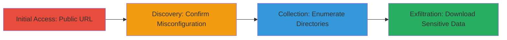

---
tags:
  - aws
  - s3
  - misconfiguration
  - public-access
  - cloud
  - dod
type: attack_chain
tools:
  - '[[tools/AWS-CLI]]'
tactics:
  - '[[Initial Access]]'
  - '[[Collection]]'
verified: false
platforms:
  - AWS
  - Cloud
submitted: true
complexity: low
created_at: '2023-10-01T00:00:00Z'
procedures:
  - '[[procedures/Access-Public-S3-Bucket-URL]]'
  - '[[procedures/Confirm-S3-Bucket-Misconfiguration]]'
  - '[[procedures/Enumerate-S3-Directories-with-AWS-CLI]]'
step_count: 3
techniques:
  - '[[Exploit Public-Facing Application]]'
  - '[[Data from Cloud Storage]]'
updated_at: '2025-12-14T17:28:58.517Z'
description: >-
  Attack chain exploiting a publicly accessible AWS S3 bucket misconfiguration
  to enumerate and access sensitive U.S. Department of Defense files without
  authentication.
skill_level: beginner
impact_level: high
id: 08d7b7b9-ff88-4d77-87b3-7b0b22d6a0fd
validated: true
mitre_tactics:
  - '[[Initial Access]]'
  - '[[Collection]]'
mitre_techniques:
  - '[[Exploit Public-Facing Application]]'
  - '[[Data from Cloud Storage]]'
---
# Public Access to Sensitive DoD Data via Misconfigured AWS S3 Bucket

Multi-stage attack chain demonstrating exploitation of an AWS S3 bucket misconfiguration that exposed sensitive U.S. Department of Defense data, including manuals, documents, and media files from directories like admin, production, beta, and localhost. The attack requires no authentication and leverages public URLs and AWS CLI for enumeration and access.

## Chain Metrics Dashboard

| Metric | Value |
|--------|-------|
| Chain Status | Unverified |
| Total Steps | 3 |
| Execution Time | ~5 minutes |
| Skill Level | Beginner |
| Complexity | Low |
| Impact Level | High |

## Attack Flow Visualization



## Prerequisites & Requirements

### Required Tools

- [[tools/AWS-CLI]]

### Target Environment

- AWS Cloud platform
- S3 storage service
- Publicly accessible bucket (no authentication required)

### Initial Access Requirements

- Internet access to the public S3 URL
- No credentials needed due to misconfiguration
- AWS CLI installed for advanced enumeration

## Detailed Attack Procedures

### Step 1: Initial Access
procedure: [[procedures/Access-Public-S3-Bucket-URL]]

**Objective**: Gain unauthenticated access to the S3 bucket by directly navigating to its public URL, confirming exposure of contents.

**Instructions**: Open a web browser and navigate to the public S3 bucket URL, such as `https://example-bucket.s3.amazonaws.com/`, where the bucket name is redacted as `██████`. This step verifies that the bucket is publicly readable without any login prompts.

**Expected Output**: Browser displays a directory listing of bucket contents, including files and subdirectories.

**Success Indicators**:
- No authentication challenge appears
- Bucket contents are visible immediately

### Step 2: Discovery
procedure: [[procedures/Confirm-S3-Bucket-Misconfiguration]]

**Objective**: Observe the bucket's public listing to confirm the absence of access controls, identifying the scope of exposed data.

**Instructions**: Once at the URL from Step 1, browse the root directory. The page should list all objects publicly, such as files in root, admin, production, beta, and localhost folders, without any restrictions.

**Expected Output**: Full directory structure visible, revealing sensitive items like DoD manuals and media.

**Success Indicators**:
- All contents load without errors or redirects
- No access denied messages

### Step 3: Collection
procedure: [[procedures/Enumerate-S3-Directories-with-AWS-CLI]]

**Objective**: Use AWS CLI to systematically list and explore contents across multiple directories, enabling targeted download of sensitive files.

**Instructions**: Install and configure AWS CLI if not already done (no credentials needed for public buckets). Then execute listing commands for various paths. Start with the root:

using [[commands/aws-s3-ls-root]]:

```bash
aws s3 ls s3://███/
```

Follow with subdirectory enumerations, such as admin or production:

using [[commands/aws-s3-ls-admin-directory]]:

```bash
aws s3 ls s3://████/██████/
```

Continue for beta:

using [[commands/aws-s3-ls-beta-directory]]:

```bash
aws s3 ls s3://███████/███████████████/
```

And localhost:

using [[commands/aws-s3-ls-localhost-directory]]:

```bash
aws s3 ls s3://██████████/███████/
```

Finally, another subdirectory:

using [[commands/aws-s3-ls-production-directory]]:

```bash
aws s3 ls s3://██████████/████/
```

These commands reveal files like sensitive manuals, documents, and media for download using `aws s3 cp` if desired.

**Expected Output**: Lists of objects, sizes, and last modified dates for each directory, showing sensitive DoD-related content.

**Success Indicators**:
- Commands return file listings without authentication errors
- Sensitive file names and paths are enumerated

## Attack Chain Summary

### Key Achievements

1. Confirmed public access to a DoD S3 bucket without credentials
2. Enumerated multiple sensitive directories including admin, production, beta, and localhost
3. Identified and potentially exfiltrated manuals, documents, and media files

## Technique & Tactic Coverage

### MITRE ATT&CK Techniques

- [[Exploit Public-Facing Application]] Exploit Public-Facing Application
- [[Data from Cloud Storage]] Data from Cloud Storage Object

### MITRE ATT&CK Tactics

- [[Initial Access]] Initial Access
- [[Collection]] Collection

---
*Last updated: 2023-10-01T00:00:00Z*
