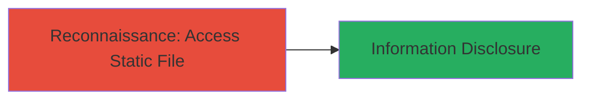

---
tags:
  - access-control
  - information-disclosure
  - package-json
  - node-js
  - staging-environment
type: attack_chain
tools: []
tactics:
  - '[[Reconnaissance]]'
verified: false
platforms:
  - Web
submitted: true
complexity: low
created_at: '2023-10-01T00:00:00Z'
procedures:
  - '[[procedures/Bypass-Authentication-to-Access-Static-package.json-File]]'
step_count: 1
techniques:
  - '[[Gather Victim Host Information]]'
updated_at: '2025-12-14T17:26:17.678Z'
description: >-
  Attack chain demonstrating the discovery and exploitation of improper access
  control allowing unauthorized access to sensitive static files like
  package.json in a protected staging environment.
skill_level: beginner
impact_level: medium
id: a4ec1600-b3fd-4adb-8dd5-946de96ad695
validated: true
mitre_tactics:
  - '[[Reconnaissance]]'
mitre_techniques:
  - '[[Gather Victim Host Information]]'
---
# Public Exposure of package.json via Improper Access Control in Staging Web Application

Multi-stage attack chain demonstrating a complete attack workflow.

## Chain Metrics Dashboard

| Metric | Value |
|--------|-------|
| Chain Status | Unverified |
| Total Steps | 1 |
| Execution Time | ~1 minute |
| Skill Level | Beginner |
| Complexity | Low |
| Impact Level | Medium |

## Attack Flow Visualization



## Prerequisites & Requirements

### Required Tools

- None (uses standard browser or curl)

### Target Environment

- Web platform
- Node.js-based application
- Staging environment with partial access controls

### Initial Access Requirements

- Public internet access to the target URL
- No credentials required due to the vulnerability

## Detailed Attack Procedures

### Step 1: Access Exposed Static File
procedure: [[procedures/Bypass-Authentication-to-Access-Static-package.json-File]]

**Objective**: Bypass authentication on the main application endpoint to directly access and retrieve the package.json file, exposing application dependencies and versions.

**Instructions**: Use [[commands/curl-fetch-package-json]] to request the static file directly:

```bash
curl https://apps-staging.pingone.com/package.json
```

Alternatively, navigate to the URL in a web browser to view the content.

**Expected Output**: JSON response containing package details, such as dependencies and versions (e.g., {"name": "app", "version": "1.0.0", "dependencies": {...}}).

**Success Indicators**:
- HTTP 200 response with package.json content
- Exposure of software versions and libraries

## Attack Chain Summary

### Key Achievements

1. Unauthorized access to sensitive configuration file
2. Disclosure of Node.js dependencies for potential further reconnaissance
3. Identification of vulnerable libraries for targeted exploitation

## Technique & Tactic Coverage

### MITRE ATT&CK Techniques

- [[Gather Victim Host Information]]

### MITRE ATT&CK Tactics

- [[Reconnaissance]]

---
*Last updated: 2023-10-01T00:00:00Z*
