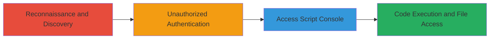

---
tags:
  - jenkins
  - rce
  - lfi
  - auth-bypass
  - google-oauth
  - improper-access-control
type: attack_chain
tools: []
tactics:
  - '[[Reconnaissance]]'
  - '[[Initial Access]]'
  - '[[Execution]]'
verified: false
platforms:
  - Web
  - Server
submitted: true
complexity: medium
created_at: '2023-10-01T00:00:00Z'
procedures:
  - '[[procedures/Discover-Test-Jenkins-Instance]]'
  - '[[procedures/Authenticate-with-Google-Account]]'
  - '[[procedures/Access-Jenkins-Script-Console]]'
  - '[[procedures/Execute-Arbitrary-Code-via-Script-Console]]'
step_count: 4
techniques:
  - '[[Active Scanning]]'
  - '[[Domain Accounts]]'
  - '[[Command-Line Interface]]'
  - '[[File and Directory Discovery]]'
updated_at: '2025-12-14T17:31:52.717Z'
description: >-
  An attack chain exploiting improper authentication in a test Jenkins instance,
  allowing any valid Google account to gain access and execute arbitrary code
  via the Script Console, leading to RCE and LFI in a limited test environment.
skill_level: intermediate
impact_level: high
id: 75bc2837-8ccc-466a-955f-b512bf847ce6
validated: true
mitre_tactics:
  - '[[Reconnaissance]]'
  - '[[Initial Access]]'
  - '[[Execution]]'
mitre_techniques:
  - '[[Active Scanning]]'
  - '[[Domain Accounts]]'
  - '[[Command-Line Interface]]'
  - '[[File and Directory Discovery]]'
---
# RCE and LFI on Test Jenkins Instance via Improper Google OAuth Authentication

Multi-stage attack chain demonstrating exploitation of a misconfigured test Jenkins instance through reconnaissance, unauthorized authentication, and code execution.

## Chain Metrics Dashboard

| Metric | Value |
|--------|-------|
| Chain Status | Unverified |
| Total Steps | 4 |
| Execution Time | ~10 minutes |
| Skill Level | Intermediate |
| Complexity | Medium |
| Impact Level | High |

## Attack Flow Visualization

## Prerequisites & Requirements

### Required Tools

- Web browser for authentication and navigation
- Reconnaissance tools (e.g., browser-based search or content discovery scripts)

### Target Environment

- Jenkins CI/CD server (test instance)
- Exposed web interface on standard HTTP/HTTPS ports (e.g., 8080)
- Google OAuth integration enabled

### Initial Access Requirements

- Internet access to perform reconnaissance
- A valid Google account (any account suffices due to misconfiguration)
- No prior credentials needed for the target

## Detailed Attack Procedures

### Step 1: Discover the Test Jenkins Instance
procedure: [[procedures/Discover-Test-Jenkins-Instance]]

**Objective**: Identify the existence and location of the misconfigured test Jenkins instance through reconnaissance and content discovery.

**Instructions**: Perform web reconnaissance by searching for Jenkins-related endpoints or using content discovery techniques to locate the instance. For example, query search engines or use directory brute-forcing tools to find paths like /jenkins or /ci.

**Expected Output**: URL of the Jenkins login page, confirming it's a test instance.

**Success Indicators**:
- Jenkins dashboard or login page accessible
- Indicators of test environment (e.g., non-production URLs or labels)

### Step 2: Authenticate Using Any Valid Google Account
procedure: [[procedures/Authenticate-with-Google-Account]]

**Objective**: Bypass authentication restrictions by logging in with an arbitrary valid Google account due to flawed OAuth flow.

**Instructions**: Navigate to the Jenkins login page and select Google OAuth as the authentication method. Enter credentials for any valid Google account. The improper flow allows successful login without additional verification.

**Expected Output**: Successful redirection to the Jenkins dashboard as an authenticated user.

**Success Indicators**:
- User session established
- Access to Jenkins UI features granted

### Step 3: Access Jenkins Script Console
procedure: [[procedures/Access-Jenkins-Script-Console]]

**Objective**: Gain entry to the administrative Script Console feature post-authentication.

**Instructions**: From the authenticated Jenkins dashboard, navigate to the "Manage Jenkins" section and select "Script Console." No additional permissions are required due to the lack of access controls.

**Expected Output**: Script Console interface loaded, ready for Groovy script input.

**Success Indicators**:
- Console page accessible without errors
- Ability to input and execute scripts

### Step 4: Execute Arbitrary Code for RCE and LFI
procedure: [[procedures/Execute-Arbitrary-Code-via-Script-Console]]

**Objective**: Leverage the Script Console to perform remote code execution and local file inclusion within the test environment.

**Instructions**: In the Script Console, input and execute Groovy scripts to run system commands or read local files. For RCE, use scripts like `def proc = 'ls'.execute(); proc.waitFor(); println proc.text`. For LFI, attempt file reads via `new File('/path/to/file').text`.

**Expected Output**: Execution results displayed, such as command output or file contents.

**Success Indicators**:
- Commands execute successfully
- File contents retrievable (limited to test env)

## Attack Chain Summary

### Key Achievements

1. Discovered hidden test Jenkins instance via reconnaissance
2. Bypassed authentication using generic Google credentials
3. Accessed privileged Script Console for code execution
4. Achieved RCE and LFI, though confined to non-production resources

## Technique & Tactic Coverage

### MITRE ATT&CK Techniques

- [[Active Scanning]] Active Scanning
- [[Domain Accounts]] Domain Accounts
- [[Command-Line Interface]] Command and Scripting Interpreter
- [[File and Directory Discovery]] File and Directory Discovery

### MITRE ATT&CK Tactics

- [[Reconnaissance]] Reconnaissance
- [[Initial Access]] Initial Access
- [[Execution]] Execution

---
*Last updated: 2023-10-01T00:00:00Z*
