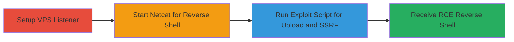

# RCE in Aiven Kafka Connect via Malicious SQLite Upload and SSRF to Jolokia

Multi-stage attack chain demonstrating remote code execution on Aiven's managed Kafka Connect service by chaining unrestricted file upload of a malicious SQLite database containing a JVM agent JAR with SSRF to an unprotected Jolokia interface for agent loading.

## Chain Metrics Dashboard

| Metric | Value |
|--------|-------|
| Chain Status | Unverified |
| Total Steps | 4 |
| Execution Time | ~5 minutes |
| Skill Level | Intermediate |
| Complexity | Medium |
| Impact Level | High |

## Attack Flow Visualization



## Prerequisites & Requirements

### Required Tools

- [[tools/nc]]
- [[tools/python3]]
- [[tools/kafka-python]]
- [[tools/poc-py]]

### Target Environment

- Aiven managed Kafka Connect service with JdbcSinkConnector (SQLite JDBC driver) and HttpSinkConnector enabled
- Access to Kafka topics for connector configuration
- Network access to Aiven Kafka Connect API endpoints
- Ports: 6725 (internal Jolokia), 4446 (external listener for reverse shell)

### Initial Access Requirements

- Valid credentials or API access to configure Kafka Connect connectors in Aiven
- VPS or external server for hosting the reverse shell listener
- kafka-python library installed for local script execution

## Detailed Attack Procedures

### Step 1: Setup VPS for Listener
procedure: [[procedures/Setup-VPS-Listener]]

**Objective**: Prepare an external virtual private server to host the netcat listener for the incoming reverse shell.

**Instructions**: SSH into the VPS to gain shell access and set up the environment.

Execute [[commands/ssh-login]] to connect:

```bash
ssh ████
```

**Expected Output**: Interactive shell on the VPS.

**Success Indicators**:
- Successful SSH login to VPS
- Shell prompt on remote server

### Step 2: Start Netcat Listener
procedure: [[procedures/Start-Netcat-Reverse-Shell-Listener]]

**Objective**: Initiate a TCP listener on port 4446 to catch the reverse shell from the exploited Kafka Connect server.

**Instructions**: In the VPS shell, run netcat in listen mode.

Execute [[commands/nc-listen]]:

```bash
nc -nlvp 4446
```

**Expected Output**: Netcat waiting for connections; verbose output showing listener active.

**Success Indicators**:
- Netcat listener active on port 4446
- No firewall blocks on the port

### Step 3: Execute Exploit Script
procedure: [[procedures/Execute-Kafka-Connect-Exploit-Script]]

**Objective**: Upload a malicious SQLite database via JdbcSinkConnector and trigger SSRF via HttpSinkConnector to load the JVM agent through Jolokia, resulting in RCE.

**Instructions**: Ensure kafka-python is installed if needed, navigate to the exploit directory, and run the POC script targeting the Aiven Kafka Connect instance.

First, install the library if not present using [[commands/pip-install-kafka-python]]:

```bash
pip install kafka-python
```

Then change directory with [[commands/cd-exploit-dir]]:

```bash
cd jdbc-sqlite-jolokia-rce
```

Finally, run the script with [[commands/python-run-poc]]:

```bash
python3 poc.py
```

The script configures the connectors: uploads the SQLite DB with embedded JAR BLOB via JDBC, then uses HTTP Sink for SSRF to localhost:6725/Jolokia invoking jvmtiAgentLoad on the DiagnosticCommand MBean.

**Expected Output**: Script completes connector setup; reverse shell connects to listener.

**Success Indicators**:
- Connectors successfully configured in Kafka Connect
- HTTP requests sent via SSRF to internal Jolokia
- JVM agent loaded, triggering reverse shell

### Step 4: Receive Reverse Shell
procedure: [[procedures/Receive-Reverse-Shell-Connection]]

**Objective**: Establish and interact with the reverse shell spawned by the RCE on the Kafka Connect server.

**Instructions**: Monitor the netcat listener for the incoming connection from the exploited server.

No additional commands needed; the POC triggers the connection automatically.

**Expected Output**: Incoming TCP connection on port 4446 with a shell prompt from the Kafka Connect server.

**Success Indicators**:
- Reverse shell connection established
- Ability to execute commands on the target server

## Attack Chain Summary

### Key Achievements

1. Uploaded malicious SQLite DB with embedded JVM agent JAR via unrestricted JdbcSinkConnector
2. Exploited SSRF in HttpSinkConnector to access unprotected Jolokia on localhost:6725
3. Loaded the agent via JMX MBean jvmtiAgentLoad for arbitrary code execution
4. Achieved full RCE with reverse shell on the Kafka Connect server

## Technique & Tactic Coverage

### MITRE ATT&CK Techniques

- [[Exploit Public-Facing Application]] Exploit Public-Facing Application (via connector APIs)
- [[Remote File Copy]] Ingress Tool Transfer (malicious file upload)
- [[Exploitation of Remote Services]] Exploitation of Remote Services (SSRF to Jolokia)
- [[Process Injection]] Process Injection (JVM agent loading)

### MITRE ATT&CK Tactics

- [[Initial Access]] Initial Access (via connector configuration)
- [[Execution]] Execution (RCE via agent)

---

*Last updated: 2023-10-01T00:00:00Z*
