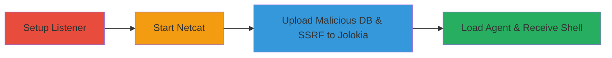

# RCE in Aiven Kafka Connect via SQLite JDBC File Upload and SSRF to Jolokia

Multi-stage attack chain exploiting vulnerabilities in Aiven's Kafka Connect setup to achieve remote code execution. The chain begins with setting up a listener on a controlled VPS, followed by configuring Kafka Connect connectors to upload a malicious SQLite database containing an embedded JVM agent JAR via the JdbcSinkConnector. SSRF in the HttpSinkConnector is then used to access the unprotected Jolokia instance on localhost:6725, invoking the jvmtiAgentLoad MBean operation to load the agent and execute arbitrary code, resulting in a reverse shell.

## Chain Metrics Dashboard

| Metric | Value |
|--------|-------|
| Chain Status | Unverified |
| Total Steps | 4 |
| Execution Time | ~5 minutes |
| Skill Level | Intermediate |
| Complexity | Medium |
| Impact Level | High |

## Attack Flow Visualization



## Prerequisites & Requirements

### Required Tools

- [[tools/Netcat]]
- [[tools/Python3]]
- [[tools/Kafka-Python]]

### Target Environment

- Aiven Kafka Connect instance with JdbcSinkConnector (SQLite JDBC driver) and HttpSinkConnector enabled
- Unprotected Jolokia JMX endpoint on localhost:6725
- Network access to Kafka Connect REST API (typically port 8083)
- Required services/ports: Kafka Connect (8083), Jolokia (6725 internal)

### Initial Access Requirements

- Valid credentials or API access to create Kafka Connect connectors
- Controlled VPS for reverse shell listener
- kafka-python library installed locally for PoC execution

## Detailed Attack Procedures

### Step 1: Setup VPS for Reverse Shell Listener

procedure: [[procedures/Setup-VPS-Listener-for-Reverse-Shell]]

**Objective**: Prepare a VPS instance to receive the incoming reverse shell connection post-exploitation.

**Instructions**: SSH into the VPS to access the shell environment.

Execute [[commands/ssh-login-to-vps]]:

```bash
ssh ████
```

**Expected Output**: Interactive shell session on the VPS.

**Success Indicators**:
- Successful SSH login to VPS
- VPS environment ready for listener setup

### Step 2: Start Netcat Listener

procedure: [[procedures/Start-Netcat-Listener-on-Port-4446]]

**Objective**: Establish a TCP listener on port 4446 to catch the reverse shell from the exploited Kafka Connect server.

**Instructions**: From the VPS shell, launch netcat in listen mode.

Execute [[commands/nc-listen-port-4446]]:

```bash
nc -nlvp 4446
```

**Expected Output**: Netcat output indicating it's waiting for connections (e.g., "Listening on [0.0.0.0] (family 0, port 4446)").

**Success Indicators**:
- Listener active and verbose output displayed
- No port conflicts or firewall blocks

### Step 3: Execute PoC Script for Exploitation

procedure: [[procedures/Execute-PoC-Script-for-Kafka-Connect-RCE]]

**Objective**: Configure Kafka Connect connectors to upload the malicious SQLite DB via JDBC and trigger SSRF to Jolokia for agent loading and RCE.

**Instructions**: Navigate to the PoC directory and run the Python script, which handles connector creation, file upload, SSRF request, and agent invocation.

First, change directory with [[commands/cd-to-poc-directory]]:

```bash
cd jdbc-sqlite-jolokia-rce
```

Then execute [[commands/python-run-poc-script]]:

```bash
python3 poc.py
```

**Expected Output**: Script output showing successful connector creation, DB upload, SSRF request to localhost:6725, and agent load confirmation; reverse shell should connect shortly after.

**Success Indicators**:
- Connectors created without errors
- Jolokia MBean invocation succeeds
- Reverse shell connection appears in netcat listener

### Step 4: Receive Reverse Shell

procedure: [[procedures/Receive-and-Interact-with-Reverse-Shell]]

**Objective**: Interact with the established reverse shell on the Kafka Connect server for post-exploitation activities.

**Instructions**: Monitor the netcat listener for the incoming connection from the exploited JVM agent.

No additional commands needed; the shell will appear in the existing netcat session.

**Expected Output**: Interactive shell prompt from the Kafka Connect server (e.g., bash or sh shell).

**Success Indicators**:
- Incoming TCP connection on port 4446
- Ability to execute commands on the target server

## Attack Chain Summary

### Key Achievements

1. Bypassed file upload restrictions to embed a malicious JVM agent in a SQLite DB
2. Exploited SSRF to access internal Jolokia without authentication
3. Loaded and executed arbitrary code via JMX MBean, achieving full RCE
4. Established persistent reverse shell access to the Kafka Connect environment

## Technique & Tactic Coverage

### MITRE ATT&CK Techniques

- [[Remote File Copy]] Ingress Tool Transfer (file upload of agent JAR)
- [[Exploit Public-Facing Application]] Exploit Public-Facing Application (SSRF and connector misconfiguration)
- [[PowerShell]] Command and Scripting Interpreter (JVM agent execution)

### MITRE ATT&CK Tactics

- [[Initial Access]] Initial Access (via connector API)
- [[Execution]] Execution (agent load and shell spawn)

---

*Last updated: 2023-10-01T00:00:00Z*
