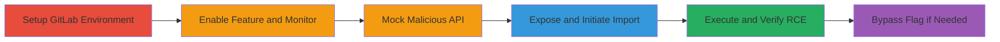

# RCE in GitLab BulkImports via Command Injection in DecompressedArchiveSizeValidator

Multi-stage attack chain demonstrating remote code execution in GitLab v15.1.0-ee through command injection in the DecompressedArchiveSizeValidator used by the BulkImports feature. An attacker controls the import_source parameter via a mocked GraphQL API, injecting shell metacharacters into a gzip command executed with Open3.popen3, leading to RCE as the 'git' user after a timeout in the import process. The attack requires enabling a feature flag or bypassing it via API, and impacts GitLab instances with BulkImports enabled, potentially allowing full server compromise.

## Chain Metrics Dashboard

| Metric | Value |
|--------|-------|
| Chain Status | Unverified |
| Total Steps | 6 |
| Execution Time | ~10 minutes |
| Skill Level | Intermediate |
| Complexity | Medium |
| Impact Level | High |

## Attack Flow Visualization



## Prerequisites & Requirements

### Required Tools

- [[tools/ngrok]]
- [[tools/Flask]]
- [[tools/Burp-Suite]]
- [[tools/api_project_ql.py]]

### Target Environment

- GitLab v15.1.0-ee on Linux
- Services: PostgreSQL 12.10, Redis 6.2.7, Sidekiq 6.4.0
- Ports: 80/443 (GitLab), 5000 (Flask), 8080 (Burp optional)
- Network access: Local GitLab instance or remote with admin access for setup

### Initial Access Requirements

- Admin or maintainer access to GitLab for feature enablement (bypassable via API)
- Ability to create groups/projects and API tokens
- External network access for ngrok tunnel

## Detailed Attack Procedures

### Step 1: Setup GitLab Environment
procedure: [[procedures/Setup-and-Enable-GitLab-Bulk-Import-Feature]]

**Objective**: Prepare a testable GitLab instance and enable the vulnerable BulkImports feature.

**Instructions**: Spin up a GitLab instance (local VM or Docker), create a group and project, generate an API token, and enable the bulk_import_projects feature flag using the Rails console.

**Expected Output**: Feature flag enabled, API token ready, group/project created.

**Success Indicators**:
- Rails console confirms feature enablement
- API token authenticates successfully

### Step 2: Monitor Logs
procedure: [[procedures/Monitor-GitLab-Logs-for-Exploitation]]

**Objective**: Observe real-time logs to track import process and command execution.

**Instructions**: Use [[commands/gitlab-ctl-tail]] to tail GitLab service logs before initiating the import.

```bash
sudo gitlab-ctl tail
```

**Expected Output**: Live log streams from GitLab services.

**Success Indicators**:
- Logs show import initiation
- Errors or tar failures indicate injection trigger

### Step 3: Configure Mock API Server
procedure: [[procedures/Configure-Mock-GitLab-API-Server]]

**Objective**: Set up a Flask-based mock server to respond with malicious import_source containing shell injection payload.

**Instructions**: Download and configure [[tools/api_project_ql.py]], set PROJECT_PATH and PROJECT_ID, modify import_source to '/tmp/ggg;echo lala|tee /tmp/1234;#', then run the Flask app.

```bash
FLASK_APP=api_project_ql.py flask run
```

**Expected Output**: Local server running on port 5000, responding to GraphQL queries with payload.

**Success Indicators**:
- Server logs confirm startup
- Test GraphQL query returns injected import_source

### Step 4: Expose Mock Server
procedure: [[procedures/Expose-Mock-Server-via-Ngrok-Tunnel]]

**Objective**: Tunnel the local mock API to the internet for GitLab to access during import.

**Instructions**: Start ngrok to expose port 5000.

```bash
ngrok http 5000
```

**Expected Output**: Public ngrok URL (e.g., https://abc123.ngrok.io).

**Success Indicators**:
- Ngrok dashboard shows active tunnel
- Public URL accessible and proxies to local Flask

### Step 5: Initiate Bulk Import
procedure: [[procedures/Initiate-Malicious-Bulk-Import-via-UI]]

**Objective**: Trigger the import process using the ngrok URL and API token, injecting the malicious payload.

**Instructions**: In GitLab UI, navigate to New Group > Import Group, enter ngrok URL, API token, select source group, set no parent, name the destination, and start import.

**Expected Output**: Import job queued, logs show pipeline start.

**Success Indicators**:
- UI confirms import initiation
- Logs display GraphQL calls to mock server

### Step 6: Verify Execution and Bypass
procedure: [[procedures/Verify-Command-Injection-and-Bypass-Feature-Flag]]

**Objective**: Confirm RCE via file creation and use API bypass if flag not enabled.

**Instructions**: After ~2-5 minutes timeout, check [[commands/cat-tmp-file]] for payload output; for bypass, use [[commands/curl-bulk-import-bypass]].

```bash
cat /tmp/1234
curl 'https://gitlab.com/import/bulk_imports.json' -H 'content-type: application/json' ... --data-raw '{"bulk_import":[{"source_type":"project_entity","source_full_path":"group1/project1","destination_namespace":"secret-vakzz","destination_name":"group1aaa"}]}'
```

**Expected Output**: File contains 'lala'; API response shows import started.

**Success Indicators**:
- Injected file exists with payload
- Logs show tar error and command execution
- Reverse shell possible with advanced payload

## Attack Chain Summary

### Key Achievements

1. Enabled or bypassed BulkImports feature to access vulnerable validator
2. Injected shell commands via controlled import_source in mock API
3. Achieved RCE as 'git' user, writing files and potentially escalating
4. Demonstrated full compromise path without direct server access

## Technique & Tactic Coverage

### MITRE ATT&CK Techniques

- [[Unix Shell]] Unix Shell
- [[Exploit Public-Facing Application]] Exploit Public-Facing Application

### MITRE ATT&CK Tactics

- [[Execution]] Execution
- [[Initial Access]] Initial Access

---
*Last updated: 2023-10-01T00:00:00Z*
