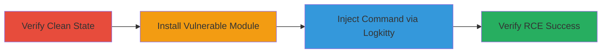

---
tags:
  - rce
  - command-injection
  - node-js
  - adb
  - android
type: attack_chain
tools:
  - '[[tools/npm]]'
  - '[[tools/logkitty]]'
tactics:
  - '[[Execution]]'
verified: false
platforms:
  - Linux
  - Node.js
submitted: true
created_at: '2023-10-01T00:00:00Z'
procedures:
  - '[[procedures/Verify-Clean-Exploitation-Environment]]'
  - '[[procedures/Install-Vulnerable-Logkitty-Module]]'
  - '[[procedures/Exploit-Logkitty-RCE-with-Malicious-App-Name]]'
  - '[[procedures/Verify-RCE-Exploitation-Success]]'
step_count: 4
techniques:
  - '[[Unix Shell]]'
  - '[[Exploitation for Client Execution]]'
updated_at: '2025-12-14T17:23:32.527Z'
description: >-
  Multi-stage attack exploiting command injection in the logkitty Node.js module
  (v0.7.0) to achieve remote code execution on the victim's machine through
  unsanitized ADB shell commands.
id: 81479573-dfe1-4b49-badb-0388196e3b40
validated: true
mitre_tactics:
  - '[[Execution]]'
mitre_techniques:
  - '[[Unix Shell]]'
  - '[[Exploitation for Client Execution]]'
---
# RCE in Logkitty via ADB Command Injection

Multi-stage attack chain demonstrating a complete attack workflow exploiting the logkitty Node.js module vulnerability for remote code execution.

## Chain Metrics Dashboard

| Metric | Value |
|--------|-------|
| Chain Status | Unverified |
| Total Steps | 4 |
| Execution Time | ~5 minutes |
| Skill Level | Intermediate |
| Complexity | Medium |
| Impact Level | High |

## Attack Flow Visualization



## Prerequisites & Requirements

### Required Tools

- [[tools/npm]]
- [[tools/logkitty]]

### Target Environment

- Node.js runtime
- Linux OS
- ADB (Android Debug Bridge) installed and accessible

### Initial Access Requirements

- Local access to a machine with Node.js and ADB
- No prior network access needed; local exploitation

## Detailed Attack Procedures

### Step 1: Verify Clean Environment
procedure: [[procedures/Verify-Clean-Exploitation-Environment]]

**Objective**: Ensure no existing 'HACKED' file is present to confirm a clean state before exploitation.

**Instructions**: Check the current directory for the 'HACKED' file using standard file listing commands.

```bash
ls -la | grep HACKED
```

**Expected Output**: No output if file does not exist, confirming clean state.

**Success Indicators**:
- No 'HACKED' file found

### Step 2: Install Vulnerable Module
procedure: [[procedures/Install-Vulnerable-Logkitty-Module]]

**Objective**: Set up the vulnerable environment by installing logkitty version 0.7.0.

**Instructions**: Use [[commands/npm-install-logkitty]] to install the module via npm.

```bash
npm i logkitty@0.7.0
```

**Expected Output**: Installation logs confirming logkitty v0.7.0 added to node_modules.

**Success Indicators**:
- logkitty installed successfully
- Version 0.7.0 verified via package.json or node_modules

### Step 3: Exploit RCE Vulnerability
procedure: [[procedures/Exploit-Logkitty-RCE-with-Malicious-App-Name]]

**Objective**: Trigger remote code execution by injecting a malicious app name into the logkitty command, exploiting unsanitized input in ADB shell execution.

**Instructions**: Execute [[commands/logkitty-android-app-injection]] with the payload 'test; touch HACKED' as the app name.

```bash
logkitty android app 'test; touch HACKED'
```

**Expected Output**: Logkitty runs but injects '; touch HACKED' into ADB, creating the 'HACKED' file; possible ADB errors or partial logs.

**Success Indicators**:
- Command executes without immediate failure
- Malicious command injected successfully

### Step 4: Verify Exploitation
procedure: [[procedures/Verify-RCE-Exploitation-Success]]

**Objective**: Confirm the RCE by checking for the created 'HACKED' file.

**Instructions**: Re-check the directory for the 'HACKED' file.

```bash
ls -la | grep HACKED
```

**Expected Output**: 'HACKED' file listed, confirming successful command injection and execution.

**Success Indicators**:
- 'HACKED' file exists
- Timestamp matches exploitation time

## Attack Chain Summary

### Key Achievements

1. Installed vulnerable logkitty module to prepare exploitation environment
2. Injected arbitrary shell command via unsanitized app name parameter
3. Achieved RCE leading to file creation on the victim's system
4. Verified impact through file presence

## Technique & Tactic Coverage

### MITRE ATT&CK Techniques

- [[Unix Shell]]
- [[Exploitation for Client Execution]]

### MITRE ATT&CK Tactics

- [[Execution]]

---

*Last updated: 2023-10-01T00:00:00Z*
