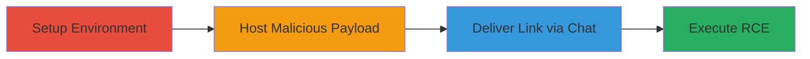

# RCE in Rocket.Chat Desktop via SMB Protocol Bypass

Multi-stage attack chain demonstrating remote code execution in the Rocket.Chat Desktop application by exploiting inadequate URL protocol filtering in the preload scripts, allowing smb:// links to execute malicious .desktop files hosted on a Samba share.

## Chain Metrics Dashboard

| Metric | Value |
|--------|-------|
| Chain Status | Unverified |
| Total Steps | 4 |
| Execution Time | ~15 minutes |
| Skill Level | Intermediate |
| Complexity | Medium |
| Impact Level | High |

## Attack Flow Visualization

## Prerequisites & Requirements

### Required Tools

- [[tools/Samba]]

### Target Environment

- Rocket.Chat Desktop app (version 2.17.10 or similar vulnerable releases)
- Victim OS: Linux (e.g., Xubuntu 20.04), Windows, or macOS
- Attacker controls a Samba server accessible via smb://
- Network access to Samba share from victim's network

### Initial Access Requirements

- Attacker account in the same Rocket.Chat channel as victim
- Victim must click the malicious link (user interaction required)
- No prior credentials needed beyond chat access

## Detailed Attack Procedures

### Step 1: Setup Victim Environment
procedure: [[procedures/Install-and-Setup-Rocket-Chat-Desktop]]

**Objective**: Prepare the victim's system with the vulnerable Rocket.Chat Desktop app and establish chat access.

**Instructions**: Download and install the app, then log in to a channel. No commands needed beyond installation.

**Expected Output**: App running with user authenticated in a chat channel.

**Success Indicators**:
- App launches successfully
- User can send/receive messages in channel

### Step 2: Host Malicious Payload
procedure: [[procedures/Setup-Malicious-Samba-Share]]

**Objective**: Create and expose a malicious .desktop file on a public Samba share to serve as the RCE payload.

**Instructions**: Configure Samba server with a public share and place the executable .desktop file containing the bash command.

**Expected Output**: smb://attacker.tld/public/pwn.desktop accessible and executable.

**Success Indicators**:
- Samba share online and file downloadable
- File permissions set to executable

### Step 3: Deliver Malicious Link
procedure: [[procedures/Send-Malicious-SMB-Link-in-Chat]]

**Objective**: Send the smb:// link to the victim via the Rocket.Chat channel to lure them into clicking it.

**Instructions**: From an attacker-controlled account, post the message with the malicious URL.

**Expected Output**: Link appears clickable in the chat interface.

**Success Indicators**:
- Message sent successfully
- Victim sees the link in chat

### Step 4: Trigger RCE
procedure: [[procedures/Trigger-and-Verify-RCE-via-Link-Click]]

**Objective**: Victim clicks the link, bypassing filters and executing the payload for RCE.

**Instructions**: Simulate victim interaction by clicking the link; observe execution of the embedded command.

**Expected Output**: Calculator launches and message box displays "Hello from Electron."

**Success Indicators**:
- Applications (e.g., mate-calc) start
- Message dialog appears confirming execution

## Attack Chain Summary

### Key Achievements

1. Bypassed URL filtering in Electron's shell.openExternal() by using unblocked smb:// protocol
2. Achieved arbitrary RCE on victim systems across Linux, Windows, and macOS
3. Demonstrated delivery via social engineering in chat without direct file attachments

## Technique & Tactic Coverage

### MITRE ATT&CK Techniques

- [[Malicious File]] User Execution: Malicious File
- [[Unix Shell]] Command and Scripting Interpreter: Unix Shell

### MITRE ATT&CK Tactics

- [[Initial Access]] Initial Access
- [[Execution]] Execution

---
*Last updated: 2023-10-01T00:00:00Z*
