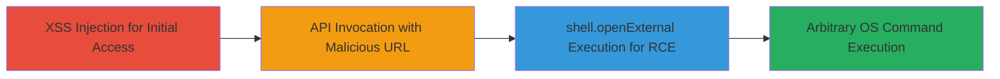

# RCE in Rocket.Chat-Desktop via XSS Exploitation of shell.openExternal

Multi-stage attack chain demonstrating a complete attack workflow exploiting an insecure implementation in Rocket.Chat-Desktop's internal video chat functionality to achieve remote code execution.

## Chain Metrics Dashboard

| Metric | Value |
|--------|-------|
| Chain Status | Unverified |
| Total Steps | 3 |
| Execution Time | ~5 minutes |
| Skill Level | Intermediate |
| Complexity | Medium |
| Impact Level | High |

## Attack Flow Visualization



## Prerequisites & Requirements

### Required Tools

- Browser developer tools for crafting XSS payloads
- Access to a Rocket.Chat instance with desktop app integration

### Target Environment

- Rocket.Chat-Desktop application (Electron-based)
- Internal video chat feature disabled or Mac App Store build
- Platforms: macOS, Windows (cross-platform Electron)
- No specific ports or services required beyond standard web access to Rocket.Chat

### Initial Access Requirements

- Valid user account in Rocket.Chat for injecting XSS payloads
- Network access to the Rocket.Chat server
- Desktop app running with API exposure enabled

## Detailed Attack Procedures

### Step 1: XSS Injection to Access Desktop API
procedure: [[procedures/Exploit-XSS-to-Access-Rocket-Chat-Desktop-API]]

**Objective**: Gain execution context within the Rocket.Chat web interface to call the exposed desktop API.

**Instructions**: Identify an XSS vulnerability in the Rocket.Chat web client (e.g., via unsanitized message input). Inject a JavaScript payload that invokes the openInternalVideoChatWindow function from the Rocket.Chat-Desktop-API. For example, use a payload like:

```javascript
<script>window.rocketChatDesktop.openInternalVideoChatWindow('malicious-url');</script>
```

This assumes the API is exposed in the web context due to the desktop app's integration.

**Expected Output**: The desktop API function is called without errors, preparing for URL injection.

**Success Indicators**:
- JavaScript executes in the browser console without blocking
- No CSP violations or sanitization blocks the payload

### Step 2: Inject Malicious URL Parameter
procedure: [[procedures/Inject-Malicious-URL-into-openInternalVideoChatWindow]]

**Objective**: Pass a user-controlled URL that bypasses validation and sets up command injection.

**Instructions**: Within the XSS payload, craft the 'url' parameter to point to a malicious scheme, such as file:// or a custom protocol that Electron's shell.openExternal interprets as an OS command. Example payload extension:

```javascript
window.rocketChatDesktop.openInternalVideoChatWindow('file:///C:/Windows/System32/calc.exe');
```

Ensure the internal video chat is disabled (via app settings) or use a Mac App Store build to bypass any internal checks at internalVideoChatWindow.ts line 14.

**Expected Output**: The function accepts the URL parameter and proceeds to line 17 without validation.

**Success Indicators**:
- URL parameter is logged or visible in app debugging
- No rejection due to scheme validation

### Step 3: Trigger Arbitrary Code Execution
procedure: [[procedures/Trigger-shell-openExternal-for-Arbitrary-Code-Execution]]

**Objective**: Leverage the insecure direct pass to shell.openExternal for OS-level command execution.

**Instructions**: The injected URL is automatically passed to Electron's shell.openExternal() at internalVideoChatWindow.ts line 17. This triggers the OS to interpret the URL as a command, e.g., launching calc.exe on Windows or an equivalent on macOS.

Monitor the desktop app for execution; no further input needed as the chain completes here.

**Expected Output**: Arbitrary OS command runs, such as a calculator opening or custom payload executing.

**Success Indicators**:
- Visible OS process launch (e.g., task manager shows new process)
- Payload effects observed on the victim's machine

## Attack Chain Summary

### Key Achievements

1. Bypassed web-to-desktop boundary via exposed API
2. Achieved RCE without direct app modification
3. Exploited Electron's shell for cross-platform command injection

## Technique & Tactic Coverage

### MITRE ATT&CK Techniques

- [[Drive-by Compromise]]
- [[Exploitation for Client Execution]]
- [[JavaScript]]

### MITRE ATT&CK Tactics

- [[Initial Access]]
- [[Execution]]

---
*Last updated: 2023-10-01T00:00:00Z*
