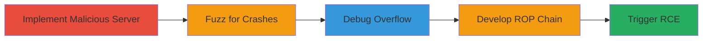

---
tags:
  - rce
  - buffer-overflow
  - steam
  - valve
  - udp
  - exploit
type: attack_chain
tools:
  - '[[tools/Python]]'
  - '[[tools/Immunity-Debugger]]'
tactics:
  - '[[Execution]]'
commands:
  - '[[commands/python-steam-serverinfo-exploit]]'
platforms:
  - Windows
  - Linux
  - macOS
complexity: medium
procedures:
  - '[[procedures/Implement-Malicious-UDP-Server-for-Steam-Queries]]'
  - '[[procedures/Fuzz-Steam-Server-Responses-for-Crashes]]'
  - '[[procedures/Debug-Steam-Crash-with-Immunity-Debugger]]'
  - '[[procedures/Develop-ROP-Chain-for-Steam-Exploitation]]'
  - '[[procedures/Trigger-Steam-Exploit-via-Server-Browser]]'
step_count: 5
techniques:
  - '[[Exploitation for Client Execution]]'
description: >-
  Multi-stage attack exploiting a stack-based buffer overflow in the Steam
  client's serverbrowser library during A2S_PLAYER response processing, leading
  to remote code execution.
skill_level: intermediate
impact_level: high
id: 4d1a7531-b740-4b2c-9c87-57f96c2bdd4b
created_at: '2025-12-14T17:24:18.442Z'
updated_at: '2025-12-14T17:24:18.442Z'
verified: false
validated: true
submitted: true
mitre_tactics:
  - '[[Execution]]'
mitre_techniques:
  - '[[Exploitation for Client Execution]]'
---
# RCE in Steam Client via Stack Buffer Overflow in Serverbrowser Library

Multi-stage attack chain demonstrating a complete exploit workflow for a stack-based buffer overflow in the Steam client's serverbrowser library, allowing remote code execution when processing oversized player names in A2S_PLAYER responses from the Valve server queries UDP protocol.

## Chain Metrics Dashboard

| Metric | Value |
|--------|-------|
| Chain Status | Unverified |
| Total Steps | 5 |
| Execution Time | ~30 minutes |
| Skill Level | Intermediate |
| Complexity | Medium |
| Impact Level | High |

## Attack Flow Visualization



## Prerequisites & Requirements

### Required Tools

- [[tools/Python]]
- [[tools/Immunity-Debugger]]

### Target Environment

- Target OS/Platform: Windows (primary for full RCE), Linux (partial EIP control), macOS (SIGABRT crash)
- Required services/ports: UDP port 27015 for Valve server queries
- Network access requirements: Local network or remote access to send UDP packets to the victim's Steam client

### Initial Access Requirements

- Credential requirements: None (client-side exploit triggered via server browser or steam:// URL)
- Network position: Attacker controls a UDP server; victim must query it via Steam
- Prior access needed: Victim must use Steam client and view server info

## Detailed Attack Procedures

### Step 1: Implement Malicious UDP Server
procedure: [[procedures/Implement-Malicious-UDP-Server-for-Steam-Queries]]

**Objective**: Set up a custom Python UDP server to mimic Valve game server responses on port 27015, handling A2S_INFO and A2S_PLAYER queries.

**Instructions**: Use [[tools/Python]] to create the server script with socket library. Define functions to respond to queries, including oversized payloads in A2S_PLAYER for player names.

**Expected Output**: Server listening on UDP 27015, ready to respond to Steam client queries.

**Success Indicators**:
- Server binds to port 27015 without errors
- Logs incoming A2S queries from Steam

### Step 2: Fuzz Server Responses
procedure: [[procedures/Fuzz-Steam-Server-Responses-for-Crashes]]

**Objective**: Identify buffer overflow by sending large or malformed player names in A2S_PLAYER responses to crash the Steam client.

**Instructions**: Modify the server to send payloads like 'A'*1100 or unicode strings (e.g., u'\u4141'*1100) in the player name field. Launch Steam and query the server via the server browser.

**Expected Output**: Steam client crashes upon receiving the response.

**Success Indicators**:
- Client crash observed
- No response from server after query

### Step 3: Debug the Crash
procedure: [[procedures/Debug-Steam-Crash-with-Immunity-Debugger]]

**Objective**: Analyze the crash to confirm stack overflow in serverbrowser library during unicode conversion, identifying return address overwrite.

**Instructions**: Attach [[tools/Immunity-Debugger]] to Steam.exe, set breakpoints on UDP handling, and replay the fuzzed response. Inspect stack for corruption and EIP control.

**Expected Output**: Debugger shows stack overflow, corrupted return address, and lack of canary on Windows.

**Success Indicators**:
- EIP overwritten with attacker-controlled data
- Overflow location pinpointed in unicode conversion routine

### Step 4: Develop Exploitation Payload
procedure: [[procedures/Develop-ROP-Chain-for-Steam-Exploitation]]

**Objective**: Craft a unicode-compatible ROP chain and shellcode to achieve RCE, bypassing unicode constraints.

**Instructions**: Use Python to build ROP gadgets from Steam.exe (e.g., VirtualProtect call), handle invalid chars (replace with '?'), and include shellcode for cmd.exe spawn. Set STEAM_BASE address dynamically.

**Expected Output**: Valid ROP chain and shellcode payload integrated into A2S_PLAYER response.

**Success Indicators**:
- Payload encodes without invalid unicode chars
- Test in debugger shows successful ROP execution

### Step 5: Trigger the Exploit
procedure: [[procedures/Trigger-Steam-Exploit-via-Server-Browser]]

**Objective**: Execute the exploit server and induce the victim to trigger RCE via Steam's server browser or steam:// URL.

**Instructions**: Run the exploit script with [[commands/python-steam-serverinfo-exploit]] on 0.0.0.0:27015. Victim views server info in Steam (View > Servers > View server info) or loads a malicious HTML with steam://connect/IP iframe.

```bash
python steam_serverinfo_exploit.py
```

**Expected Output**: Payload sent, RCE triggered (e.g., cmd.exe spawns on victim).

**Success Indicators**:
- Victim's Steam crashes or executes shellcode
- Remote cmd.exe access confirmed

## Attack Chain Summary

### Key Achievements

1. Confirmed stack buffer overflow in Steam's serverbrowser library
2. Developed full RCE exploit using ROP and shellcode
3. Demonstrated remote trigger via standard Steam features

## Technique & Tactic Coverage

### MITRE ATT&CK Techniques

- [[Exploitation for Client Execution]]

### MITRE ATT&CK Tactics

- [[Execution]]

---
*Last updated: 2023-10-01*
