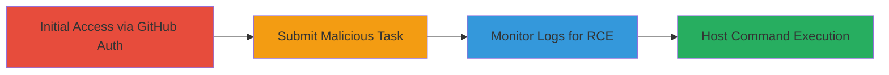

---
tags:
  - rce
  - command-injection
  - taskcluster
  - podman
  - gcp
type: attack_chain
tools:
  - '[[tools/podman]]'
tactics:
  - '[[Initial Access]]'
  - '[[Execution]]'
verified: false
platforms:
  - Web
  - Cloud
  - Linux
submitted: true
created_at: '2023-10-01T00:00:00Z'
procedures:
  - '[[procedures/Access-Taskcluster-Instance-with-GitHub]]'
  - '[[procedures/Submit-Malicious-Task-Definition]]'
  - '[[procedures/Monitor-Task-Execution-and-Logs]]'
step_count: 3
techniques:
  - '[[Exploit Public-Facing Application]]'
  - '[[Unix Shell]]'
updated_at: '2025-12-14T17:23:53.994Z'
description: >-
  Exploits unsanitized environment variable names in Taskcluster task
  definitions to achieve remote code execution on the worker host using podman
  container runtime.
id: 2d37ed0a-c599-4988-8751-2682a5d4a77a
validated: true
mitre_tactics:
  - '[[Initial Access]]'
  - '[[Execution]]'
mitre_techniques:
  - '[[Exploit Public-Facing Application]]'
  - '[[Unix Shell]]'
---
# RCE on Taskcluster Worker Host via Unsanitized Environment Variable Names

Multi-stage attack chain demonstrating remote code execution on Taskcluster worker hosts by injecting shell commands into unsanitized environment variable names in task definitions, bypassing shell escaping applied to other parameters.

## Chain Metrics Dashboard

| Metric | Value |
|--------|-------|
| Chain Status | Unverified |
| Total Steps | 3 |
| Execution Time | ~5 minutes |
| Skill Level | Intermediate |
| Complexity | Medium |
| Impact Level | High |

## Attack Flow Visualization



## Prerequisites & Requirements

### Required Tools

- [[tools/podman]]

### Target Environment

- Taskcluster instance at community-tc.services.mozilla.com
- Access to 'proj-misc/tutorial' task queue
- Podman-based worker hosts on GCP

### Initial Access Requirements

- GitHub account for authentication
- Public internet access to Taskcluster UI
- No prior credentials needed beyond GitHub login

## Detailed Attack Procedures

### Step 1: Access Taskcluster Instance
procedure: [[procedures/Access-Taskcluster-Instance-with-GitHub]]

**Objective**: Authenticate to the Taskcluster instance to gain permission to submit tasks to the public queue.

**Instructions**: Open a web browser and navigate to the Taskcluster UI. Use GitHub credentials to log in, granting access to task creation features.

**Expected Output**: Successful login, redirect to the dashboard with task creation options available.

**Success Indicators**:
- GitHub OAuth flow completes without errors
- Task creation page is accessible

### Step 2: Submit Malicious Task Definition
procedure: [[procedures/Submit-Malicious-Task-Definition]]

**Objective**: Craft and queue a task with an injected environment variable name to trigger command injection during podman execution on the worker host.

**Instructions**: Navigate to the task creation page. Paste a JSON task definition including a malicious env variable name like 'test2 --help ; whoami ; ls -lah ;:'--help''. Set taskQueueId to 'proj-misc/tutorial', image to 'ubuntu:latest', and command to [[commands/echo-hello]]. Click save to queue the task.

Use [[commands/inject-shell-via-env-var]] for the payload in the env name field:

```json
{
  "version": 1,
  "payload": {
    "image": "ubuntu:latest",
    "command": ["echo", "hello"],
    "env": [{"name": "test2 --help ; whoami ; ls -lah ;:'--help'", "value": "value"}]
  },
  "taskQueueId": "proj-misc/tutorial"
}
```

**Expected Output**: Task queued successfully, status changes to 'pending'.

**Success Indicators**:
- Task ID generated
- No immediate validation errors on submission

### Step 3: Monitor Task Execution and Logs
procedure: [[procedures/Monitor-Task-Execution-and-Logs]]

**Objective**: Observe the task run and capture evidence of injected commands executing on the host via live logs.

**Instructions**: Refresh the task status page until it runs (it will fail due to injection). Access the live logs to view output from injected commands like [[commands/inject-shell-via-env-var]], including whoami and ls -lah results from the host.

**Expected Output**: Log entries showing host user (e.g., root or worker), directory listings, and container echo output.

**Success Indicators**:
- Injected commands appear in logs (e.g., 'root' from whoami)
- Host filesystem details visible (ls -lah output)
- Potential access to GCP metadata indicated

## Attack Chain Summary

### Key Achievements

1. Authenticated access to public Taskcluster queue without restrictions
2. Injected and executed arbitrary shell commands on worker host via podman env parsing
3. Observed RCE impact including host process access and potential internal resource exposure

## Technique & Tactic Coverage

### MITRE ATT&CK Techniques

- [[Exploit Public-Facing Application]]
- [[Unix Shell]]

### MITRE ATT&CK Tactics

- [[Initial Access]]
- [[Execution]]

---
*Last updated: 2023-10-01T00:00:00Z*
