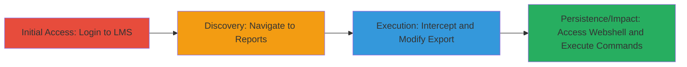

---
tags:
  - rce
  - webshell
  - path-traversal
  - aspx
  - asp.net
  - dod
  - lms
type: attack_chain
tools:
  - '[[tools/Burp-Suite]]'
tactics:
  - '[[Initial Access]]'
  - '[[Execution]]'
verified: false
platforms:
  - Web
  - Windows
submitted: true
complexity: medium
created_at: '2023-10-01T00:00:00Z'
procedures:
  - '[[procedures/Login-and-Navigate-to-DoD-LMS-Reports]]'
  - '[[procedures/Intercept-Report-Export-with-Burp-Suite]]'
  - '[[procedures/Modify-Parameters-for-ASpx-Webshell-Upload]]'
  - '[[procedures/Execute-Commands-via-Uploaded-Webshell]]'
step_count: 4
techniques:
  - '[[Exploit Public-Facing Application]]'
  - '[[Web Shell]]'
  - '[[Windows Command Shell]]'
updated_at: '2025-12-14T17:24:08.191Z'
description: >-
  Multi-stage attack exploiting insufficient validation in the DoD LMS report
  export to upload an ASPX webshell, enabling remote command execution on the
  Windows server.
skill_level: intermediate
impact_level: high
id: 1815d83c-1ec1-423e-b746-bb497e131526
validated: true
mitre_tactics:
  - '[[Initial Access]]'
  - '[[Execution]]'
mitre_techniques:
  - '[[Exploit Public-Facing Application]]'
  - '[[Web Shell]]'
  - '[[Windows Command Shell]]'
---
# RCE via ASPX Webshell Upload in DoD LMS Report Export

Multi-stage attack chain demonstrating exploitation of the report export functionality in the U.S. Department of Defense's Learning Management System (LMS) to achieve remote code execution by uploading a malicious ASPX webshell. Discovered during Hack the Army 3.0, this leverages parameter manipulation in the rdExportFilename and rdReportName fields to write executable server-side code, bypassing file type restrictions and enabling arbitrary command execution on the underlying Windows/IIS server.

## Chain Metrics Dashboard

| Metric | Value |
|--------|-------|
| Chain Status | Unverified |
| Total Steps | 4 |
| Execution Time | ~10 minutes |
| Skill Level | Intermediate |
| Complexity | Medium |
| Impact Level | High |

## Attack Flow Visualization

## Prerequisites & Requirements

### Required Tools

- [[tools/Burp-Suite]]

### Target Environment

- Target OS/Platform: Windows with IIS and ASP.NET
- Required services/ports: HTTP/HTTPS on port 80/443
- Network access requirements: Direct access to the LMS web application

### Initial Access Requirements

- Credential requirements: Valid DoD LMS user credentials
- Network position: External or internal network access to the LMS URL
- Prior access needed: None, but authenticated session required

## Detailed Attack Procedures

### Step 1: Login and Access Reports Section
procedure: [[procedures/Login-and-Navigate-to-DoD-LMS-Reports]]

**Objective**: Gain authenticated access to the LMS and reach the reports functionality to prepare for export exploitation.

**Instructions**: Visit the LMS URL and authenticate using provided credentials. Navigate to the reports page and select a report to run.

**Expected Output**: Successful login and report generation page load.

**Success Indicators**:
- Authenticated session established
- Reports section accessible and a report runs without errors

### Step 2: Setup Interception for Export Request
procedure: [[procedures/Intercept-Report-Export-with-Burp-Suite]]

**Objective**: Configure traffic interception to capture the report export POST request for modification.

**Instructions**: Configure your browser to proxy through Burp Suite. Trigger the export action and intercept the POST to /RServer/rdPage.aspx.

**Expected Output**: Intercepted HTTP POST request visible in Burp Suite Repeater or Proxy.

**Success Indicators**:
- Proxy configured successfully
- Export request captured with parameters like rdExportFilename and rdReportName

### Step 3: Modify Parameters to Upload Webshell
procedure: [[procedures/Modify-Parameters-for-ASpx-Webshell-Upload]]

**Objective**: Alter the export parameters to write a malicious ASPX file containing C# webshell code to the server.

**Instructions**: In the intercepted request, change rdExportFilename to a value ending in .aspx (e.g., hashedname.aspx) and inject URL-encoded C# code into rdReportName for command execution.

**Expected Output**: Modified request forwarded, resulting in a 302 redirect to the uploaded .aspx file.

**Success Indicators**:
- File uploaded successfully without errors
- Webshell accessible via the generated URL

### Step 4: Execute Arbitrary Commands via Webshell
procedure: [[procedures/Execute-Commands-via-Uploaded-Webshell]]

**Objective**: Interact with the uploaded webshell to run commands and confirm RCE.

**Instructions**: Access the webshell URL with a query parameter containing the command, e.g., ?key=whoami, to execute and retrieve output.

**Expected Output**: HTTP response containing the command output, such as the current user identity.

**Success Indicators**:
- Command executes and outputs server details
- Arbitrary commands can be run, confirming full RCE

## Attack Chain Summary

### Key Achievements

1. Authenticated access to DoD LMS reports
2. Successful upload of ASPX webshell via parameter injection
3. Remote execution of Windows commands on the server
4. Potential for path traversal to overwrite critical files

## Technique & Tactic Coverage

### MITRE ATT&CK Techniques

- [[Exploit Public-Facing Application]] Exploit Public-Facing Application
- [[Web Shell]] Web Shell
- [[Windows Command Shell]] Windows Command Shell

### MITRE ATT&CK Tactics

- [[Initial Access]] Initial Access
- [[Execution]] Execution

---
*Last updated: 2023-10-01T00:00:00Z*
