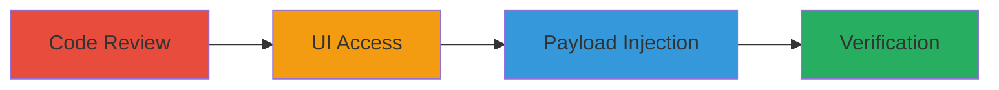

# RCE via Command Injection in Apache Airflow Docker Provider Example DAG

Multi-stage attack chain demonstrating exploitation of CVE-2022-38362 in Apache Airflow Docker Provider versions before 3.0, where an authenticated user injects commands via the 'source_location' parameter in the example_docker_copy_data.py DAG, leading to arbitrary OS command execution on the Airflow worker host.

## Chain Metrics Dashboard

| Metric | Value |
|--------|-------|
| Chain Status | Unverified |
| Total Steps | 4 |
| Execution Time | ~5 minutes |
| Skill Level | Intermediate |
| Complexity | Medium |
| Impact Level | High |

## Attack Flow Visualization

## Prerequisites & Requirements

### Required Tools

- None (manual exploitation via web UI)

### Target Environment

- Apache Airflow 2.3.3 with Docker Provider <3.0
- Exposed Airflow web UI on port 8080
- Linux-based worker host
- Network access to Airflow UI

### Initial Access Requirements

- Authenticated user account in Airflow
- Permissions to trigger DAGs via UI
- No prior elevated access needed

## Detailed Attack Procedures

### Step 1: Code Review
procedure: [[procedures/Review-Airflow-DAG-Source-Code-for-Vulnerability]]

**Objective**: Identify the command injection vulnerability in the example DAG script by analyzing source code.

**Instructions**: Examine the airflow/providers/docker/example_dags/example_docker_copy_data.py file in Airflow 2.3.3 source, focusing on the BashOperator's bash_command which uses {{params.source_location}} without validation.

**Expected Output**: Confirmation of unsanitized Jinja2 template rendering leading to bash concatenation.

**Success Indicators**:
- Identified lack of input sanitization in {{params.source_location}}
- Noted vulnerability in bash_command: 'find {{params.source_location}} -type f -printf "%f\n" | head -1'

### Step 2: UI Access
procedure: [[procedures/Access-Airflow-UI-and-Trigger-Vulnerable-DAG]]

**Objective**: Gain access to the Airflow web interface and prepare to trigger the vulnerable DAG.

**Instructions**: Log in to the Airflow UI at http://target:8080, navigate to the DAGs menu, select 'docker_sample_copy_data', and choose 'Trigger DAG w/ config'.

**Expected Output**: DAG trigger interface loaded with config input field.

**Success Indicators**:
- Successful authentication and navigation to DAGs view
- Endpoint http://target:8080/trigger?dag_id=docker_sample_copy_data accessible

### Step 3: Payload Submission
procedure: [[procedures/Submit-Malicious-Payload-to-Inject-Commands]]

**Objective**: Inject arbitrary commands using shell metacharacters in the DAG configuration payload.

**Instructions**: In the config field, enter the JSON payload {"source_location":";touch /tmp/thisistest;"}, then click 'Trigger' to execute the DAG.

**Expected Output**: DAG run initiated with injected command concatenated into bash execution.

**Success Indicators**:
- Payload accepted without validation errors
- DAG status shows running or success

### Step 4: Verification
procedure: [[procedures/Verify-RCE-Execution-via-Logs-and-File-Creation]]

**Objective**: Confirm remote code execution by reviewing logs and checking for side effects on the worker host.

**Instructions**: Monitor Airflow logs for the task execution, then access the worker host to verify the created file /tmp/thisistest exists.

**Expected Output**: Log entries showing execution of 'touch /tmp/thisistest' and file presence on filesystem.

**Success Indicators**:
- Logs indicate injected command ran successfully
- Test file created, proving OS-level RCE

## Attack Chain Summary

### Key Achievements

1. Identified command injection in Airflow example DAG via code review
2. Exploited via authenticated UI trigger with malicious JSON payload
3. Achieved arbitrary command execution on worker host
4. Verified impact through logs and filesystem changes

## Technique & Tactic Coverage

### MITRE ATT&CK Techniques

- [[Exploit Public-Facing Application]]
- [[Unix Shell]]

### MITRE ATT&CK Tactics

- [[Initial Access]]
- [[Execution]]

---
*Last updated: 2023-10-01T00:00:00Z*
